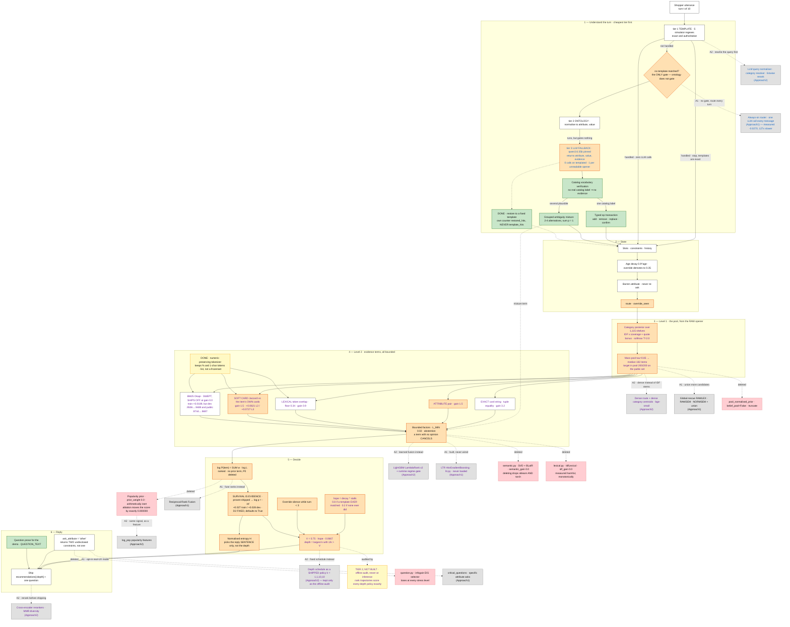

# MERGE.md — one agent from three branches

**Status: v3 — Tier 0 and Tier 1 are BUILT and measured; Tier 2 and 3 are not.** v1 was written before I had read
[`SUMMARY.md`](SUMMARY.md) (592 lines, now identical to `docs/SUMMARY.md`). That document changed the
plan substantially — see [§8](#8-what-changed-from-v1). The headline change: **this is a polish job,
not a rebuild.**

**This repo (`track4-Approach-Daeren`) is the base.** It wins all three shared datasets, it is the
fastest by 9×, it is numpy-only, and it holds **zero trained model files** — so "do not retrain" is
satisfied by construction.

---

## 0. The evidence base

Verified by checksum before anything else:

```
evaluator/local_evaluator.py       245f7d86…   identical  Approach2 · Daeren
public_set.jsonl                   1c8030f2…   identical  all three
resplit_60_20_20/{train,val,test}              identical  all three
freeform_v1/{train,val,test}                   identical  all three
combine/{train,validation}                     identical  all three
```

Daeren rows are from [`SUMMARY.md`](SUMMARY.md) §5; the other two from each branch's own docs. Nothing
was re-run for this document.

| dataset (n) | Approach2 | Approach1 | **R5 = shipped** |
|---|---|---|---|
| `public_set` (200) | 0.94754 | 0.95667 | **0.9744** |
| `resplit/test` (2,800) | 0.94077 | 0.91466 | **0.9562** |
| `freeform_v1/test` (800) | 0.92780 | 0.51369 | **0.9348** |
| ms/session, public 200 | 176 | 5,435 | **20** |
| runtime deps | numpy · sklearn · lightgbm · torch · transformers | numpy · sklearn · torch | **numpy** |
| trained weights on disk | 2 × `.npz` + schedule | `ltr_model.pkl` (**never loaded**) | **none** |

---

## 1. 🔑 How much is actually left to win

This is the number that should govern every decision below. Theoretical max is **0.9922** — perfect
Hit@10, perfect MRR, and the structural MTTC floor of 1.39 that the `intent_override` sessions impose.

| set | now | Hit gap | MRR gap | Efficiency gap | **realistically reachable** |
|---|---|---|---|---|---|
| `public_set` | 0.9744 | 0.0000 | 0.0017 | 0.0160 | **0.005** — saturated |
| `resplit/test` | 0.9562 | 0.0045 | 0.0065 | 0.0250 | **0.014** |
| `freeform_v1/test` | 0.9348 | 0.0137 | 0.0119 | 0.0318 | **0.029** |

"Realistically reachable" = the Hit and MRR gaps in full, plus **+0.0033** for stopping — the measured
oracle ceiling on *any* stopping rule from `scripts/earlyhit.py`. The rest of the Efficiency gap is
structural: sessions genuinely need turns to disclose their constraints.

**Three consequences that shape the whole plan:**

1. **The templated ceiling is ~0.014.** No architecture change can be worth more than that on the
   distribution the private 800 are drawn from. Importing another branch's spine cannot pay for itself.
2. **Free-form has 2× the headroom (0.029).** It is the only place a language layer can earn anything,
   which is the real argument for taking Approach1's contributions — stronger than the Pillar argument
   I gave in v1.
3. **The largest single risk is not a missing feature — it is [D2](SUMMARY.md).** `exclude_shipped`
   defaults `False` and every published number sets it `True`. If the organizer's harness constructs
   `Agent(catalog_path)` with no environment, we ship a configuration that has never been measured.
   Fixing that is worth more than every merge item combined.

---

## 2. How to read the colours

**Fill = where this part of the merged agent comes from.**

| fill | meaning |
|---|---|
| 🟧 **orange** | **unique to this base.** Keep — nothing in the other two branches does this job. |
| 🟩 **green** | **merged in from Approach1.** |
| 🟨 **yellow** | **merged in from Approach2.** |
| ⬜ **white** | here *and* independently built in Approach2 — convergent design, no merge action. |
| 🟥 **red, dashed** | **still in this codebase and deleted by this merge.** |
| ⬛ **grey** | **built in Approach1 or Approach2 and NOT used here.** Source branch named in the label. |

**Font = what the node needs at runtime.** 🔵 blue = an LLM call · 🟣 purple = parameters fitted by our
own code (`scripts/training/hyperparameter_tuning.py`) · ⚫ black = deterministic, no model.

**Solid arrows are the live path. Every dotted arrow means *this is where that part sat*** — it points
from the surviving node to the red one it replaces, or to the grey one from another branch that does
the same job. Nothing dotted runs at inference.

> ⚠️ `track4-Appraoch1` is a **git fork of this repo at `9ed6066`**, so most of the R3 spine is
> trivially "also in Approach1". Counting that as common would paint the diagram white and erase who
> built what. Commonality is judged against **Approach2 only** — an independently written codebase.
> Approach1 is credited green for its **post-fork additions** and nothing it merely inherited.

---

## 3. The merged architecture



> ⚠️ **This diagram is about provenance, not runtime.** Fill colour answers *"where did this part come
> from?"*, and it deliberately draws things that are **not** in the running system — red for deleted,
> grey for never taken. [SUMMARY.md](SUMMARY.md) §4 draws the same agent as a **runtime** diagram:
> every node white, font colour carrying deterministic / fitted / model-call, and only what executes.
> Two views of one system; neither is a redraw of the other.

**Read it in one line:** the orange spine stays untouched; Approach1 adds a *safety and ambiguity*
layer **downstream** of the LLM tier that already exists; Approach2 contributes one tokenizer and one
offline audit; five dead switches get deleted, and deleting them removes `sklearn` and `torch`.

⚠️ **The LLM tier is orange, not green.** v1 proposed replacing it with Approach1's router. That
contradicts resolved decision **D1** — the tier is kept deliberately, fires exactly once per unreadable
opener and never on a templated turn. Approach1's contribution is what happens to the model's output
*after* it returns, not whether it is called.

---

## 4. Provenance — every node and its evidence

### 🟧 Orange — unique to this base, kept

| node | evidence |
|---|---|
| **escalation gate** | `llm_calls = 0` on all three templated datasets. **Forcing the LLM onto readable text costs −0.0270 and 127× latency**, damage almost entirely MRR (0.9942 → 0.9469) |
| **tier-3 LLM fallback** 🔵 | D1: keep as fallback only. Sets no category, chooses no pool, ranks nothing; its attribute label is **discarded** and the value re-fed through `normalise()` so the catalog's vocabulary decides |
| **`exclude_shipped`** | +0.027 train, +0.028 dev. The rule must be **binary** — a soft penalty cost −0.0607 and took override MRR 0.983 → 0.504 |
| **soft-card Jaccard** | +0.0621 L2, +0.0727 L3 — the largest single win in R4 |
| **abstention + `L_MIN`** | letting soft matches delete candidates dropped Hit@10 to 0.79, *below* the 0.815 do-nothing baseline |
| **category posterior + mass pool** | 50,000 → **median 182**, target in pool **200/200**. A naive-Bayes alternative lost 0.525 vs 0.825 |
| **`hope` / `V` / depth** | 3 fitted numbers for the entire stopping policy. `turn_cost = 0.0667` is read off the scoring formula, not tuned. A **constant** `V` degenerates to shipping one item forever — 0.6216 at L3 |
| **override silence** | the evaluator discards every list shipped before the override lands |

### 🟩 Green — merged from Approach1

| node | why | caveat |
|---|---|---|
| **catalog vocabulary verification** | an LLM value is not evidence until it resolves to a real catalog label; `evidence` must be a literal substring of the message | the safety layer. Merge this **even if everything else from A1 is dropped** |
| **grouped ambiguity mixture** | `"poly"` → polyester / polyurethane / polycarbonate, confidences summing to 1 | drops into a log-posterior natively — that is the only reason it is worth porting |
| **typed op transaction** | `add · remove · replace · confirm · no_preference`, validated then applied atomically | the only typed implementation of Pillar II's "slot erasure and rewriting" |
| **`QUESTION_TEXT` prose** | real question text for the demo | zero score impact by design — the simulator ignores prose |
| **`_render` → fixed template** ⚠️ **Tier 2** | the "rewrite it so the deterministic parser can read it" idea | **must not touch `template_hits`** — see §6.3 |

### 🟨 Yellow — merged from Approach2

| node | why |
|---|---|
| **numeric-preserving tokenizer** | §6.1 — the only finding that can overturn a four-way negative |
| **offline depth-policy audit** 🟣 | settles §6.2 in one offline run with no retraining. Prize capped at +0.0033, so it is an audit, not a win |

---

## 5. Deliberately NOT merged

⬛ **grey** in the diagram, each labelled with its source branch. All are actually implemented.

| not merged | from | why |
|---|---|---|
| always-on LLM router | A1 | **−0.0270 and 127× slower** on `public_set`, measured in *this* repo (R9). Kept, but gated |
| `ltr.py` HistGradientBoosting | A1 | **never loaded by its own agent** — every "LTR" row in its scoreboard is identical to six decimals to the non-LTR row. Unmeasured |
| RAWLEX · RAWSEM · NORMSEM · union | A1 | all default `False`. **There is no recall failure to rescue**: the target is in the level-1 pool ~100% of the time |
| Reciprocal-Rank Fusion | A1 | same; and RRF discards score magnitude, which is what separates a hit on `100% Cotton` from one on `Cotton` |
| `critical_questions` specific asks | A1 | `"other"` returns **two** undisclosed constraints, any named attribute returns one. EIG loses at every stress level |
| LightGBM LambdaRank ×2 + regime gate | A2 | weights are unusable without A2's full feature stack, which re-imports everything §3 deletes. **Templated ceiling is 0.014** — it cannot pay for itself |
| dense route + dense category centroids | A2 | **four independent negatives** on semantic retrieval here: R2's `bge-m3`, a separate codebase, SVD (D19), BLaIR (D20). The customer is quoting the catalog — there is no vocabulary gap to bridge |
| depth schedule as a shipped policy | A2 | oracle ceiling on *any* stopping rule is **+0.0033** |
| `log_pop` features | A2 | `prior_weight` is 0.0 here and ablating popularity moves the score by **exactly 0.000000**; A2 itself gives `log_pop` 0.7% of ranker gain |
| cross-encoder rerankers · MMR | A2 | `ms-marco` −0.929 at L0; `bge-reranker-v2-m3` −0.929 L0 at 12× slower. MMR monotone −0.002 |
| LLM query normaliser · resolver · listwise | A2 | all ship **off** in A2. Listwise measured **+0.0000 [0, 0]** at 13× slower. The normaliser improves category accuracy +0.126 and the score −0.003 |

---

## 6. The three open mechanism questions

### 6.1 🟨 The tokenizer — the finding that did NOT overturn a settled negative ✅ resolved

```python
# src/common/attributes.py:94
_TOKEN = re.compile(r"[a-z0-9]+")
def tokens(text) -> frozenset[str]:            # ← a SET
    return frozenset(t for t in _TOKEN.findall(text.lower())
                     if len(t) > 2 and t not in STOPWORDS)
```

```
>>> tokens('100% Cotton cotton cotton XL fit')
frozenset({'100', 'cotton', 'fit'})            # '%' destroyed · 'XL' dropped · tf collapsed
```

Measured over 79,143 intent-card constraint strings from 20,000 products:

| | count | share |
|---|---|---|
| contain a `%` token this tokenizer destroys | 8,754 | **11.1%** |
| contain a ≤2-char token it drops | 19,567 | **24.7%** |

And [`src/r5/bm25.py`](src/r5/bm25.py) iterates that frozenset, so `f(t,d) ≡ 1` everywhere — the `k1`
term-saturation half of BM25, *the stated reason that file exists*, does nothing.

**Why this matters more than it looks.** [`SUMMARY.md`](SUMMARY.md) §3.6 argues BM25 will lose because
"the IDF lexical route is BM25 without length normalisation and term saturation, over the same surface,
and it already failed to earn a positive gain." That argument is sound **only if both routes read the
surface correctly.** They read it damaged, through the same tokenizer. `tokens()` also feeds the
`lexical` term and `softcard`'s Jaccard, so the loss is three-way.

**The fix was surgical** — a BM25/lexical-specific tokenizer in `src/understand/tokens.py`, leaving
`tokens()` untouched — **and the hypothesis it was built to test is false.**

| | L0 | L2 | L3 | mean |
|---|---|---|---|---|
| no BM25 | 0.9513 | 0.8281 | 0.7880 | 0.8558 |
| BM25 @2.0, **legacy** tokenizer | 0.9498 | 0.8545 | 0.8112 | 0.8718 (+0.0160) |
| BM25 @2.0, **repaired** tokenizer | 0.9516 | 0.8570 | 0.8141 | 0.8742 (+0.0184) |

The repair is worth **+0.0024**; BM25 itself is worth +0.0160 — and the legacy row reproduces the
previously published +0.0160 exactly, which is the check that the harness is stable. But none of it
holds out. On the clean discriminating sets BM25 is **monotonically negative at every gain**:
`dev` 0.9506 → 0.9495 → 0.9494 → 0.9489 and `public` 0.9744 → 0.9700 → 0.9700 → 0.9697 for gains
0.0 / 0.5 / 1.0 / 2.0.

🔑 **So the earlier lexical negatives were not an artefact of the damaged surface.** The mechanism was
right all along: the shopper quotes the catalog, so a fuzzy lexical route is a blurrier view of
evidence the exact terms already read. `bm25_gain` ships at **0.0** with the full sweep recorded in
`src/copilot/flags.py`, and `--ablate bm25` reproduces the loss.

⚠️ **RESOLVED.** `SUMMARY.md` used to contradict itself and the code on BM25. §2's chart says *"BM25 Okapi,
`src/r5/bm25.py` — BUILT (D24), +0.0160 mean on train at gain 2.0, gain 0.0 OFF pending held-out
confirmation."* §3.6 and §4 say *"There is no BM25"* / *"not present."* The file exists and is wired
into `r4/belief.py:43`. Whichever way 6.1 resolves, this needs one correction.

### 6.2 🟧 Why there is a clean `V` and a paraphrased `V`

`paraphrased()` is **not** a paraphrase detector:

```python
def paraphrased(self) -> bool:
    return self.turn >= 2 and self.template_hits == 0
```

*"Past turn 1, and not one utterance this session has ever matched a template."* It is an observable
about **our own parser**, and it enters only `hope` — never `v_continue`, never `turn_cost`.

It exists because **a barren turn means two opposite things**:

| what we see | what it means | what to do | decay |
|---|---|---|---|
| templates matching, nothing new | the customer genuinely has no more preferences | be patient, one more turn can still lift rank 3 → 1 | **0.8** |
| templates never matched, nothing new | we are not parsing them at all | more turns will not help — ship wide now | **0.2** |

Conflating them made `boundary` the worst scenario in R3: MRR 0.8583 at MTTC 2.30 against R1's 0.9333
at 3.10 — converting fastest and ranking worst.

**Two limits [`SUMMARY.md`](SUMMARY.md) §3.3b already admits, both worth fixing here:**

- **the paraphrased branch is a cliff, not a ramp** — one barren turn takes depth 1 → 10, nothing between
- **`k` is constant in everything except `stalls`** — it does not read the posterior, so a razor-sharp
  belief and a flat one produce identical depth (verified at H = 0.237 / 0.757 / 1.000)

A belief-aware `V` was built and lost once (D15), but that fit used 120 sessions of the public 200
where a 0.02 gap is noise. `train.jsonl` (12,000) now exists. `SUMMARY.md` calls it *"the honest next
experiment rather than a closed question"* — Tier 2 below.

⚠️ Both decays chose **boundary values** of their sweep ranges — 0.2 is the low edge of
(0.2, 0.35, 0.6) and 0.8 the high edge of (0.4, 0.6, 0.8). D14 established that *"a boundary optimum is
not an optimum"* and extended the `prior_weight` range for exactly that reason, **and the conclusion
changed.** That extension was never done for the decays.

### 6.3 🟩 The hazard `_render` introduces, and the guard

Approach1's `_render` rewrites a free-form message into the simulator's template — and then does
`state.template_hits += 1`. That flips `paraphrased()` to `False`, moving the session into the
**patient** branch.

**That is a claim we understood the message.** If the restoration is wrong, we become patient and ship
one item while actually lost — slow *and* wrong, the worst square available. Today's design cannot make
that mistake, because the tier-3 extractor writes only to `state.constraints` and can never touch
`template_hits`.

**Guard:** `_render` gets its own counter, `restored_hits`. The decay choice becomes three-way —
template / restored / blind — and whether a restoration earns the patient decay is **measured**, not
assumed. Also note `v_continue` and both decays were fitted on a corpus where the LLM path never fired;
if the merge changes which branch fires, they need a re-fit.

---

## 7. Work order

**Tier 0 — before any merging** ✅ **complete**

| # | step | gate |
|---|---|---|
| 0.1 | ✅ **DONE** — **Fix D2.** Make the shipped configuration the *constructed* configuration: `Agent(catalog_path)` with no environment must reproduce 0.9744 / 0.9562 / 0.9348 | all three reproduce to 4 dp; `R4-A1` / `R5-A1` reduction tests still pass |
| 0.2 | ✅ **DONE** — `SUMMARY.md` rewritten; BM25 now has one statement backed by the held-out sweep | one statement, matching the code |
| 0.3 | ✅ **DONE** — Produce the missing `runs/final_r5.json` and register the row | registry newest row is `r5_ship`, not `r4_ship` |

**Tier 1 — cheap, strong evidence** ✅ **complete.** Outcome: 0.9345 / 0.9562 / 0.9744 / 0.9506, 85 tests. BM25 was swept and **ships off** — it wins on train and loses on every held-out set.

| # | step | gate |
|---|---|---|
| 1.1 | ✅ **DONE** — BM25/lexical tokenizer (§6.1) + re-sweep `bm25_gain`, `idf_gain` and `soft_card_floor` on the repaired surface | `resplit/test` + `dev`, **never** the saturated 200. Ship only if a **paired** bootstrap CI excludes zero |
| 1.2 | ✅ **DONE** — Approach1's catalog verification + ambiguity mixtures, downstream of the existing tier-3 | `freeform_v1/validation`; `llm_calls` must stay **0** on all three templated sets |
| 1.3 | ✅ **DONE** — `QUESTION_TEXT` prose | no score change of any kind — cosmetic by design |

**Tier 2 — measurement first, mechanism only if it earns it** ⏳ **not started**, except 2.4's `restored_hits` guard, which shipped with 1.2 because `_render` came in with the rest of the pipeline.

| # | step | gate |
|---|---|---|
| 2.1 | Approach2's offline policy scorer | replaying `U(k)` reproduces the shipped MTTC exactly, else the recorder is wrong |
| 2.2 | extend both decay sweeps past their boundaries (§6.2) | re-fit on `train.jsonl` only |
| 2.3 | belief-aware `V`, and a ramp instead of the 1 → 10 cliff | must beat the Tier-1 config on `resplit/test` **and** `dev` |
| 2.4 | `_render` + `restored_hits` three-way decay (§6.3) | `freeform_v1/validation`; a wrong restoration must **not** buy the patient branch |

**Tier 3 — only if Tier 1 and 2 leave a gap** ⏳ **not started**

| # | step | gate |
|---|---|---|
| 3.1 | GBDT reranker over the ~180-item pool | **requires retraining.** Ceiling is 0.014 on templated data — must beat Tier 2 with a CI excluding zero |
| 3.2 | if 3.1 ships, port Approach2's **numpy tree export** | `max abs(lightgbm − numpy) == 0` over ≥512 rows |

> ⚠️ 3.2 is not optional if 3.1 ships. `Booster.predict` **segfaults (exit 139)** and dataset
> construction **deadlocks** when torch is imported first — both bundle their own OpenMP. A segfault is
> not catchable by `respond()`'s `try/except`: the process dies and every remaining session is lost.

**Deletions** (🟥 red): `semantic.py`, `lexical.py`, `question.py`'s EIG, the popularity prior,
`pool_normalised_prior` / `belief_pool=False` / `truncate`. Removing the first two drops `sklearn` and
`torch`. Every one is default-off, so each deletion must be verified byte-identical across all nine
matrix cells — the same discipline `SUMMARY.md` §1 already used for the previous round.

⚠️ Deleting the popularity prior conflicts with open BUILD item **B1** (*"re-fit `prior_weight`, or
explain the zero"*) while agreeing with resolved **D3** (*"accepted as measured"*). B1 and D3
contradict each other; resolve that before deleting.

---

## 8. What changed from v1

| v1 claim | corrected |
|---|---|
| "rewrite the stale root `SUMMARY.md`" | **done** — it is now byte-identical to `docs/SUMMARY.md` |
| delete `prior_damp`, `shipped_penalty`, `llm_fallback`, `freetext_*`, `fuzzy_expand` | **already deleted**, verified behaviour-preserving on all nine matrix cells |
| replace the LLM extraction tier with A1's router | ❌ contradicts **D1**. The tier stays; A1 contributes downstream verification only |
| A1's always-on router costs −0.016 | this repo measured it directly: **−0.0270, 127× slower** (R9) |
| "turn BM25 on" | BM25 is **already built and measured** at +0.0160 on train, held at 0.0 pending held-out confirmation |
| no headroom analysis | **§1** — templated ceiling 0.014, free-form 0.029. Reframes the whole plan as polish |
| no position on `V` | **§6.2** — cliff not ramp, `k` blind to the posterior, both decays fitted at range boundaries |
| `_render` merged without comment | **§6.3** — it silently flips the patience branch. Guarded, and demoted to Tier 2 |
| D2 mentioned as Tier 1.2 | promoted to **Tier 0.1** — the single highest-value item in the project |

---

## 9. End state

| | |
|---|---|
| runtime dependencies | **numpy** (plus `urllib` for the gated fallback) |
| trained model files | **none** |
| LLM calls on templated input | **0** |
| LLM calls on free-form input | **≤ 1 per unreadable message** |
| inference cost | **~4–20 ms/session** offline |
| Pillar I | dual-track routing ✅ · multi-route evidence ✅ · gated LLM layer ✅ |
| Pillar II | typed slot state machine ✅ · accumulation ✅ · override erasure ✅ · depth-0 clarification ✅ |
| Pillar III | context distillation via typed ops ✅ · runtime re-orchestration via the escalation gate and `hope` ✅ |
| Pillar IV | Hit@10 · MRR · MTTC, paired-bootstrapped, on three disjoint sets ✅ |
