# BayesPilot — Two-Level Deterministic Offline Probabilistic Agent for Conversational Discovery

**TikTok TechJam 2026 — Track 4: Conversational E-Commerce Search Challenge**

- **Team Name**: Algo Lover
- **Team Members**: Alvin Saw, Daeren Kim, Ewen Cheung

---

## Executive Summary

**BayesPilot** is a deterministic, offline, probabilistic multi-turn shopping agent that locates a hidden target product in a frozen 50,000-item Amazon catalog within 10 turns.

The evaluated BayesPilot runtime is built purely on **NumPy and the Python standard library**. It operates with **zero LLM calls**, **zero neural network weights**, **zero token costs**, and an ultra-low inference latency of **~7–17 ms per session**. Optuna is used only to reproduce the offline hyperparameter-fitting process.

```text
TechnicalScore = 0.50 × Hit@10 + 0.30 × MRR + 0.20 × Efficiency
Efficiency     = clip((11 − MTTC) / 10, 0, 1)      # MTTC counts a miss as turn 11
```

---

## Benchmark Results

Evaluated with the official unmodified evaluation harness:

| Dataset | Sessions | Hit@10 | MRR | MTTC | **TechnicalScore** | Total Time | Latency / Session | LLM Calls | Cost |
|---|---:|---:|---:|---:|---:|---:|---:|---:|---:|
| `public_set.jsonl` | 200 | 1.0000 | 0.9942 | 2.19 | **0.9744** | 3.4s | 16.9 ms | 0 | \$0.00 |
| `generated_template_set/test` | 2,800 | 0.9911 | 0.9783 | 2.64 | **0.9562** | 21.7s | 7.8 ms | 0 | \$0.00 |
| `freeform_set/test` | 800 | 0.9912 | 0.9801 | 2.62 | **0.9572** | 10.1s | 12.7 ms | 0 | \$0.00 |

- **Official Baseline Comparison**: Official starter agent = `0.1067` · Popularity baseline = `0.7133` · **BayesPilot = 0.9744**

---

## High-Level Architecture

BayesPilot replaces opaque neural architectures with a mathematically grounded, two-level probabilistic discovery pipeline:


---

## Detailed Architecture

```mermaid
flowchart LR
    subgraph S1["1. Deterministic NLP & State Tracking Tier"]
        T{"Exact regex<br/>template match?"}
        U["Customer utterance at turn t"]
        SS["Session State Tracker<br/>• Slot constraints C_t<br/>• Age decay γ = 0.9<br/>• Override demotion factor = 0.35"]
        ON["Ontology Normalizer<br/>(Fuzzy attribute-value extraction:<br/>brand, color, size, specs)"]
    end

    subgraph S2["2. Level 1: Bayesian Category Belief (1,115 Categories)"]
        C1["Category scoring:<br/>s_c(x) = W_c(x) · coverage_c(x)<br/>+ 3.0 · 1[quoted] · W_c(x)"]
        C2["Softmax with prior (T = 2.0, catalog share π_c):<br/>P(c|x) = softmax(s_c(x)/2.0 + 0.25 · log π_c)"]
        C3["Prefix mass pruning (τ = 0.85):<br/>Retain the smallest set where ΣP(c|x) ≥ 0.85<br/>(50,000 items → median 182 candidates)"]
    end

    subgraph S3["3. Level 2: Bounded Item Likelihood Fusion"]
        L1["Multi-source evidence accumulator:<br/>• Exact card match (g_exact = 3.2)<br/>• Soft-card Jaccard (J ≥ 0.34, g_soft = 1.5)<br/>• Lexical token overlap"]
        L2["Bounded log-likelihood floor:<br/>log L_r = log(max(0.02, exp(g_r(s−1))))"]
        L3["Temporal item log-posterior:<br/>log P_t(i) ∼ Σ 0.9^(t−turn)<br/>[log L_main + log L_soft]"]
        L4["Hard rejection masking:<br/>Proven-wrong shipped ASINs → log P(i) = −∞"]
    end

    subgraph S4["4. Decision-Theoretic Recommendation Depth Policy"]
        K1["Dynamic expected-utility maximizer:<br/>k* = argmax [Σ(p_j/j) + (1 − Σp_j) · V]"]
        K2["Continuation value:<br/>V = max(0, 0.75 · d^s − 0.0667)<br/>d ∈ {0.8 understood, 0.2 unreadable}"]
        OUT["Emit top k* ASIN recommendations or ask for evidence<br/>(k* ∈ 0..10, dynamic turn by turn)"]
    end

    U --> T
    T -- No --> ON
    ON --> SS
    SS --> C1
    C1 --> C2
    C2 --> C3
    C3 --> L1
    L1 --> L2
    L2 --> L3
    L3 --> L4
    L4 --> K1
    K1 --> K2
    K2 --> OUT
    T -- "Yes (deterministic fast path)" --> SS

    T:::stage1
    U:::stage1
    SS:::stage1
    ON:::stage1
    C1:::stage2
    C2:::stage2
    C3:::stage2
    L1:::stage3
    L2:::stage3
    L3:::stage3
    L4:::stage3
    K1:::stage4
    K2:::stage4
    OUT:::stage4

    classDef stage1 fill:#dbeafe,stroke:#2563eb,color:#0f172a
    classDef stage2 fill:#ede9fe,stroke:#7c3aed,color:#0f172a
    classDef stage3 fill:#fef3c7,stroke:#d97706,color:#0f172a
    classDef stage4 fill:#dcfce7,stroke:#16a34a,color:#0f172a
```



### 1. Level 1 — Category Posterior (Search Space Reduction)
* **Inspiration**: Narrow down product candidates using category as an early high-precision signal, slashing the search space before performing fine-grained item scoring.
* **Mechanism**: Computes a posterior distribution $P(c \mid \text{opener})$ over 1,115 product categories using category-IDF weighting, stemmed token overlap, and verbatim quote bonuses ($\text{bonus} = 3.0$).
* **Tau-Mass Pooling**: Selects the minimal set of categories covering **85% of posterior mass** ($\tau = 0.85$), pruning 50,000 catalog items down to a **median of 182 candidates** with 100% target recall on `public_set`.

### 2. Level 2 — Bounded Item Likelihood Fusion
* **Bounded Likelihood ($L_{\min} = 0.02$)**: Bounding evidence terms from below prevents soft mismatches from erroneously eliminating the true target.
* **Multi-Channel Evidence**:
  $$\log P(\text{item}) = \sum_t w_t \cdot \log L(e_t \mid \text{item})$$
  - Exact constraint strings (gain: 3.2)
  - Normalized attribute-value pairs (gain: 1.5)
  - Token overlap (gain: 0.9)
  - SoftCard Jaccard token matching against product intent-card strings (gain: 1.5, floor: 0.34)
* **Aging Decay & Intent Override**: Older preferences decay geometrically over turns, allowing changed customer constraints (Turn 3/4 Intent Overrides) to seamlessly override earlier statements.
* **Survival Evidence**: Evaluator stops immediately upon a target hit. A surviving session proves all previously recommended items are incorrect, setting their log-posterior to $-\infty$.

### 3. Optimal K — Expected Utility Formula $U(k)$
* **Mathematical Insight**: From the Technical Score formula:
  $$\text{Score}(\text{Turn 2, Rank 1}) = 0.50(1) + 0.30(1) + 0.20\left(\frac{11 - 2}{10}\right) = 0.980$$
  $$\text{Score}(\text{Turn 1, Rank 2}) = 0.50(1) + 0.30(0.5) + 0.20\left(\frac{11 - 1}{10}\right) = 0.850$$
  $$\implies (\text{Turn 2, Rank 1}) > (\text{Turn 1, Rank 2})$$
  **MRR weight (0.30) outweighs early turn speed (0.20).** Prematurely guessing with low confidence damages MRR more than asking another clarifying question.
* **Expected Utility Equation**:
  $$U(k) = \sum_{i=1}^k \frac{p_i}{i} + \left(1 - \sum_{i=1}^k p_i\right) \left(V_{\text{continue}} \cdot \text{hope} - \text{cost}_{\text{turn}}\right)$$
  The agent derives list length $k$ dynamically by choosing the largest $k$ where marginal value $1/k > V$.

### 4. Hyperparameter Tuning via TPE (Tree-structured Parzen Estimator)
* Rather than manual trial-and-error or blind grid search, all 8 hyperparameter constants (evidence gains, category temperature, depth policy thresholds) were fitted offline using **Optuna's Tree-structured Parzen Estimator (TPE)** on the training split with noise-gated bootstrap confirmation.

### 5. Pruned / Rejected Components (Empirical Negative Results)
* **Dense / Semantic Embeddings (BLaIR, SVD)**: Evaluated extensively and deleted. Catalog intent matching is exact and keyword-grounded; semantic embeddings introduced noise and reduced Hit@10.
* **Heavy LLM Tier / LLM Router**: Removed. Evaluator messages follow structured patterns; deterministic ontology extraction achieves higher accuracy at $0$ token cost and $100\times$ lower latency.
* **GBDT / LightGBM Rerankers**: Overhead in runtime and complexity without statistically significant gains over bounded Bayesian fusion.

---

## Project Structure

```
README.md                               # Project documentation & architecture report
submission/                             # Standalone submission directory
  agent.py                              # Entry point exporting Agent
  requirements.txt                      # NumPy runtime dependency
  evaluation_results.json               # Full evaluation logs & timings
  data/
    catalog.jsonl                       # Frozen 50,000-product catalog
    public_set.jsonl                    # 200 official public evaluation sessions
    freeform_set/                       # Free-form natural-language dataset
    generated_template_set/             # ASIN-disjoint 60/20/20 template dataset
  demo/
    index.html                          # Interactive multi-turn replay visualizer
  participation_kit/                    # Official competition kit
    evaluator/local_evaluator.py        # Official local evaluator engine
    starter/agent.py                    # Starter agent baseline
    docs/                               # Specification & API contracts
    data/public_set.jsonl               # Official dataset copy
  scripts/
    evaluation/evaluate.py              # Multi-dataset evaluation CLI
    training/hyperparameter_tuning.py   # Bayesian hyperparameter fitting (Optuna)
    earlyhit.py                         # EarlyHit@k curve analysis
    llm_tier.py                         # Diagnostic tool
  src/
    simulator.py                        # Customer simulator
    copilot/
      agent.py                          # Core Agent class (reset, respond, fallback)
      flags.py                          # All submission hyperparameters & defaults
    retrieve/
      bm25.py                           # Okapi BM25 implementation (ships disabled)
      category.py                       # Level 1: Category posterior distribution
      index.py                          # 50K catalog vocabulary index
    rank/
      belief.py                         # Level 2: Item log-posterior & depth policy
      likelihood.py                     # Bounded log-likelihood evidence fusion
      softcard.py                       # Paraphrase-tolerant SoftCard matching
    state/
      session.py                        # Conversational state & aging decay
    understand/
      attributes.py                     # Attribute extraction from prose
      extract.py                        # Attribute extraction helpers
      intent.py                         # Intent pipeline & catalog resolution
      parse.py                          # Deterministic ontology parsing cascade
      tokens.py                         # Numeric-preserving tokenizer
    eval/
      harness.py                        # Non-invasive evaluator harness
      stress.py                         # Paraphrase stress engine
      ablations.py                      # Ablation test suite
      compare.py                        # TechnicalScore bootstrap CI calculator
      datasets.py                       # Dataset loader utilities
```

---

## Setup & Reproduction Instructions

### Prerequisites
- **Python**: 3.11+
- **OS**: macOS / Linux / Windows

### 1. Environment Setup

```bash
cd submission

python3 -m venv .venv
source .venv/bin/activate    # On Windows: .venv\Scripts\activate

pip install -r requirements.txt
```

### 2. Run Evaluation

```bash
# Evaluate on public_set.jsonl (200 sessions)
python3 scripts/evaluation/evaluate.py \
    --agent agent:Agent \
    --catalog data/catalog.jsonl \
    --dataset data/public_set.jsonl \
    --offline

# Run full evaluation across all benchmark datasets
python3 scripts/evaluation/evaluate.py --all --ci --scenarios
```

### 3. Reproduce Hyperparameter Tuning

The production agent has no runtime dependency beyond NumPy. Install the pinned Optuna version only
when reproducing the offline TPE fitting process:

```bash
python3 -m pip install optuna==4.9.0
```

#### Quick Smoke Test

Use this small run to verify that dataset loading, evaluation, Optuna, checkpointing, and result
writing all work. With only 200 sessions and 3 trials, it is a pipeline check—not a statistically
meaningful tuning result:

```bash
python3 scripts/training/hyperparameter_tuning.py \
    --dataset data/generated_template_set/train.jsonl \
    --catalog data/catalog.jsonl \
    --n 200 \
    --levels 0,2,3 \
    --trials 3 \
    --seed 0 \
    --resume runs/tuning_smoke.db \
    --output runs/refit_smoke.json
```

#### Full Reproduction Run

```bash
python3 scripts/training/hyperparameter_tuning.py \
    --dataset data/generated_template_set/train.jsonl \
    --catalog data/catalog.jsonl \
    --n 3000 \
    --levels 0,2,3 \
    --trials 60 \
    --seed 0 \
    --resume runs/tuning.db \
    --output runs/refit.json
```

The search jointly fits eight constants, stores resumable trials in `runs/tuning.db`, applies a
paired-bootstrap noise gate, and writes the reproducible result to `runs/refit.json`. It is a
long-running, CPU-only experiment and does not call an LLM or modify the shipped defaults.

---

## Cost, Latency & Resource Disclosures

| Metric | Measured Value |
|---|---|
| **Inference Latency** | **7.8 – 16.9 ms** per multi-turn session |
| **Prompt Tokens** | **0** |
| **Completion Tokens** | **0** |
| **Model Cost** | **\$0.00** |
| **GPU / MPS Requirements** | None (Runs purely on standard CPU) |
| **External Network APIs** | None (100% offline & reproducible) |
| **Runtime Fallback** | Safe popularity-ordered fallback on any unexpected exception |

---

## Interactive Demo

An interactive multi-turn session visualizer is provided in `submission/demo/index.html`. Open it in any web browser to explore turn-by-turn belief updates, candidate rankings, category posterior masses, and depth policy decisions.

---

## License

Competition submission for TikTok TechJam 2026, Track 4.
