# Conversational Shopping Copilot — TikTok TechJam 2026, Track 4

**The master document.** Approach, mathematics, machine learning, benchmarks, and the record of what
we rejected. Self-contained: everything a teammate or judge needs is here or linked from §9.

---

## 1. Executive summary & core mission

### The problem

A shopper wants one specific product out of a **frozen 50,000-item Amazon catalog** but never names
it. Our agent has **10 turns** of dialogue. Each turn it returns a ranked list and one follow-up
question; the session ends the moment the target appears in the list.

The organizer runs **800 private sessions we never see and cannot run.** We submit code; they
execute it. Nothing may depend on the network.

### The metric

$$\text{TechnicalScore} \;=\; 0.50\cdot\text{Hit@10} \;+\; 0.30\cdot\text{MRR} \;+\; 0.20\cdot\text{Efficiency}$$

$$\text{Efficiency} \;=\; \operatorname{clip}\!\left(\frac{11-\text{MTTC}}{10},\,0,\,1\right), \qquad \text{a miss counts as turn } 11$$

where MTTC is mean turns-to-conversion. The weights drive every design decision in this document:
**Hit@10 is half the score, but MRR is 1.5× the weight of Efficiency.** Being found matters most;
being found *at rank 1* matters far more than being found *quickly*.

### Headline result

| | value |
|---|---|
| **TechnicalScore, `public_set.jsonl` (200)** | **0.9744** |
| Organizer's BM25 starter, same 200 | 0.1067 |
| **Improvement** | **9.1×** |
| Hit@10 · MRR · MTTC | 1.0000 · 0.9942 · 2.19 turns |
| Model calls · tokens · cost | **0 · 0 · $0.00** |
| Network | **none** — `llm_calls = 0` counted, not asserted |
| Runtime dependencies | **numpy** and the standard library |
| Trained model files on disk | **none** |
| Latency | **8–20 ms/session** |

### The three failure modes, and how we solve them

**1. Hallucination — inventing catalog facts.** An agent that paraphrases the shopper into words no
product contains ranks noise. We measured this directly: an extractor instructed *"use the shopper's
own words — do not invent"* dutifully kept `tees` when the catalog says `T-Shirts`.
> **Our solution: nothing a model emits is evidence until the catalog confirms it.** Every proposed
> value must resolve to a string `intent_card()` actually contains; unverifiable means **abstain**,
> not "score it weakly" (§7). An ambiguous span becomes a probability **mixture** over real catalog
> strings, never a guess.

**2. Vocabulary mismatch — the shopper's words ≠ the catalog's words.** The industry answer is dense
retrieval. Here that is the wrong answer, for a structural reason given below.
> **Our solution: a posterior over bounded, abstaining evidence terms** (§5.2), plus **soft-card
> matching** — the paraphrase-tolerant twin of exact matching, and the largest single win in the
> project at **+0.0621 (L2)** and **+0.0727 (L3)**.

**3. Over-asking vs. premature conversion.** Ship too early and you convert at a bad rank; ship too
late and you burn Efficiency. This is the tension the metric creates and most teams get backwards.
> **Our solution: price waiting, and let list length fall out of it** (§5.5). Nobody tuned "how many
> items to show." One expectation replaces every hand-tuned gate, and *"say nothing this turn"* falls
> out as the $k=0$ case rather than being a special rule.

### The insight everything follows from

**The evaluator is also the customer.** `local_evaluator.py` derives the shopper's entire script from
the hidden target's own catalog row:

```python
intent_card(product):
    candidates = flatten(product["features"]) + flatten(product["details"])
    if MATERIAL_RE matches: insert that word at index 0
    if COLOR_RE    matches: insert "color: X" at index 1
    if price:              append f"budget around ${price}"
    cleaned = dedup(clean(c)[:180] for c in candidates)
    hard_constraints = cleaned[:2];  soft_preferences = cleaned[2:4]
```

Four fixed templates splice those strings in **verbatim** — the shopper is *quoting the product*.

| consequence | evidence |
|---|---|
| there is no vocabulary gap for a semantic model to bridge | **four** independent negatives on dense retrieval (§7) |
| the problem is *recognition*, not search — which catalog row were these fragments drawn from? | exact + attribute + card-string matching beats every text-similarity route tried |
| the category is decided by the raw opener, and is unrecoverable when wrong | the target is in the level-1 pool **~100%** of the time; the misses sit deep in an already-correct pool — pure ranking |
| patience is cheap and precision is dear | one extra turn costs 0.02 of Efficiency; rank 2 instead of 1 costs 0.15 of MRR |

⚠️ **The risk this creates, and why we never optimise on the clean score.** If the organizer
paraphrases the private set, the quoting stops and every exact matcher degrades at once. Hence the
L0–L3 stress harness, and the standing rule that a change is judged on its **stressed** numbers.

---

## 2. Project evolution — the roads we walked

Five roads, each a different answer to *"what kind of problem is this?"*, built separately and raced
on one harness, one rewriter, one ablation vocabulary. Then a merge of three independent codebases.

| road | question | gate | outcome |
|---|---|---|---|
| **R1** | is the agent a **filter**? | ⚠️ split | fast and precise on clean templates; brittle under paraphrase |
| **R2** | is the agent a **ranker**? | ⚠️ split | robust recall; **collapses on free-form text (0.7306)** |
| **R3** | is the agent a **posterior**? | ✅ | won every held-out condition — the spine that ships |
| **R4** | is the remaining loss **ranking or stopping**? | ✅ | **the whole jump: +0.0289 freeform, +0.0261 resplit** |
| **R5** | does a real lexical route help? | ❌ **rejected** | wins on train, loses on every held-out set (§7) |
| **merge** | what do two sibling codebases have that we don't? | ✅ / score-neutral | the language layer ships; the tokenizer falsified a hypothesis |

### The three architectural roads

**Road 1 — constraint satisfaction (rejected).** Treat each disclosed constraint as a hard filter and
shrink the candidate set. Intuitive, and wrong here: letting soft matches delete candidates dropped
Hit@10 to **0.79**, *below* the 0.815 do-nothing baseline. The agent was deleting the target on a
guess. Its relaxation rule — *"an intersection that would empty the set is discarded"* — survives as
arithmetic instead of a special case: `L_MIN` floors every likelihood factor so **no term may zero an
item** (§5.2).

**Road 2 — retrieve & rank (partially adopted).** Score all 50,000 by a scheduled blend of dense
embeddings and lexical overlap. Strong on paraphrase, weak on the thing that actually decides these
sessions: exact strings like `75% Polyester, 25% Spandex`. It also needed a hand-coded regime switch
— *if `spec_support < 0.60`, load a second weight table* — which is a symptom of a blend, not a model.
Its generic token-overlap route survives as **one evidence term among four**.

**Road 3 — Bayesian fusion (adopted).** Two levels: a posterior over categories picks the pool, a
posterior over items orders it. R1's shrink rule and R2's two weight tables collapse into **one fitted
number**, `exact_gain = 3.2` — large and the posterior behaves like R1's filter, small and it behaves
like R2's blend. We considered **Reciprocal-Rank Fusion** as the combiner and rejected it: RRF
discards score magnitude, which is exactly the signal separating a match on `100% Cotton` from one on
`Cotton`.

### The merge

Two sibling branches solved the same problem independently, against a **byte-identical evaluator and
byte-identical splits** — verified by checksum, which is what makes their scoreboards comparable at
all. Everything worth having from each was merged here; [MERGE.md](MERGE.md) is the full record.

| from | merged in | what it bought |
|---|---|---|
| **Approach1** | typed operation transaction, **catalog vocabulary verification**, grouped ambiguity mixtures, `restore_template`, question prose | 0 on templated data — it is insurance for free-form text, and the answer to failure mode 1 |
| **Approach2** | the **numeric-preserving tokenizer** | +0.0024 on the train mean, and it falsified a hypothesis (§7) |

Two deliberate deviations from the source branches, both recorded at the line that makes them:

1. **The router runs behind the escalation gate**, not on every message. Its own branch called it
   unconditionally; measured here that costs **−0.0270 and 127× the latency**, the damage almost
   entirely in MRR (0.9942 → 0.9469).
2. **`_render` increments `restored_hits`, not `template_hits`.** The latter flips `paraphrased()`
   and moves the session into the *patient* branch of the depth policy on the strength of a model
   claim. A wrong restoration would then buy patience while the agent is lost — slow **and** wrong,
   the worst square available.

### What we would have done differently

Fitted the constants on a large disjoint corpus from the start. R3 chose six on a 120-session split of
the official 200 — a set the agent now saturates at Hit@10 1.0000. When they were re-fitted on 12,000
sessions, one moved to **zero** and the entire popularity prior turned out to be arithmetically inert.

---

## 3. Master evaluation & benchmark scoreboard

Every number below was produced by the **organizer's own `evaluate()`**, with our agent passed in as
an argument. The kit is byte-identical, hash-verified before every run — `git status` is not enough,
because a kit that was modified *and committed* passes a status check and still invalidates every
number ever measured against it.

⚠️ **Two provenances, kept distinct.** Re-measured against the *current* code: the four dataset rows
below, the BM25 sweep (§7), the depth distribution (§5.5), the pool size and recall (§5.1), the
tokenizer counts (§7), and the 85 tests. Everything else — the R1/R2/R3 rows, every ablation delta,
the sweep tables in §6.2 — is **carried forward from this project's own earlier runs**, made with the
same evaluator against the same splits. R1's and R2's code is deleted, so their rows are history and
cannot be re-run from this tree.

### 3.1 Scoreboard — every road × every test set

Each cell: **Hit@10 / MRR / MTTC / TechnicalScore.** Offline unless stated.

| road | fitted on | `freeform_v1/test`<br>n=800 | `resplit_60_20_20/test`<br>n=2,800 | `public_set.jsonl`<br>n=200 |
|---|---|---|---|---|
| **R1** constraint filter | public 200 | 0.8825 · 0.7891<br>3.57 · **0.8267** | 0.9818 · 0.9057<br>2.65 · **0.9296** | 1.0000 · 0.9692<br>2.55 · **0.9597** |
| **R2** retrieve & rank | public 200 | 0.7725 · 0.7189<br>4.57 · **0.7306** | 0.9775 · 0.9120<br>2.68 · **0.9288** | 1.0000 · 0.9746<br>2.08 · **0.9707** |
| **R3** Bayesian fusion | public 120-split | 0.9587 · 0.9083<br>3.30 · **0.9059** | 0.9775 · 0.9311<br>2.90 · **0.9301** | 1.0000 · 0.9829<br>2.09 · **0.9731** |
| **R4** + survival + soft card | `train.jsonl` 12,000 | 0.9725 · 0.9604<br>2.98 · **0.9348** | 0.9911 · 0.9783<br>2.64 · **0.9562** | 1.0000 · 0.9942<br>2.19 · **0.9744** |
| **merged**<br>**← SUBMITTED** | `combine` / `resplit` | 0.9725 · 0.9596<br>2.98 · **0.9345** | 0.9911 · 0.9783<br>2.64 · **0.9562** | 1.0000 · 0.9942<br>2.19 · **0.9744** |
| *organizer baseline* | — | — | — | 0.1250 · 0.0680<br>9.81 · *0.1067* |

95% bootstrap CI, 1,000 resamples — freeform (0.9230, 0.9446) · resplit (0.9526, 0.9599) · public (0.9692, 0.9789).

> Reference points: starter `0.1067` · popularity-only `0.7133` · paraphrase-proof floor `0.826` ·
> **theoretical max `0.9922`** — perfect Hit and MRR against the structural MTTC floor of 1.39 that
> the `intent_override` sessions impose.

### 3.2 Per-scenario, submitted configuration

| dataset | scenario | n | Hit@10 | MRR | MTTC |
|---|---|---|---|---|---|
| **resplit/test** | buying | 1,120 | 0.9920 | 0.9801 | 2.18 |
| | browsing | 1,120 | 0.9911 | 0.9774 | 2.68 |
| | intent_override | 420 | **0.9929** | 0.9795 | 3.76 |
| | boundary | 140 | 0.9786 | 0.9678 | 3.65 |
| **public_set** | all four | 200 | **1.0000** | 0.9942 | 2.19 |

🔑 **`intent_override` is the *strongest* scenario on Hit@10**, having been the weakest for every
earlier road. Those sessions get turns 1–2 free — the evaluator discards any list shipped before the
override lands — and this is the first design to *spend* them: it ships, learns those items are wrong,
and excludes them (§5.4).

### 3.3 Cost and latency

| dataset | n | wall | ms/session | model calls | USD |
|---|---|---|---|---|---|
| `public_set` | 200 | 4.0 s | 20.0 | **0** | 0.00 |
| `resplit/test` | 2,800 | 22.0 s | 7.9 | **0** | 0.00 |
| `freeform_v1/test` | 800 | 77.0 s | 96.2 | **0** | 0.00 |

Per-session cost *falls* as the set grows because the ~20 s index build amortises — the evaluator
constructs **one** `Agent` for all sessions. Free-form is slower per session because those sessions run
more turns and have longer conversational payloads.

⚠️ **`llm_calls = 0` on every templated dataset is measured, not asserted.** It is the direct
confirmation that the escalation gate fires per unreadable message and nowhere else.

### 3.4 Reading the scoreboard — four honest caveats

1. ⚠️ **The first three rows flatter themselves.** R1 and R2 were fitted on the public 200, R3 on a
   120-session split of it. Only R4 and the submitted agent are fitted on a corpus disjoint from every
   evaluation set.
2. ⚠️ **`public_set` is saturated** — Hit@10 1.0000 for four of five roads — and can no longer rank
   configurations. **`resplit/test` (2,800) and `dev` (2,000) are the discriminating sets**, and every
   gate in this project uses them.
3. ⚠️ **Train and dev disagree with the public 200 under paraphrase, and this is unresolved.** Two
   disjoint sets totalling 14,000 sessions say R4 is far more robust than R3 (+0.145 / +0.259 / +0.291
   at L1/L2/L3); the saturated 200 says slightly worse (−0.029 / −0.040 / −0.024). The stated
   suspicion is that the stress rewriter was itself built against the 200, so its absolute levels
   there are not comparable elsewhere — but that is reasoning, not proof.
   **A second, independent instance of the same conflict turned up while re-measuring §7.** BM25 at
   its train-fitted gain *helps* train stress substantially (+0.029 L2, +0.026 L3) and *hurts* public
   stress by almost as much (−0.0345 L2, −0.0405 L3). Two unrelated mechanisms now disagree in sign
   between the two corpora at the same stress levels, which makes "the rewriter behaves differently
   on train" the leading explanation rather than a guess — and makes item 1 of §11 more urgent, not
   less.
4. ⚠️ **200 sessions is small.** Every development comparison is a paired bootstrap; a gap inside the
   CI is reported as a null result, not a win.

### 3.5 ⚠️ The one deliberate regression

**The merge cost 0.0003 on free-form and nothing anywhere else.** It comes from taking Approach1's
`add()` de-duplication contract verbatim, which treats a retired constraint differently from ours on
override sessions. It sits well inside the CI (0.9230, 0.9446), and it was accepted rather than
patched because the alternative is a merged codebase that is neither branch's tested code.

**The merge was never going to be a scoring event, and that was predicted before it started.** Only
**~0.014** of TechnicalScore remains reachable on templated data: `resplit/test` sits 0.0045 from
perfect Hit and 0.0065 from perfect MRR, and an oracle stopping rule is worth **+0.0033**. What the
merge bought is the language layer, the typed slot machine, ambiguity as a mixture, and a repository
with no `torch` and no `sklearn`.

---

## 4. End-to-end architecture

```mermaid
flowchart TD
  U(["customer utterance · turn t of 10<br/><b>respond(session_id, message, turn, top_k=10)</b>"]):::io

  subgraph PARSE["① &nbsp;PARSE CASCADE &nbsp;·&nbsp; cheapest tier first, stop at the first that works"]
    direction TB
    T1["<b>tier 1 · TEMPLATE</b><br/>6 literal regexes — opener · key requirement · reply<br/>override · null-ask · no-preference<br/><i>exact and free; recovers the VERBATIM constraint string</i>"]:::plain
    G{"no template<br/>matched?"}:::plain
    T2["<b>tier 2 · ONTOLOGY</b> &nbsp;normalise(text)<br/>KEY_HINTS over messy details keys + 4 lead-in regex cues<br/><i>returns every (attribute, value) the string implies</i>"]:::plain
    T3["<b>tier 3 · ROUTER</b> &nbsp;qwen3.6:35b, model id pinned<br/>route · kind · normalized_text · typed operations<br/><i>0 calls on templated data · 1 per unreadable opener</i>"]:::llm
    VER["<b>CATALOG VERIFICATION</b> — deterministic<br/>evidence must be a literal substring of the message<br/>value must resolve to a string intent_card() contains"]:::plain
    TXN["<b>TYPED TRANSACTION</b><br/>add · remove · replace · confirm · no_preference<br/><i>validated in full, then applied atomically</i>"]:::plain
    MIXN["<b>AMBIGUITY</b> — 2 to 4 catalog-supported readings<br/>idf-weighted, normalised so sum p = 1"]:::math
    DROP["<b>DISCARDED</b> — unverifiable is not evidence.<br/>Abstain; never score a guess weakly"]:::plain
    REND["restore_template → <b>restored_hits</b><br/><i>never template_hits: a claim is not proof</i>"]:::plain

    T1 -->|"handled — escalating could only add noise"| STOP([stop]):::io
    T1 -->|"not handled"| G
    G --> T2
    T2 -->|"runs, but gates nothing"| T3
    T3 --> VER
    T3 -.-> REND
    VER -->|"one label"| TXN
    VER -->|"several"| MIXN
    VER -->|"nothing"| DROP
  end

  subgraph STATE["② &nbsp;SESSION STATE &nbsp;·&nbsp; accumulate, decay, override"]
    direction TB
    ST["constraints · ambiguities · slots · asked · route<br/>override_seen · category<br/><b>template_hits and restored_hits kept apart</b>"]:::plain
    W["<b>slot age decay</b><br/>w(c,t) = 0.9^(t − t_c) × (0.35 if demoted else 1)"]:::math
    OV["<b>override = DEMOTE, not delete</b><br/><i>the target never changes, so what was learned is still true<br/>deleting outright measured −0.05 MRR</i>"]:::plain
    BAR["<b>barren attribute</b> → asked[a] = False, never re-asked<br/><i>without it, turns 4-10 burn on 'up to you' — ~1.5 MTTC at L3</i>"]:::plain
    ST --> W --> OV --> BAR
  end

  subgraph LVL1["③ &nbsp;LEVEL 1 &nbsp;·&nbsp; the pool, as a distribution over 1,115 categories"]
    direction TB
    C0["reads history[0] — the <b>RAW opener</b><br/><i>never a model rewrite: this decision is unrecoverable</i>"]:::plain
    C1["idf(t) = log( N / df(t) ),&nbsp; N = 1,115<br/>score = Σ idf(shared) × coverage + 3.0 × quote bonus"]:::math
    C2["P(c) = softmax( score / T + 0.25 · log share ),&nbsp; T = 2.0"]:::math
    C3["pool = smallest prefix with Σ P ≥ τ = 0.85,&nbsp; cap 8,000<br/><i>an argmax must guess 1-in-7 siblings; a distribution keeps all 7</i>"]:::math
    C0 --> C1 --> C2 --> C3
  end

  POOL["<b>CANDIDATE POOL</b> — median 182 of 50,000, mean 275<br/><b>target inside 200 of 200</b>, so retrieval is already done:<br/>what remains is ranking inside a small pool"]:::keynode

  subgraph LVL2["④ &nbsp;LEVEL 2 &nbsp;·&nbsp; evidence terms, every one bounded and abstaining"]
    direction TB
    B["bounded(s, g) = log( max( L_MIN, exp(s·g − g) ) ),&nbsp; L_MIN = 0.02<br/><b>no term may zero an item</b> — deleting on a guess dropped Hit@10 to 0.79"]:::math
    E1["<b>EXACT</b> card string · tuple EQUALITY · s = 1.0 · <b>g = 3.2</b><br/><i>the one dial between filter-like and blend-like behaviour</i>"]:::math
    E2["<b>ATTRIBUTE</b> pair (attr, value) · s = 1.5/3.2 · g = 1.5"]:::math
    E3["<b>LEXICAL</b> shared / query terms · floor 0.34 · g = 0.9"]:::math
    E4["<b>SOFT CARD</b> max Jaccard vs the item's OWN 4 cards<br/>floor 0.34 · g = 1.5 · <b>+0.040 L2 · +0.041 L3</b><br/><i>and only +0.0003 clean — it is a paraphrase mechanism</i>"]:::math
    E5["<b>MIXTURE</b> log( Σ p·L / Σ p ) — one span, one term"]:::math
    E6["<b>BM25</b> Okapi k1 = 1.5, b = 0.75 · <b>gain 0.0 — OFF</b><br/><i>train +0.0189, but dev .9506→.9489, public .9744→.9697</i>"]:::math
    B --> E1 & E2 & E3 & E4 & E5 & E6
  end

  SUM["<b>log P(item) = Σ w(c,t) · log L(item)</b><br/>a term with no opinion returns nothing and <b>cancels</b><br/><i>no popularity prior — it fitted to 0.0 and was deleted</i>"]:::math

  subgraph EXC["⑤ &nbsp;SURVIVAL IS EVIDENCE &nbsp;·&nbsp; the evaluator breaks on the first hit"]
    direction TB
    EX["a session still alive <b>proves</b> every item it already shipped is wrong<br/>proven ⇒ log p = −inf"]:::plain
    PR["proven = True&nbsp; if turn ≥ 4 — the override has landed by now<br/>proven = False&nbsp; if category is None, or paraphrased()<br/>proven = route ≠ override or override_seen&nbsp; otherwise"]:::plain
    HARD["<b>the rule must be BINARY</b> · +0.013 clean · +0.037 L2 · +0.052 L3<br/><i>a soft penalty measured −0.0607; override MRR 0.983 → 0.504</i>"]:::plain
    EX --> PR --> HARD
  end

  RANK["ranked, normalised posterior<br/>H = −Σ p log p / log(pool size)<br/><i>H picks the reply SENTENCE only — never the depth</i>"]:::math

  subgraph POL["⑥ &nbsp;POLICY &nbsp;·&nbsp; price waiting, and the list length falls out"]
    direction TB
    D0{"override, unseen,<br/>and turn under 3?"}:::plain
    Z["<b>depth 0</b> — anything shipped now is discarded anyway"]:::plain
    D1{"turn is 10?"}:::plain
    TK["<b>depth 10</b> — last turn; a bad rank beats no rank"]:::plain
    ST2["<b>stall</b> = a turn that revealed nothing new<br/>hope = decay ^ stalls<br/><b>decay 0.8</b> if a template ever matched, else <b>0.2</b>"]:::math
    D2["<b>V = max( 0, 0.75 · hope − 0.0667 )</b><br/><i>0.0667 = 0.2 × 0.1 / 0.3, read off the metric — not a knob</i><br/><b>depth = largest k with 1/k above V</b> — a rank threshold"]:::math
    D0 -->|yes| Z
    D0 -->|no| D1
    D1 -->|yes| TK
    D1 -->|no| ST2 --> D2
  end

  Q["ask_attribute = <b>'other'</b><br/><i>returns TWO undisclosed constraints; a named attribute returns one</i>"]:::plain
  OUT(["<b>recommendations[:depth]</b> + one question<br/>reply sentence by H &lt; 0.55 · question prose by attribute<br/><i>measured: depth 1 on 366 of 439 turns (83%)</i>"]):::io
  CRASH["any exception ⇒ ship the 50 most-reviewed items<br/><i>a crash costs the turn, never the session</i>"]:::plain

  U --> T1
  PARSE ==> ST
  STATE ==> C0
  LVL1 ==> POOL
  POOL ==> B
  LVL2 ==> SUM
  SUM ==> EX
  EXC ==> RANK
  RANK ==> D0
  POL ==> Q
  Q ==> OUT
  OUT -.-> CRASH

  classDef plain   fill:#ffffff,stroke:#666666,stroke-width:1px,color:#111111
  classDef math    fill:#ffffff,stroke:#6a1b9a,stroke-width:1.5px,color:#6a1b9a
  classDef llm     fill:#ffffff,stroke:#1565c0,stroke-width:1.5px,color:#1565c0
  classDef io      fill:#ffffff,stroke:#111111,stroke-width:2px,color:#111111
  classDef keynode fill:#ffffff,stroke:#111111,stroke-width:2.5px,color:#111111

  style PARSE fill:#eef3fb,stroke:#9db4d4,color:#1a2c47
  style STATE fill:#fdf4e6,stroke:#dcbb84,color:#4a3413
  style LVL1  fill:#edf6ef,stroke:#9dc7a6,color:#1d3f26
  style LVL2  fill:#f5eff9,stroke:#c0a5d3,color:#3b2149
  style EXC   fill:#fdeeee,stroke:#dfa3a3,color:#4d1f1f
  style POL   fill:#e9f4f4,stroke:#93c2c2,color:#173b3b
```



### Legend

**Node font colour is the only thing that carries meaning.** Subgraph background colour is
navigation — it separates the six stages, nothing more.

| | meaning | where |
|---|---|---|
| ⚫ **Black** | **Deterministic code.** No model, no fitted parameter; the same input always gives the same output by construction. | the whole parse cascade, catalog verification, the typed transaction, state, the survival rule, the reply |
| 🟣 **Purple** | **Mathematics, or a hyperparameter we tuned.** Either a closed form — IDF, softmax, entropy, Okapi BM25, the bounded log-likelihood, the expected-utility depth — or one of the **8 constants** fitted on `data/train.jsonl` by staged coordinate descent on the TechnicalScore itself. | level 1, every evidence gain, the posterior sum, entropy, the depth policy |
| 🔵 **Blue** | **An LLM call happens here.** `qwen3.6:35b`, model id pinned, one call, behind the escalation gate. | **exactly one node**, and it makes **zero** calls on every templated dataset |

**There is no fourth colour, because there is no trained model.** No `.npz`, no `.pkl`, no gradient
step, and the agent imports no `sklearn`, `lightgbm` or `torch` — see §6. The 8 purple constants are
literals in `src/copilot/flags.py`, not weights loaded from disk.

Every box is implemented and on the live path; each maps to a named function in §9's layout.
Components we measured and rejected are **not drawn** — they are in §7, each with the number that
killed it.

---|---|---|
| ⚫ **Black** | **Deterministic code.** No model, no fitted parameter — the same input always produces the same output by construction. | the whole parse cascade, catalog verification, the typed transaction, state, the survival rule, the reply |
| 🟣 **Purple** | **Mathematics, or a hyperparameter we tuned.** Either a closed-form expression (IDF, softmax, entropy, Okapi BM25, the bounded log-likelihood, the expected-utility depth) or one of the **8 constants** fitted on `data/train.jsonl` by staged coordinate descent on the TechnicalScore itself. **No weights, no gradients, no model file.** | level 1, every evidence gain, the posterior sum, entropy, the depth policy |
| 🔵 **Blue** | **An LLM call happens here.** `qwen3.6:35b`, model id pinned, one call, behind the escalation gate. | **exactly one node** — and it makes **zero** calls on every templated dataset |
| 🟢 **Green** | **A model we trained ourselves on `train.jsonl` to produce weights, and then load at inference.** | ⚠️ **No node is green. There is no such model in this system** — and that is a design outcome, not an omission. The dashed green box shows the one place such a model could go if Tier 3 were ever built. |

**Why green is empty, precisely.** Everything fitted here is fitted by *searching the metric*, not by
minimising a surrogate loss: 8 scalars found by coordinate descent, each evaluation a full run of the
organizer's evaluator. That produces constants you can read in `src/copilot/flags.py`, not weights in
a `.npz`. The practical consequences are that the agent has **nothing to load**, cannot silently
regress by pointing at a stale artefact, ships with **numpy alone**, and reproduces from source in
about 12 minutes.

⚠️ **The purple boxes are where every fitted number lives, and §6.2 lists all 8 with the sweep that
chose each.** Two of them are still boundary values of their ranges — an open item, §11.

---|---|---|
| ⬛ **Black text** | Deterministic code — no model, no fitted parameter | the parse cascade, verification, state, the posterior sum, survival, the reply |
| 🟣 **Purple text** | A parameter **fitted by our own code** on `data/train.jsonl` | category scorer · softmax · τ · all four evidence gains · the depth policy |
| 🔵 **Blue text** | A **model call** happens here | the router — **one node, and it makes zero calls on every templated dataset** |

Every box shown is implemented and reachable with the shipped defaults. Components we measured and
rejected are **not drawn** — they are in §7 with the number that killed each.

---

## 5. Mathematical formulation

### 5.1 Level 1 — a pool chosen by a distribution, not an argmax

$$\text{score}_c = \Big(\textstyle\sum_{t \in \text{shared}} \mathrm{idf}(t)\Big)\cdot\frac{|\text{shared}|}{|\text{stems}(c)|} \;+\; 3.0\cdot\mathbb{1}[\text{name verbatim in message}]$$

$$P(c\mid m) = \operatorname{softmax}\!\Big(\tfrac{\text{score}_c}{T} + 0.25\log\text{share}_c\Big),\quad T = 2.0, \qquad \mathcal{C} = \text{smallest prefix with } \textstyle\sum P \ge \tau,\; \tau = 0.85$$

**Why it matters.** This is the earliest decision in a session and **unrecoverable when wrong**. If
the target is outside the pool, no amount of good ranking finds it.

**Why it works.** `coarse_category` is *hierarchical* — the evaluator joins the last two taxonomy
levels, so "Tees & Blouses Tunics" has six siblings. When a shopper says only "tees & blouses", the
child is genuinely not in the message and **no resolver can pick it**. An argmax must guess 1-in-7; a
distribution keeps all seven. Measured on the public 200 at the shipped $\tau = 0.85$: **50,000 → a median of 182 items**
(mean 275, max 1,354), with the **target inside 200 of 200**.

⚠️ `stem()` strips a trailing `-s` on **both sides**. Symmetry matters more than correctness — the
only job is that "womens hoodies" and "Women Hoodies" land on the same string. A per-category
naive-Bayes language model was tried first and lost badly, **0.525 vs 0.825**: the scaffold words
outvote the one token carrying the category.

### 5.2 Level 2 — one log-posterior, not a weighted blend

$$\log P(i) = \sum_{c\,\in\,\text{live}} w(c,t)\cdot\log L_c(i), \qquad w(c,t) = 0.9^{\,t-t_c}\cdot\begin{cases}0.35 & \text{demoted}\\ 1 & \text{otherwise}\end{cases}$$

$$\text{bounded}(s,g) = \log\!\Big(\max\big(L_{\min},\, e^{\,sg-g}\big)\Big), \qquad L_{\min} = 0.02$$

| term | strength $s$ | gain $g$ |
|---|---|---:|
| exact card string (tuple **equality**) | 1.0 | **3.2** |
| normalised `(attribute, value)` pair | 1.5 / 3.2 | 1.5 |
| token overlap $\lvert q\cap d\rvert/\lvert q\rvert$, floor 0.34 | $\text{overlap}\cdot 0.9/3.2$ | 0.9 |
| soft card $\max_j \operatorname{Jaccard}(\text{tok}(c), \text{tok}(\text{card}_j))$, floor 0.34 | Jaccard | 1.5 |

**Two invariants make this a posterior rather than a blend:**

1. 🔑 **A term with no opinion cancels.** Equal likelihood across candidates is a constant in log space
   and vanishes under normalisation; a term matching *nothing* returns `{}` and abstains entirely.
   R2 needed a hand-coded regime switch to stop one dominant term swamping routes that still had
   something to say. **Here that switch does not need to exist.**
2. 🔑 **No term may zero an item.** R1 measured the alternative: letting soft matches delete candidates
   dropped Hit@10 to **0.79**, *below* the 0.815 do-nothing baseline.

**`exact_gain = 3.2` is the dial between the two parent roads** — one fitted number replacing R1's
shrink rule and R2's two weight tables.

**Soft-card matching is the largest paraphrase win, and almost free on clean text** (+0.0402 L2, +0.0407 L3, −0.0003 L0 — public 200, re-measured on the merged code). The exact term is tuple *equality*, so one reworded
character silences the strongest signal in the system. At L4, 97% of targets are still *in the pool*
but 44.7% rank 2+ — a **precision** problem, not a retrieval one. Token-Jaccard against the item's
**own four card strings**, not its whole text, because those are the only strings the simulator quotes.

### 5.3 Ambiguity as a mixture, not a guess

$$\log L_{\text{amb}}(i) = w\cdot\log\!\left(\frac{\sum_j p_j\,L_j(i)}{\sum_j p_j}\right), \qquad \textstyle\sum_j p_j = 1$$

`"poly"` is genuinely polyester, polyurethane or polyamide, and the conversation may resolve it two
turns later. Committing to the most common reading is a *confident wrong answer*; spreading mass over
the catalog-supported candidates is what a posterior is for. It is **one** constraint, not several —
the shopper said one thing, and adding each reading separately would let a single uncertain span
outvote three things they confirmed.

### 5.4 Survival is evidence

The evaluator does `if override_applied and target in ranked: break`. A session that is still alive
therefore **proves** every item shipped on a hit-checked turn is not the target: $P(i \mid \text{survived}) = 0$.

```
proven = True                                    if turn >= 4          # the override has landed
       = False                                   if category is None or paraphrased()
       = (route != "override") or override_seen   otherwise
```

**Why it works, and only in this exact form: the rule must be binary.** Two softer versions failed
instructively — a soft penalty cost **−0.0607** (override MRR 0.983 → 0.504), because an *unchecked*
turn's top item is the one most likely to *be* the target; and a route-based guard cost −0.0125
because `route` **defaults** to `"browsing"`, so "not an override" is also what an unparsed opener
looks like. **Reading a default as a measurement cost 9 sessions.** Worth **+0.0132 clean, +0.0371 L2, +0.0515 L3** on the public 200, and +0.0240 on `dev`.

### 5.5 Depth — price waiting, and the list length falls out

$$U(k) = \sum_{i\le k}\frac{p_i}{i} + \Big(1-\sum_{i\le k}p_i\Big)V \;\Longrightarrow\; \Delta_k = p_k\left(\frac{1}{k}-V\right) \;\Longrightarrow\; \text{depth} = \max\{k:\, 1/k > V\}$$

$$V = \max\big(0,\; v_{\text{cont}}\cdot\text{hope} - \text{turn\_cost}\big),\quad \text{hope} = \text{decay}^{\,\text{stalls}},\quad v_{\text{cont}}=0.75,\; \text{turn\_cost}=0.0667$$

$U(0) = V$, so *"say nothing"* is the $k=0$ case, not a special rule. **`turn_cost` is not a knob** —
one extra turn costs $0.2\times0.1 = 0.02$ of Efficiency, MRR is weighted 0.3, so a turn is worth
$0.02/0.3 \approx 0.0667$ of reciprocal rank, read straight off the scoring formula.

A **stall** is a turn where the customer told us nothing new. It means **two opposite things**, and
one counter conflated them:

| observation | what it means | what to do | decay |
|---|---|---|---|
| templates matching, nothing new | they genuinely have no more preferences; the belief is trustworthy | be patient — one more turn can lift rank 3 → 1 | **0.8** |
| templates never matched, nothing new | we are not parsing them at all | ship wide now | **0.2** |

Conflating them made `boundary` the worst scenario: MRR 0.8583 at MTTC 2.30 against 0.9333 at 3.10 —
converting fastest and ranking worst, the exact trap the policy exists to avoid.

**The resulting ladder, computed not asserted:**

| barren turns | $V$ (understood) | depth | | $V$ (blind) | depth |
|---|---:|---:|---|---:|---:|
| 0 | 0.683 | **1** | | 0.683 | **1** |
| 1 | 0.533 | 1 | | 0.083 | **10** |
| 2 | 0.413 | **2** | | 0.000 | 10 |
| 3 | 0.317 | **3** | | 0.000 | 10 |
| 4 | 0.241 | **4** | | 0.000 | 10 |

🔑 **We never tuned "how many items to show." We priced waiting, and the list length fell out.** While
the customer is still revealing things $V \approx 0.68$, only a rank-1 slot clears the bar, and the
agent answers with a **single** best guess — on `public_set` that is **366 of 439 turns (83%)**, right
at **rank 1 in 99%** of sessions. When they go quiet, the net widens.

### 5.6 The question — ask for strictly more evidence

`ask_attribute` is hardcoded to `"other"`, because `"other"` makes the simulator return **the next two
undisclosed constraints** while any named attribute returns at most one — and `classify_constraint`
never emits brand, budget or category at all, so a third of the choices are dead letters that burn a
turn. **No question-selection objective can beat "ask for twice as much" when one option literally
returns twice as much.**

### 5.7 Formulations we derived, measured, and rejected

Recorded because the measurement is the contribution — each of these is the obvious design.

**(a) A constant continuation value.** With fixed $V$, $U(1)-U(0) = p_1(1-V) > 0$ *always* and
$U(2)-U(1) = p_2(0.5-V) < 0$ for any $V > 0.5$. **Rejected: the agent ships exactly one item every
turn forever and never converts — 0.6216 at L3.** Waiting is only worth something when more evidence
is coming, which is what `hope` prices.

**(b) A belief-driven patience signal.** Let $V$ read the entropy of the posterior: peaked ⇒ patient,
flat ⇒ ship deep. **Built, measured, lost.** The stall counter is what survived. ⚠️ But that fit used
120 sessions where a 0.02 gap is noise; with `train.jsonl` (12,000) available it is the honest next
experiment rather than a closed question (§11).

**(c) A calibrated stopping rule (Phase C).** **Killed before building.** An oracle that ships the
instant the target reaches internal rank 1 cannot improve Hit or MRR, so everything it gains is pure
stopping efficiency: MTTC 2.704 → 2.538, a ceiling of **+0.0033** on *any* stopping rule. A calibrated
posterior cannot beat an oracle, so +0.0033 caps the entire phase — below the CI width.

**(d) Reciprocal-Rank Fusion as the combiner.** $\text{RRF}(d) = \sum_i \frac{1}{\kappa + \text{rank}_i(d)}$.
**Not adopted.** RRF discards score *magnitude*, which is the signal separating a match on
`100% Cotton` from one on `Cotton`.

**(e) A popularity prior with adaptive damping.** Scale $\log P_0 \propto \log(1+\text{reviews})$ by
how undiscriminating the evidence is. The diagnosis was right — `flatness` separates outcomes ~2.8×
(median 0.190 at rank 1 vs 0.527 for a miss) — and damping helps at any *fixed* prior weight. **But
the limit case of the idea beats every partial version of it:** `prior_weight = 0.00` scores 0.8157
against 0.7692 for the best damped configuration. The prior is deleted, not damped.

---

## 6. Machine learning & training

**Nothing is trained. No neural network, no gradient step, no weight file on disk.** `find . -name
'*.npz' -o -name '*.pkl' -o -name '*.pt'` returns nothing outside `.venv`, and the agent imports no
`sklearn`, no `lightgbm`, no `torch`. Two artefacts are computed from data; one hosted model is called
at inference as a gated fallback that never fires on templated input.

⚠️ **This is a deliberate outcome, and it is the sharpest difference between this branch and its
siblings.** Approach2 ships two LightGBM LambdaRank rankers plus a depth schedule; Approach1 ships a
HistGradientBoosting ranker it never loads. Both were considered here. A learned combiner is the
obvious design when routes emit scores on incompatible scales — but every term in §5.2 is already a
bounded log-likelihood in the same units, so there is no scale reconciliation left for a model to do,
and what remains is **8 scalars**, listed in §6.2. They are found by coordinate descent **on the
TechnicalScore itself**, not on a surrogate loss a model would optimise and hope transfers.

**What that buys, concretely:** nothing to load, so no run can silently regress by pointing at a stale
artefact — a failure this project has had; `numpy` as the sole dependency; and full reproduction from
source in about 12 minutes. **What it costs:** the ~0.011 of ranking headroom a GBDT re-ranker over
the ~180-item pool might recover (§3.5). That trade is recorded, not assumed — see §11 item 3.

| artefact | class | origin | method | data | weights on disk |
|---|---|---|---|---|---|
| Category IDF + share prior | closed-form statistic | **from scratch** | $\log(N/\mathrm{df})$ over 1,115 names | the 50k catalog | **none** — recomputed at load |
| The 8 constants | direct search (**not ML**) | **from scratch** | staged coordinate descent on the true metric | `train.jsonl` (12,000) | **none** — they are literals in `flags.py` |
| BM25 idf / avgdl | Okapi | **from scratch** | Lucene-form IDF over `lexical_text` | the 50k catalog | **none** — ⚠️ gain 0.0 anyway (§7) |
| `qwen3.6:35b` | hosted LLM | **pretrained, third party** | **not trained, not fine-tuned** — escalation only | — | **none** — remote, and gated |

### 6.1 Why direct search rather than a learned ranker

The evidence terms are already on a common scale — every one is a bounded log-likelihood in
$[\log L_{\min}, 0]$ — so there is no scale reconciliation for a learned combiner to do. What remains
is four gains and four policy constants, and those are fitted by **coordinate descent on the
TechnicalScore itself**, not on a surrogate loss. A GBDT over the same features would optimise NDCG
and hope it transfers; this optimises the number we are actually scored on.

⚠️ A gradient-boosted re-ranker over the ~180-item pool remains the obvious next thing to try. It is
deliberately *not* built, because §3.5 bounds the whole remaining prize at ~0.014 on templated data
and the ranking share of that is ~0.011.

### 6.2 The constants, and how they were chosen

`scripts/refit.py` — staged, train only; it refuses to start on a reporting set. Staged rather than a grid because the
prior's units dominate everything downstream, so it is fitted first and the policy underneath it.

**All 8 of them, in full** — this is the entire "learned" content of the system:

| constant | R3 (public 120-split) | **train fit** | effect |
|---|---|---|---|
| **`prior_weight`** | 0.18 | **0.00** | 🔑 the whole prior turned out inert |
| `v_continue` | 0.90 | **0.75** | +0.0008 |
| `tau_mass` | 0.90 | **0.85** | +0.0013 |
| `exact_gain` | 3.2 | **3.2** | unchanged |
| `soft_card_floor` · `temperature` | 0.34 · 2.0 | **0.34 · 2.0** | unchanged |
| `stall_decay` · `stall_decay_clean` | 0.20 · 0.80 | 0.20 · 0.80 | unchanged |
| `soft_card_gain` | — | **1.5** | ⚠️ 2.5 scored a marginally better objective (0.8558 vs 0.8546) but **regressed clean by 0.0086**; the pre-registered gate forbids trading L0 for stress |

⚠️ **`prior_weight` won at the *low edge* of its initial range, and a boundary optimum is not an
optimum.** The sweep was extended downward and **the conclusion changed**:

| `prior_weight` | L0 | L2 | L3 | objective |
|---|---|---|---|---|
| **0.00** | 0.9499 | **0.7759** | **0.7214** | **0.8157** |
| 0.05 | 0.9508 | 0.7595 | 0.6755 | 0.7953 |
| 0.10 | 0.9502 | 0.7172 | 0.6244 | 0.7639 |
| 0.18 *(R3's)* | 0.9483 | 0.6632 | 0.5593 | 0.7236 |

**L0 is flat across the entire range** (0.9483 → 0.9508). Deleting the prior costs nothing on clean
text and gains ~0.09 under paraphrase. `no_popularity` on the shipped configuration now measures
**exactly 0.000000** — which is the proof, and is why the prior, `prior_damp` and `flatness()` are
deleted rather than set to zero.

⚠️ **The same extension was never done for `stall_decay` (0.2, the low edge) or `stall_decay_clean`
(0.8, the high edge).** Both are still boundary values. Open item (§11).

### 6.3 Hardware

| workload | device | why |
|---|---|---|
| Index build, 50,000 rows | **single-core CPU**, ~20 s | one JSON pass; amortised across every session |
| Inference | **CPU, numpy** | 8–20 ms/session — there is nothing to accelerate |
| Constant fitting | **single-core CPU**, ~12 min | 18 objectives, each a full evaluator run |
| Catalog embedding (deleted) | CUDA / MPS | 4.6 min on MPS for BLaIR — **and it bought nothing** |

**There is no GPU in the shipped path, and no GPU is needed to reproduce any number in this document.**

---

## 7. What we built vs. what we rejected

### Built and shipped

**Re-measured on the merged code**, `public_set` 200, one run of the official evaluator per cell.
`--ablate <name>` reproduces every row; `dev` (2,000) is in the second table below.

| component | ablation | L0 | L2 | L3 |
|---|---|---|---|---|
| **(shipped)** | — | **0.9744** | **0.8858** | **0.8531** |
| Exact + attribute card-string evidence | `no_spec_phrase` | **−0.2177** | −0.0271 | −0.0179 |
| **Survival is evidence** | `no_exclude` | −0.0132 | −0.0371 | **−0.0515** |
| **Soft-card matching** | `no_soft_card` | −0.0003 | **−0.0402** | **−0.0407** |
| Generic token overlap | `no_lexical` | −0.0001 | — | — |
| BM25, switched **on** at its train-fitted gain | `bm25` | −0.0047 | −0.0345 | −0.0405 |

On `dev` (2,000): `no_spec_phrase` −0.1980 · `no_exclude` −0.0240 · `no_soft_card` −0.0007 ·
`no_lexical` −0.0002 · `bm25` −0.0018.

🔑 **The two headline mechanisms are complementary, and the table shows it.** Card-string matching is
worth **0.218 on clean text and only 0.018–0.027 under paraphrase** — because once the shopper stops
quoting, the exact matcher has already gone quiet, so removing it costs little. Soft-card matching is
the mirror image: **0.0003 clean, 0.040 under paraphrase.** Neither is redundant; each covers the
regime where the other is silent.

| component | measured contribution |
|---|---|
| Category posterior + mass pooling | 50,000 → **median 182**, target in pool **200/200** |
| Expected-utility depth | 3 fitted numbers replace every hand-tuned gate; depth 1 on **366 of 439 turns** |
| `ask_attribute = "other"` | **+0.021 clean, +0.042 L2, +0.040 L3** over EIG *(inherited)* |
| Catalog verification + ambiguity mixtures | 0 on templated data — insurance, and the answer to hallucination |
| Question prose | 0 by construction — the evaluator ignores `message` |

### Built, measured, **not shipped**

| component | measurement | why it is off |
|---|---|---|
| **The language tier** | −0.0007 on free-form; **0 calls** on everything else | kept as a fallback because the gap it covers is real even where this corpus does not exercise it |
| **BM25 over the repaired surface** | train mean **+0.0189** — but dev 0.9506 → 0.9489, public 0.9744 → 0.9697 | see the box below |
| Belief-driven patience | lost to the stall counter | ⚠️ on a 120-session fit; worth re-running (§11) |

### Rejected — measured, and the code deleted

Every row was default-off before deletion, so removal had to be behaviour-preserving — and was,
verified byte-identical across all nine matrix cells. **The measurements survive; only the code is
gone.** A default-off flag that can never be turned on is not an experiment, it is clutter.

| pattern | measurement | technical rationale |
|---|---|---|
| **Search-space narrowing** (hard filters) | Hit@10 **0.79**, below the 0.815 do-nothing floor | the agent deletes the target on a guess |
| **Semantic SVD** | 0.9720 / 0.8845 / 0.8297 → 0.9691 / 0.8712 / 0.8219 | monotonically harmful as gain rises |
| **Semantic BLaIR** | best case 0.8953 mean vs 0.8954 shipped | failed a gate registered *before* the measurement |
| **IDF lexical route** | 0.8998 → 0.8973 → 0.8886 → 0.8592 | monotonically harmful over the same surface |
| **Popularity prior** | ablation moves the score by **exactly 0.000000** | `prior_weight` fitted to 0.0 — inert arithmetic |
| **EIG question selection** | −0.021 clean, −0.042 L2, −0.040 L3 | `"other"` returns twice the evidence |
| **`shipped_penalty`** soft exclusion | **−0.0607**; override MRR 0.983 → 0.504 | the rule must be binary |
| **Fuzzy spelling correction** | **exactly 0.0000** on 10/10 configs | 2 real typos in 1,200 openers (0.17%) |
| **English-dictionary typo gate** | works — suppresses 65.3% of false corrections | for 0.17% of openers, at the cost of a system word-list dependency |
| **Embedding typo tolerance** | wrong-product cosine **0.954** beats typo'd cosine **0.877** | the ranking is inverted |
| **Free-text category / route recovery** | **exactly 0.0000** | nothing downstream reads `state.category` for ranking |
| **Always-on routing** | **−0.0270, 127× slower** | approximations rank the target a slot lower |
| **Calibrated stopping** | oracle ceiling **+0.0033** | killed before building |
| **Truncating below 10** | measured negative | — |

> ### 🔑 The most informative rejection: BM25, and the hypothesis it falsified
>
> Approach2's tokenizer repaired three genuine defects in the surface every lexical route reads:
> `%` destroyed (**11.1%** of 79,143 intent-card strings), tokens of ≤2 characters dropped
> (**24.7%** — every clothing size), and term frequency collapsed to 1 by a `frozenset`, which made
> BM25's `k1` saturation — *the entire stated reason that module exists* — compute nothing.
>
> **The hypothesis was that this defect explained the earlier lexical negatives.** It does not. The
> repair is real and worth +0.0024 on the train mean, and BM25 over the repaired surface still loses:
>
> | `bm25_gain` | 0.0 | 0.5 | 1.0 | 2.0 |
> |---|---|---|---|---|
> | `dev` (2,000) | **0.9506** | 0.9495 | 0.9494 | 0.9489 |
> | `public` (200) | **0.9744** | 0.9700 | 0.9700 | 0.9697 |
>
> On `train.jsonl[:3000]` the same configuration looks decisive — the L0/L2/L3 mean rises 0.8558 →
> 0.8747 — but **every point of that is L2/L3**, and the clean row (+0.0003 on 3,000 sessions) did not
> survive contact with 2,000 held-out ones. The private 800 come from the same templated pipeline as
> the public 200, so clean text is what decides.
>
> **This is the third independent negative for a lexical route over this surface, and the first that
> cannot be blamed on a broken tokenizer.** The mechanism in §1 was right all along: the customer is
> quoting the catalog, so a fuzzy lexical route is a blurrier view of evidence the exact terms already
> read — which is why extra weight is monotonically *worse* rather than merely useless.

---

## 8. Bugs found, and the one shape they share

Seven bugs, one root cause: **a value that is checked in one place and assumed in another.** Every one
produced a *working-looking run* rather than an error.

| # | where | what it silently did |
|---|---|---|
| 1 | flag defaults | **`exclude_shipped` defaulted `False` while every published number set it `True`** — so `Agent()`, which is exactly what the organizer constructs, reproduced nothing |
| 2 | the escalation gate | ANDed a *session*-level test with a *message*-level one; they cannot coincide when the unreadable turn is the opener. **0 calls across the entire free-form corpus**, 400/400 after a one-line repair |
| 3 | a hand-rolled bootstrap | averaged MTTC over *hits only* while the evaluator counts a miss as turn 11 → **a CI that excluded its own point estimate** |
| 4 | the soft-card write-up | cited L2/L3 gains with **no measurement in the repo**; re-measured on dev and they reproduce |
| 5 | `no_popularity` | reports "no effect" forever regardless of truth, because the prior is inert — **an ablation that cannot move is a broken instrument** |
| 6 | three hardcoded catalog paths | `data/`, `assets/`, and inside the kit — so a test could pass against a file the agent never reads |
| 7 | **this document** | claimed the router fires only when tiers 1 **and** 2 both fail. `parse()` gates on `not handled`, which is the **template tier alone**. No number moves — the condition is unchanged from every measured run — but the written contract did not match the code, and the claim was carried forward unchecked across three rewrites |

**Mitigations now in code:** the shipped defaults **are** the submission and no runner hand-sets a
flag · the kit is **hash**-verified, not `git status`-verified, because a modified-and-committed kit
passes a status check · `tests/test_ablations.py` fails any ablation that leaves every flag at its
default · one canonical catalog path · every CI goes through `harness.bootstrap_ci`.

⚠️ **The standing lesson, learned three separate times: a gate opening is not a call being made.**
Instrument the call, not the condition. Bug 2 was mis-diagnosed from code reading in *both* directions
before anyone counted actual invocations.

---

## 9. Repository layout

121 tracked files. The live inference path is **16 modules, 2,791 lines**.

| path | contents |
|---|---|
| `agent.py` | **submission entry point** — `from agent import Agent`; constructed positionally |
| `src/copilot/` | `agent` (the turn loop) · `flags` (**the defaults are the submission**) |
| `src/understand/` | `parse` (the three-tier cascade) · `attributes` · `tokens` · `intent` (router + verification) · `llm` · `extract` |
| `src/retrieve/` | `index` (one pass over the catalog) · `category` (level 1) · `bm25` |
| `src/rank/` | `belief` (the posterior and the depth policy) · `likelihood` · `softcard` |
| `src/state/` | `session` — constraints, ambiguities, slots, decay, override |
| `src/simulator.py` | a mirror of the evaluator's own shopper, for generating sessions |
| `src/eval/` | the harness around the official evaluator — **never imported by the agent** |
| `scripts/` | `evaluate` (any agent/set/level/flag) · `refit` (all 8 constants) · `fit_bm25` · `earlyhit` · `llm_tier` |
| `tests/` | 85 tests across 16 files |
| `data/` | `train` (12,000) · `dev` (2,000) · `public_set` (200) · `resplit_60_20_20` · `freeform_v1` · `combine` |
| `techjam-conversational-search-main/` | ⚠️ **the official kit — never edited**, hash-verified before every run |
| `runs/` | `final_r5.json` · `registry.jsonl` · `holdout.json` |
| `docs/` | `PROBLEM.md` · `architecture.md` · `R3/R4/R5-RESULTS.md` · per-road decision logs |
| [`MERGE.md`](MERGE.md) | what came from the two sibling branches, and what was left behind |

⚠️ **Never import `evaluator.local_evaluator` from agent code.** It does `from starter.agent import
Agent` at module scope, so an agent that imports it creates a circular import and a hard crash. A
*runner* may import it freely; `tests/test_contract.py` enforces this with an **AST check**, not a
substring search — these modules legitimately *discuss* the evaluator in their docstrings.

---

## 10. Reproduction

### Setup, once

```bash
python3 -m venv .venv && source .venv/bin/activate
pip install -r requirements.txt              # numpy + pytest. That is all.
cp /path/to/catalog.jsonl data/catalog.jsonl # 60 MB, gitignored
python3 -m pytest tests/ -q                  # 83 tests
```

### 1. Evaluate

Run evaluation with model, dataset, and output paths:

```bash
python3 scripts/evaluate.py --model agent.py --dataset data/public_set.jsonl --output runs/eval.json
```

The script is streamlined for evaluation flexibility across three key parameters:

| Flag | Description | Example |
|---|---|---|
| `--model` | Agent module or script file (default: `agent:Agent`) | `--model agent.py` |
| `--dataset` | Evaluation dataset file | `--dataset data/resplit_60_20_20/test.jsonl` |
| `--output` / `--outputs` | Destination path to save JSON evaluation report | `--output runs/eval.json` |

To evaluate across all three standard testing datasets (`resplit_60_20_20/test`, `freeform_v1/test`, `public_set.jsonl`), use `--all`:

```bash
python3 scripts/evaluate.py --all
```

### 2. Refit the constants

```bash
python3 scripts/refit.py --dataset data/combine/train.jsonl --n 3000
```

Re-derives **all 8 tuned constants** from scratch by staged coordinate descent. There are no trained
weights in this system, so this *is* the training pipeline. It takes about 12 minutes, writes
`runs/refit.json`, refuses to start on a reporting set, and flags any winner that lands at the edge of
its sweep range.

⚠️ **It writes JSON, never code.** The constants are literals in `src/copilot/flags.py`; adopting a
result is a deliberate edit, so a bad sweep cannot quietly become the submission.

### Execution Mode & LLM Behavior

* **Templated Input** (`public_set.jsonl`, `resplit_60_20_20/test.jsonl`): **0 LLM calls**. The deterministic parser handles 100% of messages.
* **Free-Form Input** (`freeform_v1/test.jsonl`): Escalates to LLM only on unhandled turns ($\le 1$ call per unreadable turn) if online.
* **Enforce Strict Offline**: Prefix any command with `COPILOT_OFFLINE=1` to disable the LLM tier and its cache entirely.

---

## 11. Limitations & outstanding

### Outstanding

1. ⚠️ **The train/dev vs public-200 conflict under paraphrase is unresolved (§3.4, caveat 3).** Two
   disjoint sets totalling 14,000 sessions disagree with one saturated set of 200. **Re-deriving the
   stress harness against a corpus it was not built on is the single highest-value measurement left
   in this project.**
2. **`stall_decay` and `stall_decay_clean` are still boundary values** of their sweep ranges.
   Extending `prior_weight`'s range changed its conclusion outright (§6.2); this one has never been
   run.
3. **A belief-aware $V$ deserves one more run.** It lost on a 120-session fit where a 0.02 gap is
   noise. `train.jsonl` has 12,000.
4. **Cold-path latency is unmeasured.** Every language-tier timing was taken against a warm
   `.cache/llm`; the submitted system runs cold.
5. **Demo video** — not recorded.

### Limitations

6. **The pool is chosen from the raw opener**, so the language tier cannot rescue a mis-resolved
   category. Verified live: `"yo need sumthin for joggin, leathr pls"` selects *Shirts T-Shirts* while
   the model has already said "running shoes". Letting the fallback set the category was built and
   measured at **exactly 0.0000**, because the current corpora spell category words correctly in
   99.5% of openers. **Real gap, not exercised by the test data.**
7. **Depth reads only the stall counter**, never the shape of the belief — a razor-sharp posterior and
   a flat one produce identical list lengths (verified at $H$ = 0.237 / 0.757 / 1.000).
8. **The paraphrased branch is a cliff, not a ramp** — one barren turn takes depth from 1 to 10 with
   nothing in between.
9. **`freeform_v1/test` is spent** and **`public_set` is saturated** (Hit@10 1.0000). Only
   `resplit/test` and `dev` still discriminate.
10. **Only turn 1 of the free-form corpus is free-form.** Its manifest claims every turn was restyled;
    the rows carry one. Real free-form dialogue would be harder.
11. **The question policy is fitted to this simulator's reveal mechanics.** `"other"` wins because
    constraints return in card order regardless of what is asked. With real shoppers a model-driven
    attribute selector would be the right design — which is why the prose exists and the mechanism is
    kept behind a flag.

---

<sub>Every number in this document was produced by the organizer's own evaluator with our agent passed
in, against a hash-verified kit, at the time of measurement. Where a number could not be verified it
is stated as unknown rather than estimated.</sub>
