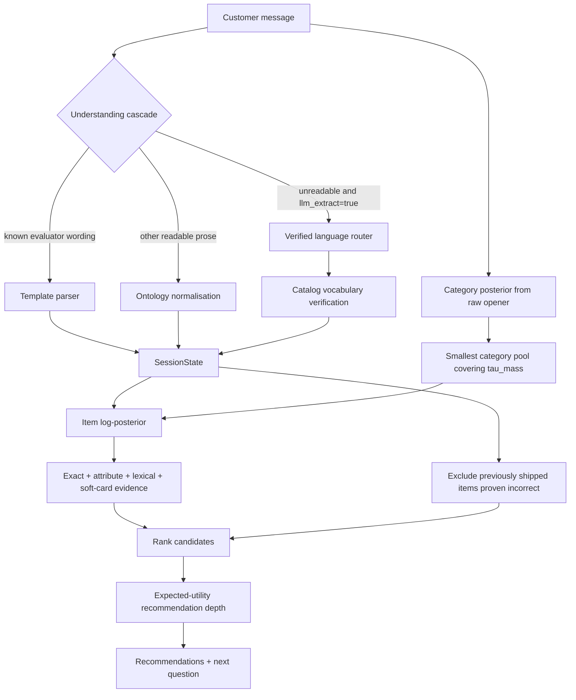

# Shopping Copilot — Current System Summary

This document describes the code and configuration currently present in this repository. It is an
operational reference for the submitted agent, evaluation workflow, and hyperparameter training
pipeline.

## 1. Current result

The default configuration is defined in `src/copilot/flags.py`. A level-0 evaluation of the current
working tree produced:

| dataset | sessions | Hit@10 | MRR | MTTC | TechnicalScore | LLM calls |
|---|---:|---:|---:|---:|---:|---:|
| `resplit_60_20_20/test` | 2,800 | 0.9911 | 0.9783 | 2.64 | **0.9562** | 0 |
| `freeform_v1/test` | 800 | 0.9725 | 0.9596 | 2.98 | **0.9345** | 0 |
| `public_set.jsonl` | 200 | 1.0000 | 0.9942 | 2.19 | **0.9744** | 0 |

Reproduction command:

```bash
.venv/bin/python scripts/evaluation/evaluate.py \
    --all \
    --levels 0 \
    --output runs/current.json
```

The output JSON contains the evaluator results, per-session records, active configuration,
repository commit, dirty-tree status, evaluator and catalog hashes, Python/platform information,
runtime, and LLM disclosure fields.

## 2. Agent contract

The submission entry point is `agent.py`, which exports `Agent` from `src/copilot/agent.py`.

```python
agent = Agent("data/catalog.jsonl")
agent.reset(session_id, user_profile)
response = agent.respond(session_id, user_message, turn, top_k)
```

`respond()` returns:

```json
{
  "message": "shopper-facing response",
  "ask_attribute": "other",
  "recommendations": [{"parent_asin": "..."}],
  "usage": {"prompt_tokens": 0, "completion_tokens": 0}
}
```

The agent keeps independent `SessionState` and recommendation history for each session. If a turn
raises unexpectedly, it returns a popularity-ordered fallback rather than losing the turn.

## 3. Live architecture



### 3.1 Understanding cascade

Messages are processed from cheapest and most exact to most flexible:

1. **Template parser** reads the evaluator's opener, reply, override, no-preference, and null-reply
   forms. A template match ends the cascade for that message.
2. **Ontology parser** strips conversational scaffolding, splits prose into chunks, and normalises
   recognised values into typed attributes such as material, colour, size, style, feature, brand,
   budget, and use case.
3. **Verified language router** is available when `llm_extract=True`. Proposed operations and values
   must resolve against catalog vocabulary before they become evidence.

The default configuration has `llm_extract=False`, so standard evaluation is deterministic and
reports zero model calls and zero model tokens.

### 3.2 Session state

`src/state/session.py` stores:

- message history and current turn;
- route: buying, browsing, or override;
- confirmed constraints and exclusions;
- unresolved ambiguity alternatives;
- active and demoted constraints;
- slot ages and exhausted attributes;
- template/router accounting;
- previously disclosed information.

Constraints decay with age. Soft evidence is discounted. An override demotes the relevant early
preference under the default `erase="demote"` policy.

### 3.3 Category pool

`src/retrieve/category.py` builds a posterior over coarse catalog categories from the raw opener:

- category text is tokenised, stemmed, and expanded through aliases;
- shared terms are weighted by category IDF;
- an exact category phrase receives a quote bonus;
- scores are temperature-scaled and combined with catalog share;
- categories are added until cumulative posterior mass reaches `tau_mass`;
- the candidate pool is capped at 8,000 products.

### 3.4 Item belief and ranking

`src/rank/belief.py` maintains one log score per candidate. Every live constraint contributes
bounded likelihood evidence through:

- exact intent-card string matching;
- normalised `(attribute, value)` matching;
- lexical overlap;
- token-Jaccard against each item's own intent-card strings;
- ambiguity mixtures when multiple verified interpretations remain live.

Evidence terms abstain when they find no support. Individual factors have a positive floor, so one
weak interpretation cannot permanently eliminate a candidate.

### 3.5 Recommendation policy

The ranked posterior is converted into a recommendation depth by expected utility:

\[
U(k)=\sum_{i=1}^{k}\frac{p_i}{i}
 +(1-\sum_{i=1}^{k}p_i)V
\]

`V` represents the value of continuing the conversation. Its effective value is reduced after turns
that reveal no new evidence. Template-understood and paraphrased sessions use separate stall-decay
rates.

The policy also:

- waits for the override message in override sessions;
- emits up to `top_k` on the final turn;
- excludes items previously shown on turns where continued conversation proves they were incorrect;
- asks `other`, which requests the simulator's next undisclosed requirements.

## 4. Current configuration

These are the defaults in `src/copilot/flags.py` and therefore the repository configuration:

| group | parameter | value |
|---|---|---:|
| evidence | `exact` | `True` |
| evidence | `attribute` | `True` |
| evidence | `lexical` | `True` |
| evidence | `exact_gain` | `3.2` |
| evidence | `soft_card_gain` | `1.5` |
| evidence | `soft_card_floor` | `0.34` |
| BM25 | `bm25_gain` | `0.0` |
| BM25 | `bm25_k1` | `1.5` |
| BM25 | `bm25_b` | `0.75` |
| category pool | `temperature` | `2.0` |
| category pool | `tau_mass` | `0.85` |
| state | `erase` | `"demote"` |
| policy | `exclude_shipped` | `True` |
| policy | `v_continue` | `0.75` |
| policy | `stall_decay` | `0.2` |
| policy | `stall_decay_clean` | `0.8` |
| policy | `deadline` | `3` |
| policy | `max_turns` | `10` |
| language | `llm_extract` | `False` |
| language | `verify` | `True` |
| language | `ambiguity` | `True` |

Local experiments can override values with `COPILOT_FLAGS`:

```bash
COPILOT_FLAGS=exact_gain=3.4,tau_mass=0.9 \
    .venv/bin/python scripts/evaluation/evaluate.py
```

The evaluator prints environment and CLI overrides in the run header. Persistent repository defaults
remain the literals in `src/copilot/flags.py`.

## 5. Data

| dataset | split | sessions | role |
|---|---|---:|---|
| `resplit_60_20_20` | train | 8,400 | default hyperparameter fitting |
| `resplit_60_20_20` | validation | 2,800 | validation |
| `resplit_60_20_20` | test | 2,800 | evaluation |
| `combine` | train | 9,600 | alternate fitting corpus |
| `combine` | validation | 3,200 | validation |
| `freeform_v1` | train | 1,200 | free-form development |
| `freeform_v1` | validation | 400 | free-form validation |
| `freeform_v1` | test | 800 | free-form evaluation |
| `public_set.jsonl` | public | 200 | official public evaluation |
| `catalog.jsonl` | catalog | 50,000 products | retrieval and ranking index |

The hyperparameter script refuses files named `dev.jsonl`, `public_set.jsonl`, `validation.jsonl`, or
`test.jsonl` as fitting inputs.

## 6. Evaluation

### 6.1 Environment setup

```bash
python3.11 -m venv .venv
.venv/bin/python -m pip install -r requirements.txt
```

The shipped agent uses NumPy and the standard library. Pytest and Optuna are development tools.

### 6.2 Standard commands

```bash
# Current public-set score
.venv/bin/python scripts/evaluation/evaluate.py

# All three current evaluation datasets
.venv/bin/python scripts/evaluation/evaluate.py --all

# Confidence interval and scenario breakdown
.venv/bin/python scripts/evaluation/evaluate.py \
    --dataset data/public_set.jsonl --ci --scenarios

# Deterministic stress ladder
.venv/bin/python scripts/evaluation/evaluate.py \
    --dataset data/public_set.jsonl --levels 0,1,2,3

# Save complete reproducibility output
.venv/bin/python scripts/evaluation/evaluate.py \
    --all --output runs/eval.json

# Temporary parameter override
.venv/bin/python scripts/evaluation/evaluate.py \
    --set exact_gain=3.4 --set tau_mass=0.9

# Enable the verified language tier for an experiment
.venv/bin/python scripts/evaluation/evaluate.py --llm_call True
```

### 6.3 Stress levels

| level | customer text |
|---:|---|
| 0 | evaluator text unchanged |
| 1 | conversational scaffold reworded |
| 2 | scaffold and constraint payload reworded |
| 3 | level 2 plus category wording changed |
| 4 | model-written paraphrase; requires a usable language client |

## 7. Hyperparameter training with TPE

The training entry point is `scripts/training/hyperparameter_tuning.py`. It fits these eight values
jointly:

```text
exact_gain          soft_card_gain       soft_card_floor
tau_mass            temperature          v_continue
stall_decay         stall_decay_clean
```

### 7.1 Why TPE

TechnicalScore depends on ranks and first-hit turns. Small parameter changes often leave every rank
unchanged, producing a flat objective, followed by a jump when two candidates exchange positions.
The objective is therefore not suitable for gradient descent.

TPE is derivative-free Bayesian optimisation. It:

1. evaluates broad startup samples from the configured ranges;
2. models parameter values observed in comparatively good and bad trials;
3. proposes joint configurations with a high ratio of good-density to bad-density;
4. prunes weak trials while progressing through stress levels;
5. reports parameter importance from the completed study.

Trial 0 is always the current configuration from `src/copilot/flags.py`, giving every new study an
explicit incumbent to beat.

### 7.2 Paired-bootstrap confirmation

The highest-scoring TPE trial is a proposal. Each changed parameter is then evaluated alone against
the incumbent over the same sessions and stress levels. The script computes a 95% confidence
interval on the paired TechnicalScore difference.

| verdict | meaning |
|---|---|
| `ADOPT` | lower CI bound is above zero |
| `no effect` | session outcomes are identical and the CI is exactly zero |
| `noise, held` | the CI includes zero or the change regresses |

Only `ADOPT` values appear in the confirmed fitted configuration.

### 7.3 Training options

| option | default | meaning |
|---|---|---|
| `--dataset` | `data/resplit_60_20_20/train.jsonl` | fitting dataset |
| `--catalog` | `data/catalog.jsonl` | catalog index |
| `--n` | `3000` | sessions used by every objective evaluation; `0` uses all 8,400 |
| `--levels` | `0,2,3` | equally weighted stress levels |
| `--trials` | `60` | number of TPE trials added in this run |
| `--seed` | `0` | reproducible sampler seed |
| `--resume PATH` | unset | persistent SQLite Optuna study |
| `--output PATH` | `runs/refit.json` | result JSON |
| `--sweep FLAG=a,b,c` | unset | evaluate one parameter curve instead of TPE |
| `--legacy-tokens` | false | use the legacy tokenizer during a sweep |

### 7.4 What `--n` controls

`--n` determines both runtime and statistical precision. Every trial runs the evaluator on `n`
sessions for each selected level. A small value is appropriate for checking the workflow; a larger
value narrows the paired-bootstrap interval used for adoption.

Measured evaluation time on this machine:

| sessions | L0 | L2 | L3 |
|---:|---:|---:|---:|
| 500 | 9.7 s | 5.5 s | 28.0 s |
| 2,000 | 13.9 s | 19.8 s | 93.1 s |

### 7.5 How to run training

Install the development dependencies first:

```bash
.venv/bin/python -m pip install -r requirements.txt
```

Smoke run:

```bash
.venv/bin/python scripts/training/hyperparameter_tuning.py \
    --n 200 --levels 0 --trials 12 \
    --output runs/tuning_smoke.json
```

Intermediate run:

```bash
.venv/bin/python scripts/training/hyperparameter_tuning.py \
    --n 2000 --levels 0,2 --trials 40 \
    --resume runs/tuning_n2000_l02.db \
    --output runs/tuning_n2000_l02.json
```

Full run:

```bash
.venv/bin/python scripts/training/hyperparameter_tuning.py \
    --n 3000 --levels 0,2,3 --trials 60 \
    --resume runs/tuning_n3000_l023.db \
    --output runs/tuning_n3000_l023.json
```

Continue the same full study with 30 additional trials:

```bash
.venv/bin/python scripts/training/hyperparameter_tuning.py \
    --n 3000 --levels 0,2,3 --trials 30 \
    --resume runs/tuning_n3000_l023.db \
    --output runs/tuning_n3000_l023_more.json
```

The same `--resume` database must always use the same dataset, sample size, levels, seed, and search
space. Different objectives use different study files.

### 7.6 Reading training output

```text
incumbent objective 0.9295

── searching 8 constants jointly
   trial   0 * obj 0.9295   best 0.9295
   trial   1   obj 0.9237   best 0.9295
   trial   2 * obj 0.9366   best 0.9366

── confirming against the incumbent, paired bootstrap per constant
   exact_gain       3.2 → 3.517   +0.0000  CI (+0.0000, +0.0000)  no effect
   soft_card_gain   1.5 → 1.748   -0.0074  CI (-0.0130, -0.0025)  noise, held
   tau_mass        0.85 → 0.900   +0.0021  CI (+0.0004, +0.0040)  ADOPT
```

- `incumbent objective` is the current `flags.py` configuration.
- `*` marks a new best completed trial.
- A trial best remains a proposal until confirmation.
- Importance bars summarize which parameters explain variation across completed trials.

### 7.7 Testing and applying the result

At completion, the script prints a complete held-out evaluation command:

```bash
COPILOT_FLAGS=exact_gain=3.2,soft_card_gain=1.5,tau_mass=0.9,... \
    .venv/bin/python scripts/evaluation/evaluate.py \
    --model agent.py \
    --dataset data/public_set.jsonl \
    --output runs/eval.json
```

It also prints the raw TPE proposal before the confirmation gate as a separate command. Run the
confirmed command on held-out data. When adopting confirmed values as repository defaults, update
the corresponding literals in `src/copilot/flags.py` and rerun the standard evaluation command.

The training JSON records:

- dataset, sample size, levels, trial count, and seed;
- incumbent, proposed, and confirmed parameter values;
- confirmed parameter names;
- parameter importance;
- objective before, proposed, and after confirmation;
- per-level before/after scores.

## 8. Repository layout

```text
agent.py                              submission entry point
src/copilot/agent.py                  session loop and recommendation policy
src/copilot/flags.py                  current configuration defaults
src/understand/                       parsing, ontology, and verified language routing
src/retrieve/                         catalog index, category posterior, optional BM25
src/rank/                             likelihood terms, item belief, recommendation depth
src/state/session.py                  conversational state and constraints
src/eval/                             evaluation, stress, datasets, and measurement helpers
scripts/evaluation/evaluate.py        reproducible evaluator CLI
scripts/training/hyperparameter_tuning.py
                                      TPE training and one-parameter sweeps
data/                                 catalog and dataset splits
runs/                                 generated evaluation and training records
techjam-conversational-search-main/   official evaluator package
```

## 9. Reproducibility checklist

Before recording a result:

1. Use the intended commit and inspect `git status`.
2. Install `requirements.txt` in the active Python environment.
3. Confirm the dataset and catalog paths.
4. Confirm the run header reports the intended configuration.
5. Use `--output` so provenance and per-session records are retained.
6. Keep training and held-out evaluation datasets separate.
7. Reuse an Optuna study only with an identical objective definition.
8. Apply confirmed defaults in `src/copilot/flags.py` and rerun evaluation from a clean process.
