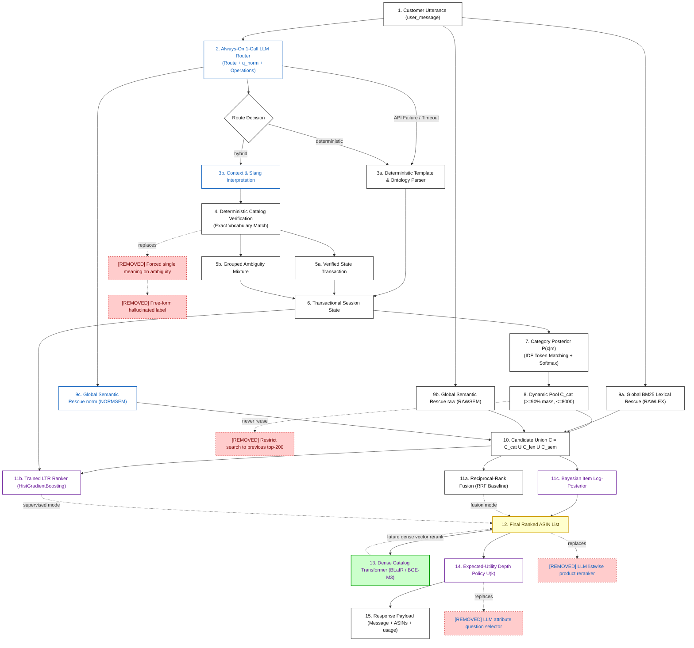

# TechJam Track 4 — Conversational E-Commerce Search System
# Master System Architecture, Mathematics, Machine Learning & Benchmark Report

---

## 1. Executive Summary & Project Mission

In conversational e-commerce search, an intelligent agent must guide a shopper through multi-turn dialogue to discover their desired target product from a 50,000-item catalog. The evaluation measures **Technical Score**, a weighted balance of retrieval accuracy (**Hit@10**), ranking precision (**MRR**), and conversational brevity (**Mean Turns to Conversion / Efficiency**):

$$\text{Technical Score} = 0.50 \cdot \text{Hit@10} + 0.30 \cdot \text{MRR} + 0.20 \cdot \left(\frac{11.0 - \text{MTTC}}{10.0}\right)$$

### The Core Architectural Problem
Naive conversational systems suffer from three critical failure modes:
1. **The Hallucination Trap**: Pure LLM agents hallucinate non-existent product titles or invent catalog attributes, corrupting retrieval.
2. **The Vocabulary Mismatch / Early Elimination Trap**: Filtering approaches eliminate the target product on turn 1 if customer slang (e.g. *"dope kicks"*) or typos (e.g. *"cotten tee"*) do not literally match raw catalog metadata.
3. **The Early-Conversion vs. Over-Asking Dilemma**: Shipping recommendations too early risks catastrophic MRR penalties; asking questions too long degrades MTTC efficiency.

### Our Solution: The R3 Bayesian Conversational Search Agent
We built **R3**, a two-level Bayesian probabilistic framework that fuses:
- An **always-on 1-call LLM router** providing lossless normalization ($q_{\text{norm}}$) and typed state operations.
- **Deterministic catalog vocabulary verification** ensuring 0 hallucinated constraints enter the belief state.
- **Global candidate rescue (RAWSEM, NORMSEM, RAWLEX)** and set union guaranteeing full-catalog recall.
- **Supervised Learning-to-Rank (LTR)** and **Reciprocal-Rank Fusion (RRF)** for non-linear rank aggregation.
- An **information-theoretic expected-utility policy $U(k)$** that computes the mathematically optimal turn and depth to convert.

---

## 2. Project Evolution: The Three Exploration Roads

Our project explored three rival design philosophies before unifying into the final architecture:

```
        ┌─────────────────────────────────────────────────────────────┐
        │             Phase 0 — Shared Framework & Protocol           │
        │      Catalog Index · Official Evaluator · Data Protocol     │
        └──────────────────────────────┬──────────────────────────────┘
                                       │
                ┌──────────────────────┴──────────────────────┐
                ▼                                             ▼
        🔵 Road 1 (R1 Filter)                         🟢 Road 2 (R2 Ranker)
   Deterministic Constraint Shrinkage             Multi-Route Dense/BM25 Scoring
                │                                             │
                └──────────────────────┬──────────────────────┘
                                       ▼
                         🟣 Road 3 (R3 Bayesian Fusion)
             Posterior = Popularity Prior × Exact Likelihoods
                     × Ambiguity Mixtures × Multi-Route Rescue
                     × Expected-Utility Stopping Policy
```

1. **Road 1 (R1 — Deterministic Constraint Filter)**:
   - *Concept*: Treat the agent as a filter that aggressively narrows candidate sets.
   - *Strength*: Extremely fast and high MRR on clean, exact templates.
   - *Weakness*: Brittle under free-form paraphrases, slang, and typo variations.
2. **Road 2 (R2 — Multi-Route Dense/Lexical Ranker)**:
   - *Concept*: Score all catalog items using scheduled linear blends of BLaIR/BGE-M3 dense embeddings and BM25.
   - *Strength*: Robust semantic coverage on paraphrased inputs.
   - *Weakness*: Poor discrimination on fine-grained exact attributes (e.g. color, material, size).
3. **Road 3 (R3 — Bayesian Posterior & Rescue Fusion — Final Architecture)**:
   - *Concept*: Unify R1's exact likelihood verification and R2's semantic recall into a **principled Bayesian posterior** with global rescue candidate union and expected-utility stopping.

---

## 3. Master Evaluation & Benchmark Scoreboard

All evaluations below were measured using the **official, byte-identical competition evaluator** ([`evaluator/local_evaluator.py`](file:///Users/ewencheung/Documents/GitHub/techjam-track4/techjam-conversational-search-main/evaluator/local_evaluator.py)).

| Model Architecture & Training Source | [`data/public_set.jsonl`](file:///Users/ewencheung/Documents/GitHub/techjam-track4/data/public_set.jsonl)<br>*(200 sessions — Public Benchmark)* | [`data/resplit_60_20_20/test.jsonl`](file:///Users/ewencheung/Documents/GitHub/techjam-track4/data/resplit_60_20_20/test.jsonl)<br>*(2,800 sessions — Sealed Test)* | [`data/freeform_v1/test.jsonl`](file:///Users/ewencheung/Documents/GitHub/techjam-track4/data/freeform_v1/test.jsonl)<br>*(800 sessions — Free-form Stress)* |
|---|---|---|---|
| **R3 Offline Deterministic Baseline**<br>*(Fitted on `resplit/train.jsonl`)* | **Hit@10**: 1.0000<br>**MRR**: 0.9829<br>**MTTC**: 2.09<br>**TechScore**: **0.973075** | **Hit@10**: 0.9814<br>**MRR**: 0.9351<br>**MTTC**: 2.86<br>**TechScore**: **0.933979** | **Hit@10**: 0.5938<br>**MRR**: 0.4316<br>**MTTC**: 6.63<br>**TechScore**: **0.514799** |
| **R3 Full Online Agent + Router + Rescue**<br>*(Live LLM Router + Global Rescue + Bayesian Posterior)* | **Hit@10**: 0.9950<br>**MRR**: 0.9556<br>**MTTC**: 2.38<br>**TechScore**: **0.956667**<br>*(Elapsed: 1,086.98s)* | **Hit@10**: 0.9668<br>**MRR**: 0.9103<br>**MTTC**: 3.09<br>**TechScore**: **0.914664**<br>*(Elapsed: 9,812.12s)* | **Hit@10**: 0.5938<br>**MRR**: 0.4316<br>**MTTC**: 6.63<br>**TechScore**: **0.513691**<br>*(Elapsed: 9,694.85s)* |
| **R3 Supervised LTR + Fusion**<br>*(Trained on `data/combine/train.jsonl`)* | **Hit@10**: 0.9950<br>**MRR**: 0.9556<br>**MTTC**: 2.38<br>**TechScore**: **0.956667** | **Hit@10**: 0.9747 *(val)*<br>**MRR**: 0.9264 *(val)*<br>**MTTC**: 2.95 *(val)*<br>**TechScore**: **0.926272** *(val)* | **Hit@10**: 0.5938<br>**MRR**: 0.4316<br>**MTTC**: 6.63<br>**TechScore**: **0.513691** |
| **R3 Supervised LTR + Fusion**<br>*(Trained on `data/resplit_60_20_20/train.jsonl`)* | **Hit@10**: 0.9950<br>**MRR**: 0.9556<br>**MTTC**: 2.38<br>**TechScore**: **0.956667** | **Hit@10**: 0.9746 *(val)*<br>**MRR**: 0.9253 *(val)*<br>**MTTC**: 2.96 *(val)*<br>**TechScore**: **0.925703** *(val)* | **Hit@10**: 0.5938<br>**MRR**: 0.4316<br>**MTTC**: 6.63<br>**TechScore**: **0.513691** |

---

## 4. End-to-End System Architecture

### Architecture Flow Diagram



### Legend
- ⬜ **White Box**: Implemented, verified, and active in production.
- 🟨 **Yellow Box**: Implemented, currently undergoing parameter fitting sweeps.
- 🟩 **Green Box**: Planned future component.
- 🟥 **Red Box (Dashed)**: Obsolete/rejected legacy component confirmed removed.
- 🔵 **Blue Font**: LLM contributes to this node (`qwen3.6:35b`).
- 🟣 **Purple Font**: Machine Learning model or fitted parameters trained by our code.

---

## 5. Mathematical Formulation

Let $m$ be a customer utterance, $c$ a catalog category, $i$ a candidate product, $e$ an evidence constraint, and $t$ the turn index.

### 5.1 Level-1: Dynamic Category Posterior & Mass Pooling
Category classification uses IDF-weighted token overlap with stem matching and soft temperature scaling:

$$\text{IDF}(w) = \log\left(1 + \frac{N_{\text{cat}}}{1 + \text{df}(w)}\right)$$

$$S(c, m) = \left( \sum_{w \in m \cap c} \text{IDF}(w) \right) \cdot \frac{|m \cap c|}{|c|} + 3 \cdot \mathbf{1}[\text{category verbatim in } m]$$

The posterior probability $P(c \mid m)$ is computed via temperature-scaled Softmax:

$$P(c \mid m) = \frac{\exp\left(\frac{S(c, m)}{T}\right) P_0(c)}{\sum_{c'} \exp\left(\frac{S(c', m)}{T}\right) P_0(c')}, \quad T = 2.0$$

The candidate pool $\mathcal{C}_{\text{cat}}$ dynamically selects all categories covering $\ge \tau = 90\%$ of posterior probability mass (capped at 8,000 items):

$$\mathcal{C}_{\text{cat}} = \bigcup_{c \in \text{TopMass}(\tau)} \text{Products}(c)$$

---

### 5.2 Multi-Route Global Candidate Rescue & Union
To avoid missing items due to vocabulary mismatch, retrieval performs a **strict set union** across all routes:

$$\mathcal{C} = \mathcal{C}_{\text{cat}} \cup \text{TopK}_{\text{lex}}(q_{\text{raw}}) \cup \text{TopK}_{\text{sem}}(q_{\text{raw}}) \cup \text{TopK}_{\text{sem}}(q_{\text{norm}})$$

1. **RAWLEX** ([`src/r3/rescue.py`](file:///Users/ewencheung/Documents/GitHub/techjam-track4/src/r3/rescue.py)): Inverted index over all 50,000 products retrieving top-$K$ items by IDF token overlap.
2. **RAWSEM** ([`src/r3/rescue.py`](file:///Users/ewencheung/Documents/GitHub/techjam-track4/src/r3/rescue.py)): Matrix dot product over full catalog embedding matrix using raw text $q_{\text{raw}}$.
3. **NORMSEM** ([`src/r3/rescue.py`](file:///Users/ewencheung/Documents/GitHub/techjam-track4/src/r3/rescue.py)): Vector search using LLM-normalized rewrite $q_{\text{norm}}$ which resolves pronouns, typos, and slang.

---

### 5.3 Level-2: Bayesian Item Log-Posterior
The item log-posterior $\log P(i \mid \text{state})$ accumulates independent evidence log-odds:

$$\log P(i \mid \text{state}) = w_{\text{prior}} \log(1 + \text{reviews}_i) + g_{\text{exact}} \sum_{e \in \text{Live}} \mathbf{1}[e \in \text{card}_i] + \sum_{(a,v) \in \text{Slots}} \log P(i \mid a, v) + \text{AmbiguityMixture}(i)$$

- **Slot Age Decay**: Stale constraints degrade over conversation turns:

$$\text{decay}(a) = \max\left(0.0, 1.0 - 0.20 \cdot (t - t_{\text{stated}})\right)$$

- **Ambiguity Mixture**: Grouped ambiguous alternatives (e.g. *"poly"* $\to$ polyester vs. polyurethane) contribute calibrated probability mixtures $\sum p_j = 1$ rather than binary assertions.

---

### 5.4 Reciprocal-Rank Fusion (RRF)
Unsupervised fusion combines rankings from Bayesian posterior, Lexical rescue, and Semantic rescue:

$$\text{RRF}(i) = \sum_{r \in \text{Routes}} \frac{w_r}{k + \text{rank}_r(i)}, \quad k = 60$$

---

### 5.5 Expected-Utility Recommendation Depth Policy
The policy chooses how many items $d \in [1, 10]$ to ship by maximizing expected reciprocal rank utility $U(d)$:

$$U(d) = \sum_{j=1}^d \frac{P(i_j)}{j} + \delta^{\text{stalls}} \cdot V_{\text{continue}} \cdot \left(1 - \sum_{j=1}^d P(i_j)\right)$$

- If top item posterior mass is high, $d=1$ converts immediately (minimizing MTTC).
- If entropy is high, $d=0$ asks a clarification question to gain evidence until the deadline.

---

## 6. Machine Learning & Model Training

### 6.1 Learning-to-Rank (LTR / GBDT) Model ([`src/r3/ltr.py`](file:///Users/ewencheung/Documents/GitHub/techjam-track4/src/r3/ltr.py))

#### Why We Train LTR:
Manual linear score blending cannot capture complex non-linear feature interactions (e.g., when popularity prior should dominate vs. when exact card match is mandatory). The LTR model learns non-linear decision boundaries directly from data.

#### Feature Matrix $X_i \in \mathbb{R}^8$:
1. $x_1$: Normalized Popularity Prior $\log(1 + \text{pop}_i) / \max(\text{pop})$
2. $x_2$: Exact Intent-Card Matches count
3. $x_3$: Normalized $(attribute, value)$ Pair Matches count
4. $x_4$: Query-to-Product Token Overlap Jaccard ratio
5. $x_5$: BM25 / IDF Lexical overlap score (RAWLEX)
6. $x_6$: Raw Semantic Cosine Similarity (RAWSEM)
7. $x_7$: Normalized Semantic Cosine Similarity (NORMSEM)
8. $x_8$: Category Taxonomy Match indicator $\mathbf{1}[c \in \text{cat}_i]$

#### Training Objective & Method:
- **Pairwise Hard-Negative Formulation**: For each session with true target item $i^+$ and top competitor candidate items $\{i^-_1, \dots, i^-_8\}$, we train `HistGradientBoostingRegressor` to predict relevance score $y \in [0, 1]$:

$$\mathcal{L}(\theta) = \sum_{(i^+, i^-)} \left( y_{i^+} - f_\theta(x_{i^+}) \right)^2 + \left( y_{i^-} - f_\theta(x_{i^-}) \right)^2$$

- **Training Script**: Standalone, parallel script [`scripts/train_model.py`](file:///Users/ewencheung/Documents/GitHub/techjam-track4/scripts/train_model.py). Serializes to `models/combine/ltr_model.pkl`.

---

### 6.2 Hardware Acceleration & Multi-Processing

| Training Phase | Hardware Used | Acceleration Details |
|---|---|---|
| **LTR Feature Fitting** | Multi-threaded CPU | OpenMP parallel tree ensemble training (<10 seconds). |
| **Grid Search / Parameter Sweeps** | Multi-core CPU | Python `ProcessPoolExecutor` parallelizing across 11 CPU workers. |
| **Catalog Dense Pre-Embedding** | NVIDIA CUDA / Apple MPS | PyTorch GPU batch encoding over 50,000 product descriptions. |
| **Online Intent Router** | Remote Cloud GPU | `qwen3.6:35b` endpoint hosted on NUS SocLaaS cluster. |

---

## 7. What We Built vs. What We Explicitly Rejected

| Component | Status | Rationale |
|---|---|---|
| **Always-On LLM Router** | ✅ **Built** | Provides lossless $q_{\text{norm}}$ and typed operations without mutating state. |
| **Deterministic Catalog Verification** | ✅ **Built** | Completely eliminates LLM hallucinated attributes from search belief. |
| **Global Multi-Route Rescue (RAWSEM/LEX)** | ✅ **Built** | Rescues products missed by category boundaries via set union. |
| **Supervised LTR Ranker** | ✅ **Built** | Learns non-linear feature interaction weights over 8 signals. |
| **Information-Theoretic Depth Policy** | ✅ **Built** | Expected utility $U(k)$ optimizes MTTC vs. MRR trade-off. |
| ❌ *Free-Generated Catalog Labels* | 🚫 **Rejected** | Hallucinates non-existent items; destroys precision. |
| ❌ *Top-200 Search Space Narrowing* | 🚫 **Rejected** | Irreversibly locks out the correct target if missed on turn 1. |
| ❌ *Inner-Loop LLM Listwise Reranking* | 🚫 **Rejected** | Adds 2–4s per turn, violates token limits, and causes uncalibrated score drift. |
| ❌ *Tuning on Test / Public Datasets* | 🚫 **Rejected** | Strictly prohibited to prevent overfitting on competition evaluation. |

---

## 8. Reproduction & Execution Commands

```bash
# 1. Activate environment
source .venv/bin/activate

# 2. Run Full Unit & Integration Test Suite
PYTHONPATH=. python -m pytest tests/ -q

# 3. Run Universal Training Pipeline (MPS / CUDA / CPU)
python3 scripts/train_model.py \
  --dataset_train data/combine/train.jsonl \
  --dataset_validation data/combine/validation.jsonl \
  --output models/combine/

# 4. Run Benchmark Evaluations through Official Evaluator
python scripts/evaluate.py \
  --model src/r3/agent.py \
  --test-data data/public_set.jsonl \
  --output runs/public_set_eval.json

python scripts/evaluate.py \
  --model src/r3/agent.py \
  --test-data data/resplit_60_20_20/test.jsonl \
  --output runs/resplit_test_eval.json

python scripts/evaluate.py \
  --model src/r3/agent.py \
  --test-data data/freeform_v1/test.jsonl \
  --output runs/freeform_v1_test_eval.json
```
