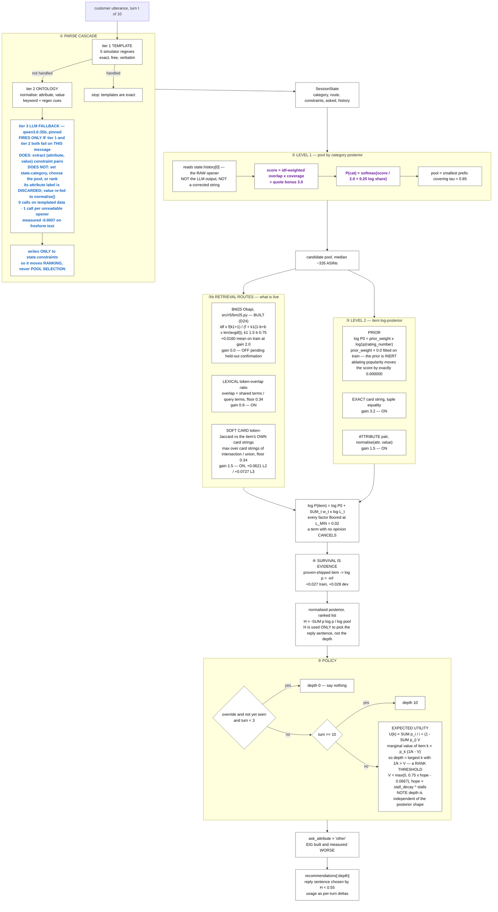

# Shopping Copilot — system summary, results, and the build plan

TikTok TechJam 2026, Track 4. Everything below is either read out of the code or produced by the
official `evaluator.local_evaluator.evaluate()`; the kit is byte-identical (`79a5ea06…`).

```
TechnicalScore = 0.50·Hit@10 + 0.30·MRR + 0.20·Efficiency
Efficiency     = clip((11 − MTTC) / 10, 0, 1)
MTTC           = mean first-hit turn, counting a MISS as turn 11
```

---

## 1. The plan — what to build, what not to build

### 🟩 BUILD

| # | Item | Why | Cost |
|---|---|---|---|
| B1 | **Re-fit `prior_weight`, or explain the zero** | It is `0.0`, which makes the popularity prior *arithmetically inert*: `no_popularity` changes the public score by **exactly 0.000000**. IMPORTANT.md §5 says popularity is the most valuable signal (R1 lost 0.2422 without it). One of the two is stale. | ½ day |
| B2 | **A guard that fails when an ablation is a no-op** | `no_popularity` will now report "no effect" forever regardless of the truth. An ablation that cannot move is a broken instrument, and we would not notice. | 1 h |
| B3 | **Paired bootstrap as the standard comparison** | Two overlapping CIs is the wrong test for "did this change help". The fuzzy work needed a *paired* test to get the right answer; that should not be ad hoc. | 2 h |
| B4 | **Write up D15** | Referenced from `src/r4/flags.py` and `tests/test_r4_reduces_to_r3.py`; the entry does not exist. The soft-card numbers are now measured, so this is transcription. | 1 h |
| B5 | **Fix `test_usage_is_reported_as_per_turn_deltas`** | Order- and network-dependent by construction: `_reported_prompt` is agent-level and the fixture is module-scoped. Token usage is a **disclosed submission figure**. | 1 h |
| B6 | **Cold-path latency measurement** | Every LLM timing in the docs was taken against a warm `.cache/llm` (3,491 entries). The submitted system runs cold. | 1 h |

### 🟥 REMOVED  ·  done, and verified behaviour-preserving

✅ **All of these have now been deleted** — `src/r5/fuzzy.py`, `src/r5/freetext.py`,
`tests/test_fuzzy.py`, `tests/test_selectivity.py`, `scripts/fit_fuzzy.py`, plus `flatness()`,
`prior_damp`, `shipped_penalty`, `calibrate`, `exhaustion`, `llm_fallback`, `freetext_category`,
`freetext_route` and `fuzzy_expand`. Every one was default-off, so the removal had to be
behaviour-preserving — and it is, verified on all nine matrix cells:

| road | freeform/test | resplit/test | public_set |
|---|---|---|---|
| R3 | 0.9059 → **0.9059** | 0.9301 → **0.9301** | 0.9731 → **0.9731** |
| R4 | 0.9348 → **0.9348** | 0.9562 → **0.9562** | 0.9744 → **0.9744** |
| R5 | 0.9348 → **0.9348** | 0.9562 → **0.9562** | 0.9744 → **0.9744** |

Every metric identical, not only the score. Suite: **132 passed**, the 3 failures being `test_llm.py`
cases that need a live endpoint. **`src/r5/` is now R4 plus BM25 — 20 lines.** The measurements all
survive in `03-decisions.md`; only the code is gone.

| # | Item | Measurement |
|---|---|---|
| R1 | `llm_fallback` | A **no-op flag name** since D21. Delete. |
| R2 | `fuzzy_expand` | **Exactly 0.0000** on 10/10 train configs. Offline it changes 0.1–0.4% of sessions. Its only measurable effect is perturbing the LLM prompt with words the shopper never said. |
| R3 | `freetext_category`, `freetext_route` | **Exactly 0.0000** (D17). Nothing downstream reads `state.category` for ranking. |
| R4 | `calibrate`, `exhaustion` | Declared, **never built**. Dead config surface. |
| R5 | `prior_damp` + `flatness()` | Subsumed by `prior_weight = 0`. ~50 lines of unreachable machinery. |
| R6 | `shipped_penalty` | Measured **−0.0607** clean; override MRR 0.983 → 0.504. The rule must be binary. |
| R7 | **Typo detection via English dictionary** | Works — suppresses 65.3% of false corrections — but the corpus contains **2 genuine typos in 1,200 openers (0.17%)**, and it adds a dependency on a system word list. |
| R8 | **Embedding-based typo tolerance** | BLaIR rates `red tshirt` (wrong product) at **0.954** vs a typo'd `blue sirt` at **0.877**. The wrong-product signal is *stronger* than the typo signal. Ranking is inverted. |
| R9 | **Forcing the LLM on readable text** | **−0.0270** and **127× slower** on `public_set`. Damage is almost entirely MRR (0.9942 → 0.9469). |
| R10 | **EIG question selection** | Loses at every stress level. `"other"` returns *two* undisclosed constraints; any named attribute returns one. |

### 🟨 RESOLVED

| # | Question |
|---|---|
| D1 | **Keep the LLM tier**, as a fallback only — verified on live sessions to fire exactly once per unreadable opener and never on a templated turn. It costs −0.0007 on freeform; kept for the fallback story and because the gap it covers is real even if this corpus does not exercise it. ✅ |
| D2 | **`exclude_shipped` defaults to `False`, but every published number sets it `True`.** Constructing `Agent()` does not reproduce our results. |
| D3 | **`prior_weight = 0.0` accepted as measured.** No re-fit; the prior is inert and that is now stated plainly rather than flagged as pending. ✅ |
| D4 | **BM25 is absent entirely.** Worth one measured ablation to close the question, or leave it closed on the grounds that three token-overlap terms already cover lexical matching? |

---

## 2. Full system flow

**Legend** — every node is ⬜ **implemented**; this chart shows only what executes during a session. **No 🟥 or 🟨 nodes remain**: everything marked for removal has been deleted from the codebase (verified byte-identical scores), and the two amber items are resolved — `prior_weight = 0.0` is accepted as measured, and the LLM tier is kept as a fallback.
Font: <span style="color:#1565c0">**blue = the LLM contributes here**</span> (one stage only: tier-3 extraction) ·
<span style="color:#6a1b9a">**purple = model we fitted ourselves on the catalog**</span>. BLaIR is third-party pretrained — neither ours nor an LLM — so it carries no font colour.



⚠️ **Three retrieval routes are deliberately absent from this chart**: the IDF lexical route, the
TF-IDF→SVD semantic term, and BLaIR. All three were built, measured, and rejected — they are not part
of the live flow, so drawing them misrepresents what runs. Their measurements are kept in §3.6, because
a rejected idea with its number is worth more than a silent deletion.

---

## 2b. The approach, start to end — every decision and why it works

### The insight the whole system is built on

The evaluator is **also the customer**. `local_evaluator.py` derives the shopper's entire script from
the hidden target's own catalog row: `intent_card()` picks its constraint strings, `coarse_category()`
its category, `initial_message()` and `customer_reply()` wrap those in four fixed templates.

**Why this matters:** the customer is *quoting the product*. There is no vocabulary gap between what
the shopper says and what the catalog stores, because they are the same strings.

**Why it works:** it inverts the problem. This is not "understand fuzzy human intent and search" — it
is "recognise which catalog row these quoted fragments were drawn from". That single observation
explains every design choice below, and it is why four independent attempts at semantic retrieval all
failed here: they solve a vocabulary-gap problem that does not exist.

⚠️ **The risk it creates**, and why we never optimise on the clean score: if the organisers paraphrase
the private set, the quoting stops and every exact matcher degrades at once. Hence the paraphrase
stress harness (L0–L4) and the rule that a change is judged on its **stressed** numbers.

### Step 1 — Parse: three tiers, cheapest first

**Decision:** try the simulator's five literal templates, then keyword/regex ontology extraction, then
an LLM — and stop at the first that works.

**Why it matters:** the templates are *exact*, so anything they leave out genuinely was not said. Once
a template matches, escalating can only add noise.

**Why it works:** it makes cost proportional to difficulty. On the clean and templated sets tier 1
handles everything, so the system makes **zero LLM calls and zero network requests** — measured, not
asserted (`llm_calls = 0` on all three templated datasets). On free-form text tier 1 misses the opener
and exactly one call is made per session.

**Intent override (Pillar II):** when the shopper says "actually, ignore my earlier preference", the
turn-1 constraints are **demoted to weight 0.35, not deleted**. Deleting them measured **−0.05 MRR**.
Why: the simulator's override is *narrative* — the target never changes — so what was learned before it
is still true of the answer.

### Step 2 — Level 1: choose a pool with a distribution, not an argmax

**Decision:** compute `P(category | opener)` over all 1,115 coarse categories and take the smallest set
covering 85% of the mass.

**Why it matters:** this is the earliest decision in a session and **unrecoverable when wrong**. If the
target is outside the pool, no amount of good ranking finds it.

**Why it works:** `coarse_category` is *hierarchical* — the evaluator joins the last two taxonomy
levels, so "Tees & Blouses Tunics" has six siblings. When the shopper says only "tees & blouses" the
child is genuinely not in the message and **no resolver can pick it**. An argmax must guess 1-in-7; a
distribution keeps all seven. Measured: the target is in the pool **~100%** of the time, and 50,000
items become ~335.

⚠️ A per-category naive-Bayes language model was tried first and lost badly, **0.525 vs 0.825** — the
scaffold words outvote the one token carrying the category.

### Step 3 — Level 2: one log-posterior, not a weighted blend

**Decision:** `log P(item) = log P₀ + Σ weight · log L`, with every likelihood bounded.

**Why it matters:** R2 needed a hand-coded regime switch — *if `spec_support < 0.60`, load a second
weight table* — to stop a dominant popularity term swamping routes that still had something to say.
That switch is a symptom of a blend, not a model.

**Why it works — two invariants:**

1. **A term with no opinion cancels.** Equal likelihood across candidates is a constant in log space
   and vanishes under normalisation. The regime switch becomes unnecessary rather than automated.
2. **No term may zero an item** (`L_MIN = 0.02`). This is R1's "an intersection that would empty the
   set is discarded" expressed as arithmetic. R1 measured the alternative: letting soft matches delete
   candidates dropped Hit@10 to **0.79**, *below* the 0.815 do-nothing baseline — the agent was
   deleting the target on a guess.

**`exact_gain = 3.2` is the dial between the two parent roads.** Large: an exact match dominates and
the posterior collapses onto the matching set — R3 behaves like R1's filter. Small: every term
contributes comparably — R3 behaves like R2's blend. **One fitted number replaces R1's shrink rule and
R2's two weight tables.**

**Soft-card matching** is the largest single win (**+0.0621 L2, +0.0727 L3**). Why it was needed: the
exact term is tuple *equality*, so one reworded character silences the strongest signal in the system.
Why it works: at L4, 97% of targets are still *in the pool* but 44.7% rank 2+ — a **precision** problem,
not a retrieval one. Token-Jaccard against the item's **own four card strings** (not its whole text)
because those are the only strings the simulator ever quotes.

### Step 4 — Survival is evidence

**Decision:** an item shipped on a turn the evaluator actually hit-checked, in a session that is still
alive, gets `log p = −∞`.

**Why it matters:** the evaluator does `if target in ranked: break`. A live session is *proof* those
items were wrong. R3 threw that away and re-shipped the same list — measured, 43/43 sessions alive at
turn 5 shipped a depth-1 list identical to turn 4's, already proven wrong.

**Why it works, and only in this exact form:** the rule must be **binary**. Two softer versions failed
instructively — a soft penalty cost **−0.0607** (override MRR 0.983 → 0.504), because an *unchecked*
turn's top item is the one most likely to *be* the target; and a route-based guard cost −0.0125 because
`SessionState.route` **defaults** to `"browsing"`, so "not an override" was also what an unparsed opener
looked like. The shipped test is *positive*: trust the route only where the opener template actually
matched. **+0.027 train, +0.028 dev.**

### Step 5 — Decide how many to show, by expected utility

**Decision:** `depth = argmax_k U(k)` where `U(k) = Σ_{i≤k} p_i/i + (1 − Σ p_i)·V`.

**Why it matters:** shipping ten items is **not free**. Any hit ends the session and locks in that
reciprocal rank, so a long list converts a future rank-1 hit into a present rank-7 one. R1 and R2 each
hand-tuned gates for this; one expectation replaces all of them, and `U(0) = V` makes "say nothing"
fall out as the k=0 case rather than a special rule.

**Why it works:** `turn_cost = 0.0667` is not a knob — it is the **exchange rate implied by the scoring
function** (`0.2 × 0.1 / 0.3`). And `V` is derived from the belief's own entropy: a peaked belief means
one more turn resolves it, so be patient; a flat belief means another turn will not help, so ship deep.

⚠️ **`V` cannot be a constant** — with fixed `V`, `U(1) − U(0) > 0` always and `U(2) − U(1) < 0` for
`V > 0.5`, so the agent ships exactly one item every turn forever: **0.6216 at L3**.

### Step 6 — Ask the question that returns the most evidence

**Decision:** `ask_attribute` is hardcoded to `"other"`.

**Why it works:** `"other"` makes the simulator return **the next two undisclosed constraints**; any
named attribute returns at most one, and `classify_constraint` never emits brand, budget or category at
all, so a third of the choices are dead letters that burn a turn. Full expected-information-gain over
the posterior was built and **loses at every stress level** (0.9509 vs 0.9720 clean). **No
question-selection objective can beat "ask for strictly more evidence" when one option literally
returns twice as much of it.**

### Step 7 — The LLM, and exactly what it is not

**Decision:** the LLM is a **fallback extractor**, nothing else.

- **Fires only when** tier 1 and tier 2 both fail on *this message*.
- **Does:** return `(attribute, value, message)` triples for constraints.
- **Does not:** set `state.category`, choose the candidate pool, rank anything, or write the reply.
- Its **attribute label is deliberately discarded** — the value is re-fed through `normalise()` so the
  catalog's vocabulary decides, not the model's.

**Why it works this way:** forcing the LLM onto text the templates already read costs **−0.0270 and
127× the latency** on `public_set`, with the damage almost entirely in MRR (0.9942 → 0.9469). Templates
yield exact pairs; the model returns approximations of the same pairs, and approximations rank the
target a slot lower.

⚠️ **A known architectural gap.** Because the pool is chosen by level 1 from the **raw opener**, the
LLM's output cannot rescue a mis-resolved category — verified live: an opener of
`"yo need sumthin for joggin, leathr pls"` selects *Shirts T-Shirts* over 8,000 items (the cap) while
the model has already said "running shoes". Letting the fallback set the category is `freetext_category`
and it measured **exactly 0.0000**, because the current corpora spell category words correctly in 99.5%
of openers. **Real gap, not currently exercised by the test data.**

### Step 8 — Prove it, or it did not happen

**Decision:** every claim is a run of the official evaluator; every constant is fitted on
`train.jsonl`; every comparison needs a bootstrap CI; every rejected idea keeps its number.

**Why it matters:** this project has repeatedly produced *confident wrong measurements* —
a gate that never fired, a flag whose index was never built, a CI that did not contain its own point
estimate, a tuning gain measured on top of a bug. Each looked exactly like a real result.

**Why it works:** the guards are mechanical. Kill gates are written *before* the measurement (BLaIR
failed one). Reduction tests prove each road still contains its parent bit-for-bit. Ablation names mean
the same thing in every road. And the standing lesson from three separate incidents:
**a gate opening is not a call being made — instrument the call, not the condition.**

---

## 3. All the mathematics

### 3.1 Level 1 — category posterior

```
shared_i   = stems(message) ∩ stems(category_i)
weight_i   = Σ_{t ∈ shared_i} idf(t),        idf(t) = log(N / df(t)),  N = 1,115
coverage_i = |shared_i| / |stems(category_i)|
score_i    = weight_i · coverage_i  (+ 3.0 · weight_i if the full name appears verbatim)
logit_i    = score_i / 2.0 + 0.25 · log(catalog_share_i)
P(cat_i)   = exp(logit_i) / Σ_j exp(logit_j)
pool       = smallest prefix with Σ P ≥ 0.85,  capped at 8,000
```

`stem` strips a trailing `-s` on both sides — symmetry matters more than correctness.

### 3.2 Level 2 — item posterior

```
log P(item) = log P₀(item) + Σ_{c ∈ live} weight(c, t) · log L_c(item)

log P₀(item)   = prior_weight · log1p(rating_number)          prior_weight = 0.0
weight(c, t)   = 0                          if not c.alive
               = 0.9^(t − c.turn) · 0.35    if c.demoted
               = 0.9^(t − c.turn)           otherwise
_bounded(s, g) = log( max( L_MIN, exp(s·g) / exp(g) ) ),        L_MIN = 0.02
```

Evidence strengths, first match wins:

| term | strength `s` | gain `g` |
|---|---|---:|
| exact card string (tuple **equality**) | 1.0 | 3.2 |
| normalised `(attribute, value)` pair | 1.5 / 3.2 | 1.5 |
| token overlap `\|q ∩ d\| / \|q\|`, floor 0.34 | `overlap · 0.9 / 3.2` | 0.9 |
| soft card `max_j Jaccard(tokens(c), tokens(card_j))`, floor 0.34 | Jaccard | 1.5 |
| IDF lexical `Σ_{t∈q∩d} idf(t) / Σ_{t∈q} idf(t)` | — | **0.0 off** |
| semantic `cos(q, d)` | — | **0.0 off** |

Two invariants make this a posterior rather than a blend:

- **A term with no opinion cancels** — equal likelihood everywhere is a constant in log space and
  vanishes under normalisation. A term matching *nothing* returns `{}` and abstains entirely.
- **No term may zero an item** — `L_MIN` floors every factor. R1 measured the alternative: letting
  soft matches delete candidates dropped Hit@10 to 0.79, *below* the 0.815 do-nothing baseline.

### 3.3 Entropy and depth

```
p_i   = exp(log p_i − max) / Σ exp(log p_j − max)
H     = ( −Σ p_i log p_i ) / log|pool|                       normalised to [0,1]

U(k)  = Σ_{i≤k} p_i · (1/i)  +  (1 − Σ_{i≤k} p_i) · V
depth = argmax_k U(k)
V     = max(0, v_continue · hope − turn_cost)
hope  = stall_decay ^ stalls        (0.2 paraphrased, 0.8 clean)
turn_cost = 0.02 / 0.3 ≈ 0.0667      one turn of Efficiency priced in MRR
```

`U(0) = V`, so "say nothing" is the `k = 0` case, not a special rule.
⚠️ **`V` cannot be constant**: with fixed `V`, `U(1) − U(0) = p₁(1−V) > 0` always and
`U(2) − U(1) = p₂(0.5−V) < 0` for `V > 0.5`, so the agent ships exactly one item forever — measured
**0.6216** at L3.

### 3.3b How many items to show — the story in four steps

> **Every turn the agent asks one question: is my best guess worth more than another turn of
> conversation?**

| step | what it is | formula |
|---|---|---|
| **stall** | a turn where the customer told us **nothing new** — we asked, they replied, we extracted zero new constraints. The only honest signal that the conversation has dried up. | `stalls += 1 if gained == 0` |
| **hope** | how much we still believe waiting helps. Decay is a **fixed rate**; each barren turn multiplies it down. | `hope = decay ^ stalls` |
| **V** | what waiting is **worth** — the reciprocal rank we expect if we stay quiet and ask instead, minus the price of a turn. | `V = 0.75 · hope − 0.0667` |
| **k** | a slot at position *k* earns `1/k`, so it is worth using only if it beats waiting. | `k = largest k with 1/k > V` |

⚠️ `turn_cost = 0.0667` is **not a tuned number**. One extra turn costs `0.2 × 0.1 = 0.02` of
Efficiency, and MRR is weighted `0.3`, so a turn is worth `0.02 / 0.3 ≈ 0.067` of reciprocal rank —
read straight off the scoring formula.

**The resulting ladder**, computed not asserted:

| barren turns | V (clean) | depth | | V (paraphrased) | depth |
|---|---:|---:|---|---:|---:|
| 0 | 0.683 | **1** | | 0.683 | **1** |
| 1 | 0.533 | 1 | | 0.083 | **10** |
| 2 | 0.413 | **2** | | 0.000 | 10 |
| 3 | 0.317 | **3** | | 0.000 | 10 |
| 4 | 0.241 | **4** | | 0.000 | 10 |

🔑 **We never tuned "how many items to show." We priced waiting, and the list length fell out of it.**
While the customer is still revealing things, `V ≈ 0.68`, only a rank-1 slot clears the bar, and the
agent answers with a **single** best guess — measured on `public_set`, that is **366 of 439 turns
(83%)**, and it is right at **rank 1 in 99%** of sessions. When they go quiet the net widens.

⚠️ **Two honest limits.** The paraphrased branch is a **cliff, not a ramp** — one barren turn takes
depth from 1 to 10, with nothing in between. And `k` is dynamic in `stalls` and **constant in
everything else**: it does not read the posterior, so a razor-sharp belief and a perfectly flat one
produce identical depth (verified at entropy 0.237 / 0.757 / 1.000).

⚠️ **Why V is not belief-driven, accurately.** Not for want of data — `train.jsonl` has 12,000
sessions. A belief-driven patience signal **was built and measured, and lost** (D15), and a *constant*
`V` degenerated to shipping one item forever (0.6216 at L3). The stall counter is what survived
measurement. What *was* data-limited is the original fit: R3 chose these constants on 120 sessions of
the public 200, where a 0.02 gap is noise — a richer policy could not have been validated then. That
constraint lifted when `train.jsonl` arrived, which makes a belief-aware `V` the honest next
experiment rather than a closed question.

### 3.4 Survival is evidence

The evaluator does `if override_applied and target in ranked: break`. So a live session proves every
item shipped on a hit-checked turn is **not** the target: `P(item | survived) = 0`.

```
proven = True                                     if turn ≥ 4
       = False                                    if state.category is None or paraphrased()
       = (route ≠ "override") or override_seen    otherwise
```

⚠️ `SessionState.route` **defaults** to `"browsing"`, so `route ≠ override` is not evidence — it is
also what an unparsed opener looks like. Reading the default as a measurement cost 9 sessions.

### 3.5 Fuzzy (built, measured zero)

```
ratio(a,b) = 2M / T      M = Ratcliff-Obershelp matching characters, T = |a| + |b|
sirt/shirt = 2·4/9 = 0.889     sirt/skirt = 0.889     ← tie broken ALPHABETICALLY by heapq
```

---

### 3.6 Retrieval routes — keyword, lexical, semantic

Six routes have existed over the candidate pool; **two are live** and appear in the chart. The other
four were built and measured out, and are recorded here rather than drawn. All are evidence terms in
the same log posterior, so a route with no opinion cancels rather than diluting.

| route | formula | gain | status |
|---|---|---:|---|
| **BM25 / FTS5** | — | — | 🟩 **not present.** The official starter used it and scored `0.1067`; the route was deleted, not tuned |
| **lexical token overlap** | `shared / query terms`, floor 0.34 | 0.9 | ⬜ **on** |
| **soft card Jaccard** | `max_j (q ∩ c_j) / (q ∪ c_j)` over the item's own card strings, floor 0.34 | 1.5 | ⬜ **on** — the largest single win in R4 |
| **IDF lexical** *(BM25's cousin)* | `Σ_{t∈q∩d} idf(t) / Σ_{t∈q} idf(t)`, `idf = log(1 + N/(1+df))`, 64 rarest tokens/doc | 0.0 | ❌ **measured harmful**, monotonically (D23) |
| **semantic SVD** | cosine over TF-IDF(60k) → TruncatedSVD 256-d | 0.0 | ❌ **measured harmful**, monotonically (D19) |
| **semantic BLaIR** | cosine over `hyp1231/blair-roberta-base`, CLS-pooled, L2-normalised | 0.0 | ❌ **measured neutral**; failed pre-registered gate R3-A23 (D20) |

**The measurements, in full.**

| `idf_gain` (D23, 120-split) | clean | L2 | L3 | mean |
|---|---|---|---|---|
| **0 — shipped** | 0.9719 | **0.8912** | **0.8364** | **0.8998** |
| 0.5 | 0.9723 | 0.8847 | 0.8350 | 0.8973 |
| 1.5 | 0.9586 | 0.8793 | 0.8280 | 0.8886 |
| 4.0 | 0.9421 | 0.8352 | 0.8004 | 0.8592 |

| `semantic_gain` — SVD (D19, full 200) | clean | L2 | L3 |
|---|---|---|---|
| **0.0 — shipped** | **0.9720** | **0.8845** | **0.8297** |
| 1.0 | 0.9691 | 0.8712 | 0.8219 |
| 2.5 | 0.9652 | 0.8554 | 0.8196 |

| `semantic_gain` — BLaIR (D20, full 200) | clean | L2 | L3 | mean |
|---|---|---|---|---|
| **0.0 — shipped** | **0.9720** | **0.8845** | 0.8297 | **0.8954** |
| 2.5 (its best) | 0.9707 | 0.8802 | **0.8349** | 0.8953 |
| 6.0 | 0.9654 | 0.8590 | 0.8204 | 0.8816 |

🔑 **Why they fail — the mechanism, which is the durable part.** The simulator's constraints are drawn
**verbatim from the catalog's own strings**, so there is no vocabulary gap for a semantic model to
bridge — the customer is quoting the product. The exact, attribute and token terms read those strings
directly, and a dense route is *a correlated, blurrier view of evidence the existing terms already
read*. That is why extra weight is monotonically worse rather than merely useless, and why **soft-card
matching makes them more redundant, not less** — it reads the same card strings, more precisely.

This is **four independent negatives** on semantic retrieval for this benchmark: R2's `bge-m3`, a
teammate's separate codebase, D19's SVD, and D20's BLaIR. D19 explicitly refused to claim it had
settled BLaIR, so BLaIR was built and tested rather than argued about — 50,000 products embedded,
float16, 71 MB, 4.6 min on MPS — and it failed a threshold registered *before* the measurement.

⚠️ One hygiene gap remains, and it is not a reason for optimism: all of these are **public-set**
numbers, predating `train.jsonl` and the train-only rule. A confirmatory re-run would close the books;
the mechanism above predicts it confirms the negative.

⚠️ `artifacts/blair.npz` is gitignored and **not present**. `semantic_backend=blair` cannot run without
re-running `scripts/embed_blair.py` (~4.6 min).

**On BM25 specifically.** My prior is that it loses, and the reason is structural rather than about
BM25's quality: the IDF lexical route above is BM25 without length normalisation and term saturation,
it scores over the same surface, and it already failed to earn a positive gain. BM25 would have to beat
a route we measured at zero. It is worth one ablation to close the question — not a rebuild.

**What is actually doing the retrieval work.** Not a retrieval route at all: the **level-1 category
posterior** picks a pool of ~335 items from 50,000, and the target is in that pool ~100% of the time.
By the time the routes run, retrieval is done and the problem is *ranking within a small pool* — which
is why exact and card-string matching beat generic text similarity here.

---

## 4. Machine learning inventory

| component | method | fitted on | ships |
|---|---|---|---|
| **Category IDF + catalog-share prior** | `log(N/df)` over category names | the 50k catalog | ✅ |
| **IDF lexical route** | `log(1 + N/(1+df))`, top-64 rarest tokens/doc | the 50k catalog | ❌ **measured harmful** (D23), not in the flow |
| **SVD semantics** | TF-IDF (60k features, sublinear) → TruncatedSVD 256-d, cosine | the 50k catalog | ❌ **measured harmful** (D19), not in the flow |
| **BLaIR semantics** | `hyp1231/blair-roberta-base`, CLS-pooled, L2-normalised; runtime is **numpy over a precomputed float16 matrix** | pretrained third party | ❌ **measured neutral** (D20), not in the flow; artifact absent |
| **Policy constants** | staged coordinate sweep on the TechnicalScore objective | `train.jsonl` (12,000) | ✅ |
| **Fuzzy constants** | staged sweep | `freeform_v1/train` (1,200) | ❌ all tied |
| **LLM extraction** | `qwen3.6:35b`, prompt aligned to the evaluator's own vocabulary | not trained | ⚠️ costs −0.0007 |

**There is no BM25.** The official starter used BM25/FTS5 and scored 0.1067; that route was deleted. See §3.6.

---

## 5. Results — model × test set

Every cell is one run of the official evaluator. Offline unless stated.
Each cell: **Hit@10 / MRR / MTTC / TechnicalScore**.

| model | fitted on | `freeform_v1/test` (800) | `resplit_60_20_20/test` (2,800) | `public_set.jsonl` (200) |
|---|---|---|---|---|
| **R1** constraint filter | public 200 | 0.8825 / 0.7891 / 3.57 / **0.8267** | 0.9818 / 0.9057 / 2.65 / **0.9296** | 1.0000 / 0.9692 / 2.55 / **0.9597** |
| **R2** retrieve & rank | public 200 | 0.7725 / 0.7189 / 4.57 / **0.7306** | 0.9775 / 0.9120 / 2.68 / **0.9288** | 1.0000 / 0.9746 / 2.08 / **0.9707** |
| **R3** Bayesian fusion | public 120-split | 0.9587 / 0.9083 / 3.30 / **0.9059** | 0.9775 / 0.9311 / 2.90 / **0.9301** | 1.0000 / 0.9829 / 2.09 / **0.9731** |
| **R4** + survival + soft card | `train.jsonl` 12,000 | 0.9725 / 0.9604 / 2.98 / **0.9348** | 0.9911 / 0.9783 / 2.64 / **0.9562** | 1.0000 / 0.9942 / 2.19 / **0.9744** |
| **R5** shipped (= R4) | `train.jsonl` 12,000 | 0.9725 / 0.9604 / 2.98 / **0.9348** | 0.9911 / 0.9783 / 2.64 / **0.9562** | 1.0000 / 0.9942 / 2.19 / **0.9744** |
| **R5 + LLM tier** | + `freeform_v1/train` | 0.9738 / 0.9573 / 3.00 / **0.9341** | — | — |
| **R5 + LLM + fuzzy** | + `freeform_v1/train` | 0.9738 / 0.9605 / 2.96 / **0.9357** | — | — |

95% bootstrap CI, 1,000 resamples — R5: freeform (0.9233, 0.9444) · resplit (0.9526, 0.9599) ·
public (0.9692, 0.9789). Also `dev.jsonl` (2,000): 0.9865 / 0.9721 / 2.71 / **0.9506**.

Reference: starter `0.1067` · popularity-only `0.7133` · paraphrase-proof floor `0.826` ·
theoretical max `0.9922`.

**What the table says**

1. **R4 is the whole jump.** R3 → R4 is +0.0289 on freeform and +0.0261 on resplit, from two
   mechanisms: survival-is-evidence and soft-card matching.
2. **R5 adds nothing.** Identical to R4 in every cell — all three of its mechanisms measured zero.
3. **The LLM tier is negative even where it was meant to help**: 0.9348 → 0.9341 on freeform.
4. **`public_set` is saturated** and cannot rank configurations: Hit@10 is 1.0000 for four of five
   roads. `resplit/test` (2,800) and `dev` (2,000) are the discriminating sets.
5. **R2 collapses on free-form text** (0.7306) while remaining competitive on templated text —
   evidence that its cascade depends on the simulator's wording far more than R1's or R3's.

---

## 6. Ideas measured and rejected

| idea | result |
|---|---|
| per-category naive Bayes for category resolution | 0.525 vs 0.825 |
| EIG question selection | −0.021 clean, −0.042 L2, −0.040 L3 |
| `freetext_category`, `freetext_route` | **exactly 0.0000** |
| fuzzy spelling correction | **exactly 0.0000**, 10/10 configs |
| English-dictionary typo gate | works, but 2 real typos in 1,200 openers |
| embedding typo tolerance | wrong-product cosine (0.954) **beats** typo cosine (0.877) |
| forcing the LLM on readable text | −0.0270, 127× slower |
| Phase C calibration | oracle ceiling +0.0033 — killed before building |
| truncating below 10 recommendations | measured negative |
| `shipped_penalty` soft exclusion | −0.0607; override MRR 0.983 → 0.504 |
| LLM escalation on free-form openers | −0.0006 validation, −0.0007 test |

---

## 7. Corrections made while producing this

- **The escalation gate never fired** (D21). `paraphrased()` is session-level and `parse()` already
  gates per message; the two could not coincide when the unreadable turn is the opener. Measured **0**
  `extract()` calls across the free-form corpus; **400/400** after the one-line repair.
- **A CI defect, mine.** A hand-rolled bootstrap averaged MTTC over *hits only*; the evaluator counts
  a miss as turn 11. It produced an interval that did not contain its own point estimate. Both scripts
  now use `harness.bootstrap_ci`. **Point estimates were never affected.**
- **An unsourced number.** The soft-card L2/L3 gains were cited with no measurement in the repo;
  re-measured on dev and they reproduce (+0.0621, +0.0727).
- **`no_popularity` is currently a no-op**, verified at exactly 0.000000.

⚠️ **A gate opening is not a call being made.** This was mis-diagnosed twice from code reading, in
both directions, before anyone counted actual invocations. Instrument the call, not the condition.
