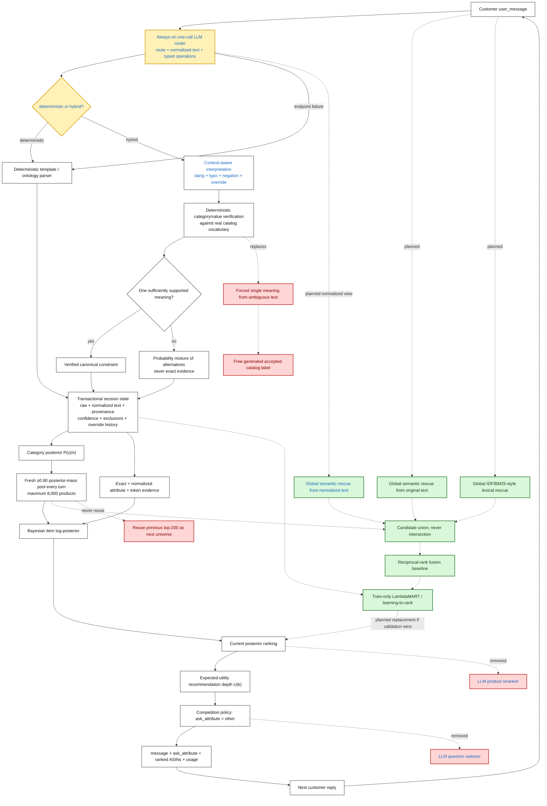

# TechJam Track 4 — current system, mathematics and build plan

## Truthful current status

R3 is one conversational-search agent combining an always-attempted LLM routing layer with
deterministic validation, catalog retrieval, Bayesian item ranking, and expected-utility output depth.
The working tree contains the always-on router, but a valid online score is still pending because the
LLM endpoint credentials were unavailable. Endpoint failure safely uses deterministic processing.

The user-authorized final holdout run on 2026-08-30 used the locked configuration and deterministic
router fallback:

| split | rows | Hit@10 | MRR | MTTC | efficiency | TechnicalScore | LLM tokens |
|---|---:|---:|---:|---:|---:|---:|---:|
| test | 2,800 | 0.981429 | 0.935120 | 2.863571 | 0.813643 | **0.933979** | 0 |
| public golden | 200 | 1.000000 | 0.982917 | 2.090000 | 0.891000 | **0.973075** | 0 |

Test bootstrap 95% CI is `0.9284–0.9394`; public is `0.9657–0.9794`. The result is stored in
`runs/r3_current_router_fallback_final.json`. It reproduces the historical locked score and does not
measure the always-on LLM. Public was used during early development and remains a regression set, not
a statistically pristine unseen estimate.

Other relevant validation results:

| method | evaluation | score | interpretation |
|---|---|---:|---|
| locked deterministic R3 | full validation, 2,800 | **0.927023** | reliable development estimate |
| deterministic R3 | strong-paraphrase pilot, 20 | **0.436750** | language robustness baseline |
| gated ambiguity-safe LLM | same paraphrase pilot | **0.565750** | `+0.129000`; CI `0.3575–0.7700` |
| always-on router fallback | clean pilot, 8 | `0.938750` | invalid as LLM evidence: all 25 calls failed |

The current regression suite has `161` passing tests.

### Free-form robustness corpus

A separate `freeform_v1` corpus now contains 1,200 train, 400 validation, and 800 sealed-test
sessions. Every first turn is non-template, and an agent-side adapter also rewrites every later
evaluator-generated reply with slang, shorthand, reordered phrases, filler-word typos, casual
punctuation, or occasional emoji. Scenario ratios remain 40% buying, 40% browsing, 15% override, and
5% boundary; target-ASIN overlap between splits is zero.

The byte-identical official `local_evaluator.py` scored the zero-LLM deterministic baseline at
**0.514799** on free-form validation (95% CI `0.4722–0.5592`). The 800-session free-form test has not
been evaluated. This synthetic corpus is a controlled language stress test, not evidence sampled
from real customers.

## Data protocol

The original `train.jsonl` and `dev.jsonl` were merged and split by sample ID and target ASIN:

| split | rows | buying | browsing | override | boundary | allowed use |
|---|---:|---:|---:|---:|---:|---|
| train | 8,400 | 3,360 | 3,360 | 1,260 | 420 | fitting and training |
| validation | 2,800 | 1,120 | 1,120 | 420 | 140 | selection and ablation |
| test | 2,800 | 1,120 | 1,120 | 420 | 140 | final evaluation only |
| public golden | 200 | — | — | — | — | frozen regression only |

Never use test or public for prompt design, model fitting, architecture selection, augmentation, or
threshold tuning. The latest requested holdout run is reporting evidence only; it must not influence
later choices.

## Checkpoints

| commit/state | method | score | purpose |
|---|---|---|---|
| `8260052` | locked deterministic R3 | validation `0.927023`; test `0.933979`; public `0.973075` | data-protocol checkpoint |
| `c816bfd` | gated ambiguity-safe LLM interpreter | clean `0.927023`; paraphrase-20 `0.565750` | safe code rollback |
| `05fb5c2` | checkpoint documentation | no new score | records rollback state |
| `4385ef0` | always-on one-call router | no valid online score | current experiment |
| `71c2b09` | free-form v1 corpus + message adapter | validation `0.514799`; test unopened | language-robustness checkpoint |

## Are we still on the old graph?

No. The old graph ran the grammar detector before the LLM. The current working tree attempts one LLM
call first; the response chooses `deterministic` or `hybrid`. Green nodes below are planned but not yet
built. Blue text means the LLM contributes to that node.



Legend: red = remove/reject; green = add; white = implemented; yellow = implemented but changing or
awaiting validation; blue text = LLM contribution.

## Complete online flow

1. Preserve the original customer message and conversation state.
2. Attempt one LLM call returning `route`, lossless `normalized_text`, message kind, category surface,
   and typed `add/remove/replace/confirm/no_preference` operations.
3. On `deterministic`, ignore model operations and run the exact template/ontology parser.
4. On `hybrid`, deterministically validate evidence spans, attributes, categories, and values against
   the catalog. Apply all accepted operations as one state transaction.
5. Store unclear meanings as one probability mixture. Never promote an LLM guess to exact evidence.
6. Recompute the category posterior from the catalog index and rebuild the full category pool every
   turn. Never narrow the previous top-200 again.
7. Rebuild the item posterior from popularity and all live evidence.
8. Rank candidates, choose output depth by expected utility, ask deterministic `other`, then repeat.

## Current mathematical model

Let \(m\) be a message, \(c\) a category, \(i\) a product, \(e\) a constraint, and \(t\) the current
turn.

### Offline parameter selection

The selected parameter vector is

\[
\theta^*=(g_{exact},w_{prior},T,\tau,V,\delta_p,\delta_c)
=(3.2,0.10,2.0,0.90,0.90,0.20,0.80).
\]

Candidates are fitted on train and selected on validation:

\[
\theta^*=\arg\max_{\theta\in\Theta_{finalists}}Score_{validation}(\theta).
\]

This is parameter search, not gradient-based model training.

### Category model

For category token \(x\), with \(N\) categories:

\[
IDF(x)=\log\frac{N}{df(x)}.
\]

If \(M\) and \(C\) are the message/category stem sets and
\(W=\sum_{x\in M\cap C}IDF(x)\):

\[
S(c,m)=W\frac{|M\cap C|}{|C|}+3W\mathbf 1[\text{category quoted verbatim}].
\]

No shared token gives \(S=-30\). The category prior is catalog share,

\[
P_0(c)=\frac{|Products(c)|}{\sum_{c'}|Products(c')|},
\]

and the posterior is

\[
P(c\mid m)=\operatorname{softmax}\left(\frac{S(c,m)}{2.0}+0.25\log P_0(c)\right).
\]

The pool is the smallest ranked category set \(C^*\) satisfying

\[
\sum_{c\in C^*}P(c\mid m)\ge0.90,
\qquad
\mathcal I=\bigcup_{c\in C^*}Products(c),
\qquad |\mathcal I|\le8000.
\]

### Catalog concept retrieval

Canonical candidates use exact concepts, aliases, token Jaccard overlap \(J\), prefix similarity
\(P\), and sequence similarity \(D\):

\[
R(v,q)=
\begin{cases}
10,&v=q\\
3J(v,q)+2P(v,q)+D(v,q),&\text{otherwise}.
\end{cases}
\]

A meaning becomes confirmed only when catalog support and confidence thresholds pass. Otherwise its
retrieved meanings remain alternatives.

### State evidence weight

\[
w_e(t)=0.9^{\max(0,t-t_e)}\cdot s_e\cdot q_e\cdot d_e,
\]

where \(s_e=0.70\) for soft evidence and \(1\) for hard evidence, \(q_e\) is confidence, and
\(d_e=0.35\) for a demoted constraint and \(1\) otherwise. Deleted evidence has weight zero.

### Match strength and bounded likelihood

\[
s(e,i)=
\begin{cases}
1,&\text{verified exact card match}\\
1.5/3.2,&\text{normalized attribute/value match}\\
0.9\,overlap(e,i)/3.2,&overlap(e,i)\ge0.34\\
0,&\text{otherwise}.
\end{cases}
\]

\[
overlap(e,i)=\frac{|tokens(e)\cap tokens(i)|}{|tokens(e)|}.
\]

With \(g=3.2\) and floor \(L_{min}=0.02\):

\[
\log L(e\mid i)=\log\max\left(0.02,e^{g(s(e,i)-1)}\right).
\]

For an exclusion, use (1-s(e,i)). The likelihood floor prevents uncertain language from permanently
deleting a potentially correct product.

### Ambiguity mixture

For alternatives \(h_j\) with normalized probabilities \(q_j\):

\[
\sum_jq_j=1,
\qquad
\log L(a\mid i)=\log\sum_jq_jL(h_j\mid i).
\]

This is one uncertain fact, not several independently counted constraints. LLM hypotheses cannot
receive exact-match strength.

### Item posterior

The popularity log-prior is

\[
\log P_0(i)=0.10\log(1+ratingCount_i).
\]

The unnormalized log posterior and normalized belief are

\[
z_i=0.10\log(1+ratingCount_i)+\sum_ew_e(t)\log L(e\mid i),
\]

\[
P(i\mid E)=\frac{e^{z_i}}{\sum_{j\in\mathcal I}e^{z_j}}.
\]

Products are ranked by descending \(z_i\). The normalized entropy diagnostic is

\[
H_{norm}=\frac{-\sum_iP(i)\log P(i)}{\log|\mathcal I|}.
\]

### Waiting and output-depth utility

After \(n\) barren turns,

\[
hope=\delta^n,
\quad
\delta=0.20\text{ paraphrased},\;0.80\text{ clean},
\]

\[
V_{continue}=\max(0,0.90\cdot hope-0.0667).
\]

For the top \(k\) ranked products,

\[
U(k)=\sum_{r=1}^{k}\frac{P(i_r)}{r}
+\left(1-\sum_{r=1}^{k}P(i_r)\right)V_{continue},
\]

\[
k^*=\arg\max_{k\in\{0,\ldots,10\}}U(k).
\]

The final turn always emits up to ten products. Override sessions remain silent until recommendations
are legally countable by the evaluator.

### Evaluation mathematics

\[
Hit@10=\frac1N\sum_s\mathbf1[rank_s\le10],
\qquad
MRR=\frac1N\sum_s\frac1{rank_s},
\]

\[
Efficiency=clip\left(\frac{11-MTTC}{10},0,1\right),
\]

\[
TechnicalScore=0.50(Hit@10)+0.30(MRR)+0.20(Efficiency).
\]

For the latest test run:

\[
0.50(0.981429)+0.30(0.935120)+0.20(0.813643)=\mathbf{0.933979}.
\]

## Machine-learning components

### Implemented

- Probabilistic category classifier with IDF features, catalog prior and softmax posterior.
- Bayesian product ranker combining popularity and bounded evidence likelihoods.
- Confidence-weighted temporal state and ambiguity mixtures.
- Grid-fitted parameters using train, then validation selection.
- Optional BLaIR/SVD semantic and accumulated IDF routes exist, but their active gains are currently
  zero because earlier validation did not justify them.
- LLM natural-language routing and structured extraction are implemented in the working tree but need
  a valid endpoint-backed evaluation.

### Planned candidate-union retrieval

Keep three representations:

\[
q_{raw}=\text{original message},\quad
q_{norm}=\text{LLM normalized message},\quad
q_{state}=\text{verified structured state}.
\]

Build a recall-oriented union, never an intersection:

\[
\mathcal C=\mathcal C_{category}\cup\mathcal C_{exact}\cup\mathcal C_{attribute}
\cup TopK_{semantic}(q_{raw})\cup TopK_{semantic}(q_{norm})\cup TopK_{lexical}(q_{raw}).
\]

First test reciprocal-rank fusion:

\[
RRF(i)=\sum_{r\in Routes}\frac{w_r}{60+rank_r(i)}.
\]

Then train LambdaMART or another learning-to-rank model on train-only hard negatives. Product features
can include

\[
x_i=[P(c_i\mid q),exact,attribute,tokenOverlap,rawSemantic,normSemantic,popularity,
constraintCoverage,contradiction].
\]

A pairwise training objective is

\[
\mathcal L(\theta)=-\sum_{(i^+,i^-)}\log\sigma(f_\theta(x_{i^+})-f_\theta(x_{i^-})).
\]

Only adopt this model if predeclared validation experiments preserve clean performance and improve
paraphrase performance and candidate recall.

## What to build next

1. Restore endpoint credentials and run identical always-on clean/paraphrase validation pilots.
2. Log router accuracy, normalized-text preservation, category-pool recall, candidate recall and final
   ranking separately. Do not diagnose everything as an LLM failure.
3. Add global raw/normalized semantic and lexical rescue candidates.
4. Union candidates and test RRF before training a more complex model.
5. Train LambdaMART with train-only positives and hard negatives; select once on validation.
6. Keep `c816bfd` as rollback until the new system wins under the predeclared validation gates.

## What not to build

- No forced single meaning for ambiguous text.
- No accepted free-generated catalog label without deterministic verification.
- No reuse of a previous top-10/top-200 as the next search universe.
- No LLM-generated shopping question for benchmark optimization.
- No LLM product reranker.
- No downsampling validation/test/public to manufacture balanced results.
- No tuning from the newly reported test/public scores.

## Reproduction

```bash
# One-time environment setup (Python 3.11)
python3.11 -m venv .venv
source .venv/bin/activate
python -m pip install --upgrade pip
python -m pip install -r requirements.txt

# Rebuild the synthetic free-form corpus; this does not evaluate it
python scripts/build_freeform_dataset.py

# Generic model-versus-dataset evaluation through the official evaluator
R3_OFFLINE=1 python scripts/evaluate.py \
  --model src/r3/agent.py \
  --test-data techjam-conversational-search-main/data/freeform_v1/validation.jsonl \
  --output runs/freeform_validation.json

# Development only
python scripts/fit_resplit.py
python scripts/evaluate_resplit.py --mode offline --splits validation
python scripts/evaluate_resplit.py --mode always-router --splits validation --stress 3 --sample-per-scenario 5

# Final reporting only; already spent for the current locked configuration
python scripts/evaluate_locked.py --acknowledge-golden-final \
  --output runs/r3_current_router_fallback_final.json
```

See `CLAUDE.md` for concise checkpoints, `docs/DATA-PROTOCOL.md` for the leakage boundary, and
`docs/RESPLIT-LLM-RESULTS.md` for experiment history.
