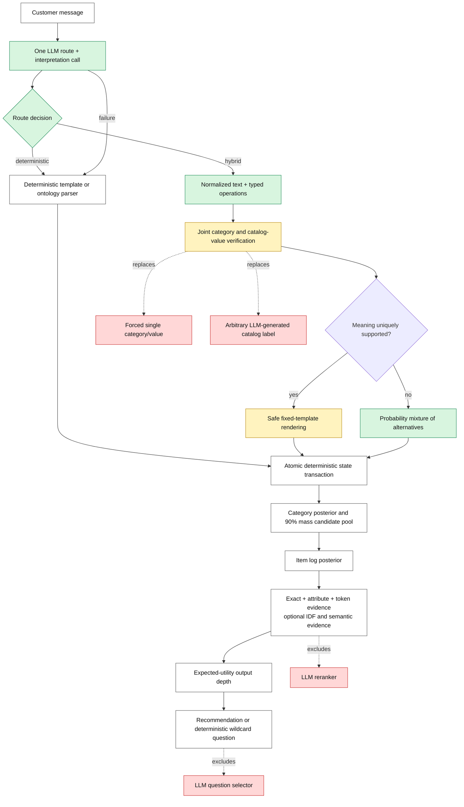

# Final conversational-search architecture

## Decision

One submitted agent always attempts one LLM routing call per customer message. The response chooses
`deterministic` or `hybrid`. It also supplies a lossless normalized message and typed operations, so a
hybrid decision does not cause a second intent call. The model never mutates state, invents an accepted
catalog label, selects the next question, or reranks products. All authoritative actions remain
deterministic and catalog-verified. Endpoint failure falls back to deterministic processing.



Legend: white = retained, green = added, yellow = updated, red = removed/rejected.

## State contract

The state retains raw and normalized messages, per-turn router decisions, the raw category surface
phrase, multiple verified category hypotheses, confirmed constraints, exclusions, superseded
constraints, and grouped ambiguity alternatives. Each confirmed
constraint records its source message, polarity, strength, confidence, and turn. The deterministic
validator applies all accepted changes as one transaction, so an intent override cannot leave a
half-updated state.

For an input such as `I want tees. Requirement: poly`, the safe result is not a fabricated category
and not a hard `cotton` constraint. `tees` remains a category surface with several catalog-backed
hypotheses, while `poly` remains one ambiguity group whose alternatives carry normalized confidence.

## Ranking mathematics

Category belief is a temperature-scaled posterior with a catalog-size prior:

```text
P(c | m) ∝ exp(S(c,m) / 2.0 + 0.25 log P(c))
```

The candidate pool is the smallest ranked set of categories covering posterior mass `τ = 0.90`,
bounded at 8,000 products.

The pool is rebuilt from the catalog-backed category index on every turn. A previous top-10, top-200,
or ranked list is never reused as the next turn's search universe. Consequently, replacing a
constraint can recover products that ranked below the previous shortlist. If the product category
changes, category inference is rerun against the global catalog before constructing a new pool. An
attribute-only correction does not needlessly score all 50,000 products; it reranks the complete
category pool, which preserves recall without adding irrelevant categories.

The item belief combines the popularity prior and independent evidence in log space:

```text
log P(i | evidence) = 0.10 log(1 + rating_count_i) + Σ_t w_t log L(e_t | i)
```

The principal likelihood gains are exact `3.2`, normalized attribute `1.5`, and lexical `0.9`, with
every factor floored at `0.02`. An LLM hypothesis is explicitly barred from exact-match strength.
Ambiguity is one mixture, not several independent constraints:

```text
log L(ambiguity | i) = log Σ_j q_j L(hypothesis_j | i)
```

Output depth maximizes expected reciprocal-rank utility:

```text
U(k) = Σ_{i≤k} p_i / i + (1 - Σ_{i≤k} p_i) V_continue
```

The next question remains deterministic. For benchmark scoring it uses the wildcard `other`, because
the simulator reveals useful hidden constraints for that action while specific attribute questions
often return nothing. A real customer UI may use concrete attribute questions, but that is a separate
UX objective and should not be confused with benchmark optimization.

## Evaluation boundary

- Fit parameters on `resplit_60_20_20/train.jsonl` only.
- Select among predeclared candidates on `validation.jsonl` only.
- Do not use `test.jsonl` or `public_set.jsonl` for fitting, prompt iteration, architecture selection,
  or augmentation.
- The gated interpreter checkpoint is `c816bfd`. The always-on router after that checkpoint has not
  produced a valid online score because endpoint credentials were absent during its first pilot.
- Keep the rollback checkpoint until a predeclared, sufficiently powered validation comparison shows
  that the always-on router preserves clean performance and improves paraphrase robustness.

## What not to build

- No LLM product reranker: verified exact/attribute evidence and the Bayesian ranker own final ranking;
  IDF/semantic routes remain deterministic experiments.
- No LLM-generated free-form question: the model does not know which hidden simulator fields exist.
- No forced canonical value when evidence is ambiguous.
- No synthetic balancing of validation, test, or public data; augmentation belongs only in training.
