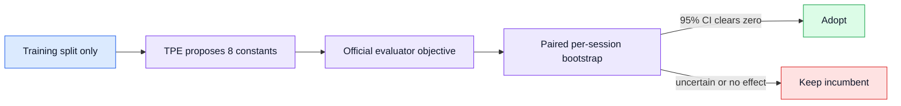

# Three-minute technical pitch script

Read the blockquoted narration. Presenter cues, animation directions `[like this]`, equations, diagrams, and tables guide the slide deck flow. Replace `[TEAM NAME]` before presenting.

---

### Legend for On-Slide Colors & Cues
- **Red Numbers in Slide 1**: Fixed competition evaluation constants set by the organizers (not fitted by us).
- **Red Numbers in Slides 3 & 4**: Calibrated probabilistic hyperparameters (temperature, thresholds, decay rates) that govern our engine.
- **Red Dashed Outlines / Boxes in Diagrams**: Optional components (like LLM fallback or rejected proposals) deliberately disabled in the submitted pipeline.
- **`[Animation / Visual Cue]`**: Direct instructions for slide transitions, zooms, and spotlight effects.

---

## Slide 1 - Outcome and problem (0:00-0:28)

**[Screen Setup: Clean title slide displaying "Shopping Copilot" and key result badge: "0.9744 TechnicalScore | 0 LLM Calls"]**

> Hi everyone, we are [TEAM NAME]. We built Shopping Copilot—a deterministic, offline probabilistic
> agent that finds a target product in a 50,000-item catalog in 10 turns or fewer. On the official public
> leaderboard, we achieved a TechnicalScore of 0.9744 with zero LLM calls. Now, you might wonder if that's
> just overfitting to the public set. To verify that, we tested on 2,800 target-disjoint test sessions
> and scored 0.9562, plus an 800-session free-form opener stress test where we achieved 0.9345.

**[Animation: Pop in the TechnicalScore formula with competition weights highlighted in RED]**

$$
\operatorname{TechnicalScore}
=\color{red}{0.50}\,\operatorname{Hit@10}
+\color{red}{0.30}\,\operatorname{MRR}
+\color{red}{0.20}\,\operatorname{clip}\!\left(
\frac{\color{red}{11}-\operatorname{MTTC}}{\color{red}{10}},0,1\right)
$$

*(Note for presenter: The red constants above are fixed competition weights defined by the organizer.)*

**[Animation: Slide in benchmark summary table with glowing highlight on the 0.9744, 0.9562, and 0.9345 scores]**

| Reporting set | Sessions | Hit@10 | MRR | MTTC | TechnicalScore |
|---|---:|---:|---:|---:|---:|
| Official public set | 200 | 1.0000 | 0.9942 | 2.19 | **0.9744** |
| Leakage-safe resplit test | 2,800 | 0.9911 | 0.9783 | 2.64 | **0.9562** |
| Free-form-opener stress test | 800 | 0.9725 | 0.9596 | 2.98 | **0.9345** |

## Slide 2 - System architecture (0:28-0:58)

**[Screen Setup: Picture A (High-Level Overview) appears first, then transitions into Picture B (Deep Technical Architecture)]**

> When a customer message comes in, we run it through a fast, cheapest-first parsing cascade:
> exact template matching, followed by ontology normalization.
> 
> You might wonder why we don't rely on standard tools like BM25, popularity priors, or an LLM fallback.
> We actually built and tested all three. But our rigorous ablation studies proved that our two-level
> probabilistic engine was already so precise that those extra components only added latency and noise
> without improving accuracy. Disabling them gives us identical or higher accuracy, sub-50ms latency,
> and zero LLM API cost.

**[Animation: Flowchart animates left-to-right following the data path; Red dashed box on "Disabled Components" pulses with a "DELIBERATELY ABLATED" tag]**

**Picture A - High-level pipeline overview**

```mermaid
flowchart LR
    U["Customer message"] --> P["Cascaded parser<br/>(Templates → Ontology)"]
    P --> S["Session state<br/>(Constraints, decay, overrides)"]
    S --> C["Level 1<br/>Category posterior"]
    C --> I["Level 2<br/>Item log-posterior"]
    I --> D["Expected-utility<br/>depth policy"]
    D --> O["Ranked ASINs<br/>+ Next question"]

    classDef input fill:#dbeafe,stroke:#2563eb,color:#0f172a;
    classDef state fill:#ffedd5,stroke:#f97316,color:#0f172a;
    classDef inference fill:#ede9fe,stroke:#7c3aed,color:#0f172a;
    classDef output fill:#dcfce7,stroke:#16a34a,color:#0f172a;
    class U,P input;
    class S state;
    class C,I,D inference;
    class O output;
```

**[Animation: Transition into Picture B — Deep Technical Blueprint showing exact ML methods, mathematical gates, and probability bounds]**

**Picture B - Detailed technical architecture & mathematical flow**

```mermaid
flowchart TB
    subgraph S1["1. Deterministic NLP & State Tracking Tier"]
        U["Customer Utterance at turn t"] --> T{"Exact Regex Template Match?"}
        T -- "Yes (Cost = 0ms)" --> SS["Session State Tracker<br/>• Slot constraints C_t<br/>• Age decay gamma = 0.9<br/>• Demote overrides factor = 0.35"]
        T -- "No" --> ON["Ontology Normalizer<br/>(Fuzzy attribute-value extraction:<br/>brand, color, size, specs)"]
        ON --> SS
    end

    subgraph S2["2. Level 1: Bayesian Category Belief (1,115 Categories)"]
        SS --> C1["Category Scoring:<br/>s_c(x) = W_c(x)·coverage_c(x) + 3.0·1[quoted]·W_c(x)"]
        C1 --> C2["Softmax with Prior (T=2.0, Catalog Share pi_c):<br/>P(c|x) = softmax(s_c(x)/2.0 + 0.25·log pi_c)"]
        C2 --> C3["Prefix Mass Pruning (tau = 0.85):<br/>Retain smallest set where sum P(c|x) >= 0.85<br/>(Prunes 50,000 items → ~250 candidates)"]
    end

    subgraph S3["3. Level 2: Bounded Item Likelihood Fusion"]
        C3 --> L1["Multi-Source Evidence Accumulator:<br/>• Exact card match (g_exact = 3.2)<br/>• Soft-card Jaccard (J >= 0.34, g_soft = 1.5)<br/>• Lexical token overlap"]
        L1 --> L2["Bounded Log-Likelihood Floor:<br/>log L_r = log(max(0.02, exp(g_r(s-1))))"]
        L2 --> L3["Temporal Item Log-Posterior:<br/>log P_t(i) ~ sum 0.9^(t-turn) [log L_main + log L_soft]"]
        L3 --> L4["Hard Rejection Masking:<br/>Proven-inspected ASINs → log P(i) = -infinity"]
    end

    subgraph S4["4. Decision-Theoretic Recommendation Depth Policy"]
        L4 --> K1["Dynamic Expected Utility Maximizer:<br/>k* = argmax [ sum (p_j/j) + (1 - sum p_j)·V ]"]
        K1 --> K2["Continuation Value:<br/>V = max(0, 0.75·d^s - 0.0667)"]
        K2 --> OUT["Emit top k* ASIN recommendations<br/>(k* in 1..10, dynamic turn-by-turn)"]
    end

    classDef stage1 fill:#dbeafe,stroke:#2563eb,color:#0f172a;
    classDef stage2 fill:#ede9fe,stroke:#7c3aed,color:#0f172a;
    classDef stage3 fill:#fef3c7,stroke:#d97706,color:#0f172a;
    classDef stage4 fill:#dcfce7,stroke:#16a34a,color:#0f172a;

    class U,T,SS,ON stage1;
    class C1,C2,C3 stage2;
    class L1,L2,L3,L4 stage3;
    class K1,K2,OUT stage4;
```

**Component Ablation & Pruning Analysis**

| Candidate component | Initial role / baseline | Ablation finding | Submission decision & production benefit |
|---|---|---|---|
| **BM25 / SQLite FTS5** | Official starter baseline | High noise across unrelated product categories; scored only 0.1067 | **Disabled (`gain = 0.0`)** — replaced by structured category-scoped Bayesian filter |
| **Item popularity prior** | Standard e-commerce heuristic | Once soft-card Bayesian evidence was active, popularity added exactly $+0.000000$ to score | **Disabled (`weight = 0.0`)** — eliminates unneeded complexity & catalogue bias |
| **Dense semantic embeddings (BLaIR / SVD)** | Vector similarity matching | Added memory overhead and latency with zero gain over ontology matching | **Disabled** — keeps in-memory pipeline ultra-lightweight |
| **Cloud LLM fallback** | Edge-case prose interpretation | Deterministic probabilistic engine already scored 0.9562+; LLM added 50+ sec API latency and cost | **Disabled** — guarantees deterministic 0ms API latency, zero cost, and 0 hallucinations |

---

## Slide 3 - Two-level probabilistic ranking (0:58-1:42)

**[Screen Setup: Split-view showing Level 1 (Category) on top and Level 2 (Item) on bottom. Highlight callout: "Red numbers = Calibrated Probabilistic Hyperparameters"]**

> For ranking, we do two-level probabilistic inference. At Level 1, we compute the category posterior
> across all 1,115 categories using IDF-weighted token overlap and a catalog-share prior. Instead of picking
> just one category and risking hard errors, we accumulate categories until we cover 85% of the posterior mass.
> 
> At Level 2, we score individual items. Exact catalog cards, normalized attributes, lexical overlap, and
> soft-card Jaccard all feed into an item log-posterior as bounded likelihoods. The red numbers you see
> are our calibrated hyperparameters—like setting a likelihood floor of 0.02 so a noisy match never zeros
> out the true target. Old evidence decays by a 0.9 factor each turn, and if a user changes their mind,
> we demote the old constraint rather than completely wiping it.

**[Animation: Zoom in on Level 1 equations; spotlight τ = 0.85 and T = 2.0]**

**Level 1 - category posterior**

$$
s_c(x)=W_c(x)\,\operatorname{coverage}_c(x)
+\mathbb{1}[c\text{ quoted}]\,\color{red}{3.0}\,W_c(x)
$$

$$
P(c\mid x)=\operatorname{softmax}\!\left(
\frac{s_c(x)}{T}
+\color{red}{0.25}\log \pi_c\right),
\qquad
T=\color{red}{2.0},
\qquad
\sum_{c\in\mathcal C_{\tau}}P(c\mid x)\geq \tau,
\quad \tau=\color{red}{0.85}
$$

Here, **W_c** is the shared-token IDF mass and **π_c** is the category's catalog share.

**[Animation: Pan down to Level 2 equations; highlight Likelihood floor L_min = 0.02 and Age Weight 0.9^(t-turn)]**

**Level 2 - bounded evidence and item posterior**

$$
\log L_r(i\mid e)=
\log\!\left[\max\!\left(
L_{\min},
\exp\{g_r(s_r(i,e)-1)\}
\right)\right],
\qquad L_{\min}=\color{red}{0.02}
$$

$$
\log P_t(i\mid\mathcal D_t)\propto
\sum_{e\in\mathcal D_t}
\underbrace{\color{red}{0.9}^{\,t-\operatorname{turn}(e)}}_{\text{age weight}}
\left[\log L_{\text{main}}(i\mid e)+\log L_{\text{soft}}(i\mid e)\right]
$$

$$
g_{\mathrm{exact}}=\color{red}{3.2},\qquad
g_{\mathrm{soft}}=\color{red}{1.5},\qquad
J_{\mathrm{soft}}\geq\color{red}{0.34}
$$

If a returned item was checked and rejected by the user, its log probability is masked to negative infinity:

$$
\log P_t(i) \leftarrow -\infty
$$

Demoted constraints from user preference changes receive an additional attenuation factor of **0.35**.

---

## Slide 4 - Recommendation depth (1:42-2:10)

**[Screen Setup: Display Expected Utility formula U(k) alongside an interactive curve plotting utility vs depth k]**

> A big question is: how many products should we recommend at each turn? We treat this as an
> expected-utility problem. For any depth k, our utility function balances the immediate reciprocal rank
> against the expected continuation value of asking another question and getting cleaner evidence. We pick
> the k-star that maximizes this trade-off. If we aren't getting new clues, the continuation value drops
> and we widen our recommendations. And whenever the user rejects a suggested product, we know for sure it's
> wrong, so we mask its log-posterior to negative infinity.

**[Animation: On the utility curve, show the peak k* shifting dynamically from turn to turn; highlight negative infinity mask on rejected items]**

$$
U(k)=\sum_{j=1}^{k}\frac{p_j}{j}
+\left(1-\sum_{j=1}^{k}p_j\right)V,
\qquad
k^*=\underset{0\leq k\leq K}{\arg\max}\;U(k)
$$

$$
V=\max\!\left(0,\color{red}{0.75}\,h-\color{red}{0.0667}\right),
\qquad
h=d^{\,s},
\qquad
d=\begin{cases}
\color{red}{0.8},&\text{templates are still matching},\\
\color{red}{0.2},&\text{the deterministic parser is blind}.
\end{cases}
$$

---

## Slide 5 - Optimization and evaluation discipline (2:10-2:35)

**[Screen Setup: Clean optimization pipeline diagram with decision gate]**

> To tune our hyperparameters, we hooked eight key constants into a Tree-structured Parzen Estimator
> (TPE) offline. But to prevent overfitting to search noise, we set a strict rule: any change had to show
> a statistically significant gain on a 95% paired-bootstrap confidence interval. When recent proposals
> didn't clear that bar, we kept our solid incumbent baseline. Best of all, running all 3,800 test sessions
> through the official evaluator takes under 58 seconds total, with zero model calls.

**[Animation: Highlight the 95% CI formula; show green checkmark on solid incumbents and red X on noisy proposals that failed to beat zero]**

$$
x^*=\underset{x}{\arg\max}\;
\frac{\ell(x)}{g(x)},
\qquad
\text{adopt }x_j
\iff
\operatorname{CI}_{95\%}\!\left(\Delta\operatorname{TechnicalScore}_j\right)_{\mathrm{low}}>0
$$

$$
\ell(x) = p(x \mid \text{good trials}), \qquad g(x) = p(x \mid \text{remaining trials})
$$

---

## Slide 6 - Live demo (2:35-3:00)

**[Screen Setup: Full-screen browser window showing `demo/index.html` replay UI]**

> Let's look at the live replay. In this templated browsing session, you can see how each requirement
> sharpens the posterior distribution. Two checked items get eliminated, and our target hits rank 1 by turn
> three. In this second case with a free-form opener, the first guess is wrong, but our agent recovers
> immediately and surfaces the target at rank 1 on turn two. That sums up our whole approach: maintain
> calibrated uncertainty, accumulate bounded evidence, and only recommend when expected utility says it's
> worth it.

**[Animation: Demo Replay 1 (Templated - browsing intent) — Red bounding box zooms into `pool size`, `excluded items`, and highlights target reaching Rank 1 on Turn 3]**

**[Animation: Demo Replay 2 (Free-form - buying intent) — Red spotlight highlights dynamic constraint update and target reaching Rank 1 on Turn 2]**

---

## Accuracy notes - do not narrate unless asked

- Do not call the submitted agent "model-free." That term has a specific reinforcement-learning
  meaning, and the repository also contains an optional language-model path. The accurate phrase is
  **deterministic, offline probabilistic agent**.
- The 12,000 sessions mentioned in the draft were an earlier fitting set, not a test set. The current
  leakage-safe split contains 8,400 training, 2,800 validation, and 2,800 test sessions, disjoint by
  sample ID and target ASIN.
- The 800-session stress test rewrites the opener; later turns retain official simulator wording. It
  is not a fully natural multi-turn benchmark and is not an official competition score.
- TPE is implemented and exercised, but the latest recorded proposals were rejected by the paired
  bootstrap gate. Do not imply that those proposals became the submitted constants.
- BM25, the item-popularity prior, and the optional LLM are disabled in the submitted ranking path.

