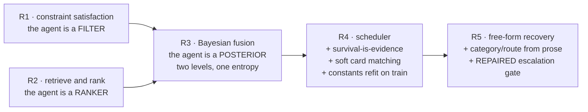
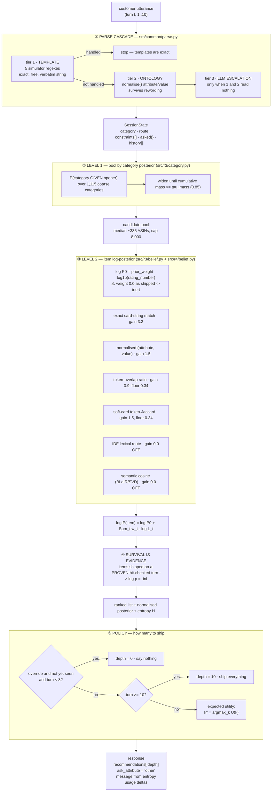

# R5 — full architecture

**Scope.** Everything the shipped R5 agent does, from the customer's first message to the ten ASINs
it returns, with the actual formulas and the actual constants. Read alongside
[docs/r5-exploration/00-r5-spec.md](r5-exploration/00-r5-spec.md) (the bet),
[03-decisions.md](r5-exploration/03-decisions.md) (why each piece is on or off) and
[IMPORTANT.md](../IMPORTANT.md) (facts about the problem).

Every number here is either read directly out of the code or cites the run that produced it.

---

## 0. Read this first — three things that surprise people

Before the diagrams, three facts about the *shipped* configuration that contradict what the
component list suggests:

1. **There is no BM25 anywhere in R5.** The official starter used BM25/FTS5 and scored 0.1067. R5
   deleted that route entirely. What remains is (a) a plain token-overlap ratio inside the likelihood
   and (b) an IDF-weighted lexical route that **ships disabled** (`idf_gain = 0.0`).
2. **The dense/semantic route ships disabled** (`semantic_gain = 0.0`). Both the BLaIR and TF-IDF+SVD
   backends are implemented and switchable; neither is on.
3. **The popularity prior is arithmetically inert** (`prior_weight = 0.0`, D14). Verified, not
   inferred — ablating it changes the public-set score by **exactly 0.000000**:

   | config | score | MRR |
   |---|---:|---:|
   | `r4_ship` | 0.974350 | 0.994167 |
   | `r4_ship` + `no_popularity` | 0.974350 | 0.994167 |

   ⚠️ This **contradicts** [IMPORTANT.md](../IMPORTANT.md) §5, which records popularity as the single
   most valuable signal (R1 lost 0.2422 without it). Both are true of their own configuration: the
   prior mattered enormously when the evidence terms were weak, and `scripts/fit_r4.py` drove its
   weight to zero once soft-card matching made the evidence strong enough to rank alone. **Treat
   `prior_weight = 0.0` as provisional** — it was fitted on `train.jsonl` at a boundary that was
   extended once already (D14), and it is the constant most likely to move if the evidence terms change.

So the ranking in shipped R5 is carried almost entirely by **four constraint-matching terms over a
category-scoped pool**, not by retrieval breadth. That is the architecture, and §5 is where it lives.

---

## 1. Inheritance — what R5 actually is

R5 is not a rewrite. It is R4 plus two deterministic recovery steps, and R4 is R3's posterior with a
different stopping rule.



⚠️ `src/r4/agent.py::_respond` is **R3's loop copied, not called** — deliberately, so the road's
differences are readable in one file instead of hidden in a post-processing diff.
`tests/test_r4_reduces_to_r3.py` (R4-A1) proves the copy is faithful by requiring identical
per-session **rank and turn** across all 2,000 sessions with every new flag off. If that test fails,
every downstream number is a comparison against an unknown baseline.

⚠️ `src/r5/` and `src/r4/` import nothing from `src/r1/` or `src/r2/`. Two AST tests enforce it —
otherwise the race compares a system against its own components.

---

## 2. The whole flow, one diagram



---

## 3. Startup — what is built once

`Agent.__init__(catalog_path)` — **positional and undocumented**; the evaluator constructs it that
way (IMPORTANT.md §13.1.1).

| structure | built from | content |
|---|---|---|
| `ItemIndex.card[asin]` | `intent_card(product)` | the item's own hard-constraint + soft-preference strings, **as a tuple in simulator order** |
| `ItemIndex.spec[asin]` | `features` + `details` | raw spec strings |
| `ItemIndex.log_pop[asin]` | `log1p(rating_number)` | spans 0–11 |
| `ItemIndex.pairs(asin)` | `normalise(spec)` | frozenset of `(attribute, value)`, lazy + cached |
| `ItemIndex.tokens(asin)` | spec + title | frozenset, lazy + cached |
| `ItemIndex.lexical_text` | title + store + categories + features[:8] | **deliberately a different surface** from `spec`, so the two are not the same evidence twice |
| `CategoryBelief.by_category` | `coarse_category(categories)` | 1,115 categories → ASIN lists, + IDF over category-name stems |
| `index._card_tokens` | `card[asin]` | token sets per card string, lazy (softcard hot loop) |

⚠️ **Never a `set` where order is read.** CPython salts string hashing per process, so a set here made
the score drift between byte-identical runs in both R1 and R2. `card` is a tuple in the simulator's
own order; `IdfLexical` keeps the *rarest* tokens rather than an arbitrary slice; `SvdSemantics`
builds its corpus from a list in catalog order.

The agent **never** calls the network at startup and makes **zero** LLM calls on clean text.

---

## 4. Stage ① — the parse cascade

`parse(message, state, llm, erase)` never raises (spec C3: a parse failure must not cost the turn).

### 4.1 Tier 1 — templates

Five regexes mirroring the simulator's own generators:

| pattern | recovers |
|---|---|
| `OPENER_RE` | `^I'm looking for (category)(tail)?$` → **category** + route |
| `KEY_REQ_RE` | `. A key requirement is: X` → route `buying` |
| `REPLY_RE` | `For that, what matters is: a; b` → constraints, split on `; ` |
| `OVERRIDE_RE` | `Actually, ignore my earlier preference. What I need is: X` → route `override` |
| `NULL_ASK_RE` / `NO_PREF_RE` | recognised-but-empty; marks the attribute exhausted |

A handled message **never reaches tier 2** — the templates are exact, so what they leave out
genuinely was not said.

**Intent override (Pillar II).** On an override, turn-1 constraints are **demoted, not deleted**:

```
weight(c, t) = 0                       if not c.alive
             = 0.9^(t - c.turn) · 0.35 if c.demoted
             = 0.9^(t - c.turn)        otherwise
```

Deleting outright measured **−0.05 MRR** on override sessions. The simulator's "override" is
narrative — the target never changes — so constraints learned before it are still true of it.

### 4.2 Tier 2 — ontology

`normalise(text)` returns **every** `(attribute, value)` pair a string implies, via four routes:
`Key: value` splitting against `KEY_HINTS`; `MATERIAL_RE`/`COLOR_RE`/`$price` regexes; lead-in cues
(`made of X`, `size X`, `good for X`); and a final fallback to `classify_constraint(text)` so nothing
is dropped. This is what makes matching survive rewording — the exact index needs the customer to
repeat a catalog string verbatim, this only needs them to mean the same thing.

### 4.3 Tier 3 — LLM escalation ⚠️ repaired in D21

```python
llm = self.llm if self.flags.llm_extract else None
parse(user_message, state, llm=llm, erase=self.flags.erase)
```

and inside `parse`:

```python
if not handled and llm is not None:
    for _attribute, value, _text in llm.extract(message) or []:
        _add(state, value, "llm")     # re-fed through normalise(); the catalog's vocabulary decides
```

**The bug that was here, and the repair.** R3 introduced — and R4 inherited — an extra conjunct:

```python
llm = self.llm if (self.flags.llm_extract and state.paraphrased()) else None   # ← removed
```

`paraphrased()` is `turn >= 2 and template_hits == 0`, a **session**-level test. `parse()` already
gates per message on `not handled`, which is the right question. On a corpus whose unreadable turn is
the **opener**, the two could never both hold: turn 1 fails `turn >= 2`, and from turn 2 the templated
replies are `handled`. Measured: **0 `extract()` calls** across the entire free-form corpus. After the
repair, **400 calls on 400 sessions** — one per unreadable opener. `src/r1/agent.py` never had the
extra conjunct; R3 added it.

⚠️ **A gate opening is not a call being made.** This was mis-diagnosed twice from code reading, in
both directions, before anyone counted actual invocations. Instrument the call, not the condition.

**The aligned prompt** (`src/r4/extract.py`) targets the *deterministic pathway*, not fluent English,
because the downstream matchers are mechanical: the exact term is tuple **equality**, soft-card is
token-Jaccard, and `normalise()` keys off a small fixed vocabulary. So a value is useful in proportion
to how many **original tokens** it preserves. "made from genuine leather" and "leather" are equally
fluent; only the second is a card string. The prompt copies `ALLOWED_ATTRIBUTES`, `MATERIALS` and
`COLORS` **verbatim from `evaluator/local_evaluator.py`** — copied, never imported, because the
evaluator does `from starter.agent import Agent` at module scope and importing it from agent code is a
circular import and a hard crash. A bad `attribute` is **repaired** by `_attribute_for(value)` rather
than discarded: the value is what the matcher uses.

Every call asserts on a parsed non-empty result and increments `failures` otherwise — some models
return `content: None` while burning the full token budget, and that looks exactly like a model that
is not helping.

---

## 5. Stage ② — level 1, the category posterior

Replaces R1's and R2's `hits² / |tokens|` argmax-plus-hedge-at-0.6. For each of the 1,115 categories,
over **stemmed** tokens (crude `-s` stripping, applied to both sides — symmetry matters more than
correctness):

```
shared_i   = stems(message) ∩ stems(category_i)
weight_i   = Σ_{t ∈ shared_i} idf(t),         idf(t) = log(N / df(t))
coverage_i = |shared_i| / |stems(category_i)|
score_i    = weight_i · coverage_i  (+ QUOTE_BONUS · weight_i  if the full name appears verbatim)
logit_i    = score_i / TEMPERATURE + 0.25 · log(catalog_share_i)
P(cat_i)   = softmax(logit)
```

`TEMPERATURE = 2.0`, `QUOTE_BONUS = 3.0`, no-overlap score `= -30.0`.

**The pool** is the smallest prefix of categories covering `tau_mass = 0.85` of the posterior,
capped at `POOL_CAP = 8000` (a latency bound, not a modelling choice).

Why a distribution rather than an argmax: `coarse_category` is **hierarchical** — the evaluator joins
the last two taxonomy levels, so "Tees & Blouses Tunics" has six siblings. When a shopper says only
"tees & blouses", the child is genuinely not in the message and no resolver can pick it — but the pool
can hold **every sibling**, which is exactly what a distribution does and an argmax cannot.

📊 Measured: the target is in the level-1 pool **100%** of the time on `train.jsonl[:3000]`. Level 1 is
not where the remaining loss is.

⚠️ Rejected (D14): a per-category naive-Bayes language model over product titles scored **0.525 vs
0.825** — the scaffold words outvote the one token carrying the category.

---

## 6. Stage ③ — level 2, the item posterior

```
log P(item) = log P₀(item) + Σ_{c ∈ live} weight(c, t) · log L_c(item)
```

Rebuilt from scratch every turn rather than updated incrementally — cheap, and it cannot drift.

### 6.1 The prior

```
log P₀(item) = prior_weight · log1p(rating_number)
```

`log1p(rating_number)` spans 0–11 while one exact match is worth 3.2, so used raw it would outvote
three exact matches — not a strong prior, a **units error**. `prior_weight` puts it on the evidence's
scale. **Shipped at 0.0** (§0, verified inert).

### 6.2 The bounded likelihood map

Every term maps a match strength `s ∈ [0,1]` to a log-likelihood through one function:

```
_bounded(s, gain) = log( max( L_MIN, exp(s · gain) / exp(gain) ) ),    L_MIN = 0.02
```

Two invariants make this a posterior rather than a weighted blend:

🔑 **A term with no opinion cancels.** A term assigning the same likelihood to every candidate adds a
constant to every log-posterior and vanishes under normalisation. R2 needed a hand-coded regime switch
(`spec_support < 0.60` → load a second weight table) to stop popularity swamping routes that still had
something to say. Here that switch does not exist. Terms that match *nothing* return `{}` — they
**abstain** rather than flatten the belief.

🔑 **No term may zero an item.** `L_MIN` floors every factor. This is R1's "an intersection that would
empty S is discarded" as arithmetic instead of a special case — and R1 measured the alternative:
letting soft matches delete candidates dropped Hit@10 to **0.79** under stress, *below* the 0.815
do-nothing baseline. The agent was deleting the target on a guess.

### 6.3 The evidence terms

Per constraint, `constraint_terms` takes the **first** match that fires:

| # | term | strength | gain | ships |
|---|---|---|---:|---|
| 1 | **exact card string** — `c.text in index.card[asin]` (tuple membership → equality) | `1.0` | `exact_gain = 3.2` | ✅ |
| 2 | **normalised pair** — `(c.attribute, c.value) ∈ index.pairs(asin)` | `1.5 / 3.2` | `ATTRIBUTE_GAIN = 1.5` | ✅ |
| 3 | **token overlap** — `\|want ∩ index.tokens(asin)\| / \|want\|`, floored at `TOKEN_FLOOR = 0.34` | `overlap · 0.9 / 3.2` | `LEXICAL_GAIN = 0.9` | ✅ |

Plus, added separately in `SelectiveBelief.update` **after** the standard terms:

| # | term | formula | gain | ships |
|---|---|---|---:|---|
| 4 | **soft card** (`src/r4/softcard.py`) | `max over the item's own card strings of Jaccard(tokens(c.text), tokens(card))`, floored at `0.34` | `soft_card_gain = 1.5` | ✅ |
| 5 | **IDF lexical** (`src/r3/lexical.py`) | `Σ_{t ∈ q∩d} idf(t) / Σ_{t ∈ q} idf(t)`, `idf(t)=log(1+N/(1+df))`, top-64 rarest tokens/doc | `idf_gain = 0.0` | ❌ |
| 6 | **semantic** (`src/r3/semantic.py`) | cosine, on the whole utterance history at once | `semantic_gain = 0.0` | ❌ |

**`exact_gain` is the R1↔R2 dial.** Large → an exact match dominates and the posterior collapses onto
the matching set: R3 behaves like R1's filter. Small → every term contributes comparably: R3 behaves
like R2's scored blend. One fitted number where R1 has a shrink rule and R2 has two weight tables.

**Why soft card exists.** The exact term is tuple *equality*, so one reworded character silences the
strongest signal in the system. At L4, **97%** of sessions still have the target in the pool but
**44.7%** hit at rank 2+ (against 2.4% on clean text) — the target is being **retrieved and not ranked
first**, a matching-precision problem, not a retrieval one. Token-Jaccard against the item's **own card
strings** specifically, because the simulator quotes from those four strings and nothing else; the
generic lexical term dilutes the signal across title, store, categories and features.

⚠️ Soft card **skips any item the exact term already scored** (`if c.text in index.card[asin]:
_bounded(0.0, gain)`). Paying twice for one piece of evidence would let a single constraint outvote
three others.

📊 Soft card is the largest single win in R4. Measured on `dev.jsonl` (2,000 sessions,
`exclude_shipped` on, `soft_card_gain` 0.0 vs 1.5), re-run 2026-08-30:

| | off | on | delta |
|---|---:|---:|---:|
| L0 clean | 0.9499 | 0.9506 | +0.0007 |
| L2 payloads | 0.7680 | 0.8301 | **+0.0621** |
| L3 + category | 0.7131 | 0.7858 | **+0.0727** |

⚠️ Note the shape: **almost nothing on clean text, large under paraphrase.** That is the intended
behaviour — on clean text the exact term already fires and soft card is skipped by design (§6.3).
The gain is fitted on `train.jsonl`; the table above is `dev.jsonl`, a reporting set.

**Why the semantic route ships at 0.** Both backends work — `BlairSemantics` loads a precomputed
float16 matrix (`artifacts/blair.npz`) so the runtime is **numpy only, no torch, no network**, which is
what "organizer policy may disable network access" requires; `SvdSemantics` is TF-IDF + 256-d truncated
SVD needing no new dependency. Neither earned its gain against the soft-card term once that existed.

### 6.4 Normalisation, entropy, ranking

```
p_i = exp(log p_i - max) / Σ exp(log p_j - max)          (log-sum-exp, numerically safe)
H   = ( -Σ p_i log p_i ) / log|pool|                      (normalised to [0,1])
```

The `log|pool|` normalisation is **load-bearing**: a pool of 200 and a pool of 4,000 are not comparable
in nats, and every decision downstream is a comparison. This single number replaces R1's NQC 0.35 and
turn-3 deadline *and* R2's four-rung depth ladder and 0.60 regime threshold.

### 6.5 `SelectiveBelief.flatness` — built, ships off

```
flatness = min over live constraints of  |{items scoring above no-match}| / |pool|
```

Defined on the **most selective** constraint, not the average — one sharp constraint is enough to rank,
and averaging lets three vague ones drown it. Intended to scale the prior by `1 - damp · flatness`.
**Ships at `prior_damp = 0.0`**: Phase S was subsumed once `prior_weight` went to 0 (there is nothing
left to damp).

⚠️ Its first version used `log(L_MIN)` as the no-match floor — which at `gain = 3.2` never binds for
any strength in `[0,1]`, so it counted **all** candidates as matching and returned flatness 1.0 for
perfectly sharp evidence. The correct floor is `_bounded(0.0, gain)`. A unit test caught it; an
end-to-end sweep would have silently reported "this buys nothing".

---

## 7. Stage ④ — survival is evidence (R4's core claim)

The evaluator does:

```python
if override_applied and target in ranked:
    best_rank = ...; break
```

So **if the session is still alive, every item shipped on a hit-checked turn is proven not to be the
target**: `P(item | survived) = 0`. R3 left that on the floor and re-shipped the same list — measured,
43/43 sessions alive at turn 5 shipped a depth-1 list *identical to turn 4's*, already proven wrong.

```python
belief.log_p[asin] = -inf   if proven
```

⚠️ **The rule has to be binary, and soundness cannot rest on route detection.** Three versions, two of
which were measured negative:

| version | rule | result |
|---|---|---|
| v1 | exclude when `state.route == "override"` | **−0.0125 at L3** — paraphrase degrades route detection, the guard silently opened, 9 override sessions became outright misses |
| v2 | soft `shipped_penalty` on unproven turns | **−0.0607 clean**, override MRR 0.983 → 0.504 — an unchecked turn's top item is the one *most likely to be the target* |
| v3 ✅ | **positive** test below | **+0.0206 at L3**, +0.027 train, +0.028 dev |

```python
if turn >= OVERRIDE_SETTLED:            # 4 — behavior_for() draws the override turn from {3,4},
    proven = True                       #     so override_applied is unconditionally True by then
elif state.category is None or state.paraphrased():
    proven = False                      # never read the opener; assume nothing
else:
    proven = state.route != "override" or state.override_seen
```

⚠️ **`SessionState.route` defaults to `"browsing"`**, so `route != "override"` is *not* evidence — it is
also what an unparsed opener looks like. Reading a default as a measurement cost 9 sessions. The test
must be positive: trust the route only where the opener template actually matched, which is the only
place `state.category` is ever set on the offline path.

The pool is never emptied (`if live:` guard) — a bad rank still beats no rank. Exclusions never
downgrade: proven wrong at turn 4 stays proven at turn 5.

---

## 8. Stage ⑤ — the policy

### 8.1 Depth by expected utility

Shipping deep is **not free**: any hit ends the session and locks in that reciprocal rank, so a long
list converts a future rank-1 hit into a present rank-7 one.

```
U(k) = Σ_{i≤k} p_i · (1/i)  +  (1 - Σ_{i≤k} p_i) · V
depth = argmax_k U(k),  k ∈ [0, top_k]
```

`U(0) = V`, so **"say nothing this turn" falls out as the k=0 case** rather than being a special rule —
which is how the override silence and R2's depth ladder both stop needing to exist.

```
V = max(0, v_continue · hope - turn_cost)
hope = stall_decay ^ stalls          (0.2 paraphrased / 0.8 clean)
turn_cost = 0.0667
v_continue = 0.75                    (refit on train; R3 used 0.90)
```

`turn_cost` is **an exchange rate, not a knob**: one extra turn costs `0.2 × 0.1 = 0.02` of Efficiency,
MRR is weighted 0.3, so a turn is worth `0.02 / 0.3 ≈ 0.0667` of reciprocal rank.

⚠️ **`V` cannot be a constant.** With fixed `V`, `U(1) − U(0) = p₁(1 − V) > 0` always and
`U(2) − U(1) = p₂(0.5 − V) < 0` for any `V > 0.5` — so the agent ships **exactly one item every turn,
forever**, scoring **0.6216 at L3** because it never hits and burns the whole session. Waiting is only
worth something when *more evidence is coming*. A second version that hard-switched `V = 0` on one
barren turn cost **0.068 of clean MRR** by panicking at a single unproductive reply. Hence `hope`,
which comes from the belief itself:

- **peaked belief** → evidence is discriminating, one more turn resolves it to rank 1 → be patient, ship 1
- **flat belief** → another turn of the same will not help → every extra item is free upside → ship the lot

### 8.2 The two overrides

```python
if state.route == "override" and not state.override_seen and turn < deadline(3):
    depth = 0            # silence: the evaluator DISCARDS pre-override hits even at rank 1
elif turn >= max_turns(10):
    depth = top_k        # last turn, nothing to save for
```

### 8.3 The question — hardcoded `"other"`

`ask_attribute = "other"`, always. `best_question` implements full expected information gain over the
posterior and **loses at every stress level**: 0.9509 vs 0.9720 clean, 0.8426 vs 0.8845 L2, 0.7899 vs
0.8297 L3 (D18).

The reason is **structural, not a tuning failure**: `"other"` makes the simulator return **the next two
undisclosed constraints**, while any named attribute returns at most one — and `classify_constraint`
never emits `brand`, `budget` or `category` at all, so a third of the attributes EIG can choose are
dead letters that burn a turn. **No question-selection objective can beat "ask for strictly more
evidence" when one option literally returns twice as much of it.**

Kept behind `R3_FLAGS=infogain` because the measurement is the point.

### 8.4 Message and usage

```python
depth == 0    -> "Understood — tell me a little more and I will narrow this down."
H < 0.55      -> "I think this is the one. Does it look right?"
otherwise     -> "Here are the closest matches so far — what else matters to you?"
```

⚠️ `usage` is reported as **per-turn deltas**. The evaluator **sums** the field across turns, so running
totals over-count quadratically — and token usage is a disclosed submission figure.

---

## 9. R5's own additions — all three ship off

| mechanism | what it does | measured |
|---|---|---|
| `freetext_category` | `CategoryMatcher`: closed-vocabulary match of a free-form opener against the 1,115 category names, coverage-of-category-tokens ≥ 0.34, **returns `None` rather than a guess** | **exactly 0.0000** (D17) |
| `freetext_route` | `route_of`: speech-act cues (`OVERRIDE_CUES` → `BROWSE_CUES` → `BUY_CUES`, most specific first) | **exactly 0.0000** (D17) |
| `fuzzy_expand` | `FuzzyCanon`: difflib correction of misspelled words, run **before** the deterministic/LLM branch. Target vocabulary restricted to the 764 category-name tokens + `MATERIALS` + `COLORS`; **expands rather than replaces**, keeping the original word | **exactly 0.0000** on all 10 train configs (D22) |

**Why zero.** On free-form openers R4 parses `state.category` from **0.0%** and leaves route at its
default in **100%** of sessions — and still scores **0.9110**. The reason nothing improves when you fix
that: the level-1 belief reads the **raw opener string** (`state.history[0]`), so the pool is selected
correctly from unparsed text, and **nothing downstream consumes the parsed `state.category` for
ranking**. Recovering it changes what the state *records*, not what the agent *retrieves*.

**Why fuzzy correction finds nothing.** The premise fails on this corpus. The target's coarse-category
tokens appear **verbatim** in the free-form opener in 64.9% of sessions (all tokens) and 99.5% (at
least one), and the `lowercase_typo` style has 84.7% mean token coverage against 83.5–88.6% for every
other style — indistinguishable. **The generator restyles the conversational scaffolding, not the
product nouns.** So the corrector fires on 18.5% of openers and is wrong essentially every time
(`wait`→`waist`, `browsing`→`bowling`), harmless only because the appended tokens are too weak to move
the level-1 posterior. On text that genuinely misspells category words it works
(`snekers`→`sneakers`, `bracelt`→`bracelets`); `freeform_v1` simply never asks the question.

`llm_fallback` is now a **no-op flag name**, retained one release so existing `runs/registry.jsonl`
rows stay interpretable. R5's parallel turn-1 LLM path was **deleted in D21**: it existed only to route
around the broken gate in §4.3, and with that repaired it would double-call every unreadable turn.
`reads_deterministically()` stays in `src/r5/freetext.py` because it documents the predicate and both
of its wrong versions.

---

## 10. Shipped configuration

`src/r5/flags.py` → `src/r4/flags.py` → `src/r3/flags.py`, overridable via `R3_FLAGS` / `R4_FLAGS` /
`R5_FLAGS` (`name=value`, `no_name`, `name`).

| flag | value | note |
|---|---|---|
| `exact` / `attribute` / `lexical` | `True` | the three inherited evidence terms |
| `exact_gain` | `3.2` | the R1↔R2 dial |
| `soft_card_gain` / `soft_card_floor` | `1.5` / `0.34` | ⚠️ 2.5 scored a better objective (0.8558 vs 0.8546) but **regressed clean by 0.0086**; R4-A31 forbids trading L0 for stress |
| `prior` / `prior_weight` | `True` / **`0.0`** | ⚠️ inert — see §0 |
| `tau_mass` | `0.85` | refit on train (was 0.90) |
| `v_continue` | `0.75` | refit on train (was 0.90) |
| `stall_decay` / `stall_decay_clean` | `0.2` / `0.8` | ⚠️ `stall_decay_clean` looked worth +0.0075 on dev; on train the whole range spans 0.002 |
| `belief_pool` | `True` | level-1 posterior picks the pool |
| `llm_extract` / `aligned_extract` | `True` / `True` | escalation only; **0 calls on clean text** |
| `deadline` / `max_turns` | `3` / `10` | structural |
| `exclude_shipped` | `False` **default**, `True` in `r4_ship` | ⚠️ defaults off so R4-A1 stays writable; **every reported R4/R5 number enables it** |
| `semantic_gain` / `idf_gain` | `0.0` / `0.0` | built, switchable, off |
| `prior_damp` / `infogain` / `calibrate` / `exhaustion` / `truncate` | off | measured negative or not built |
| `freetext_category` / `freetext_route` / `llm_fallback` | `False` | measured 0.0000 (D17) / no-op (D21) |
| `fuzzy_expand` | `False` | measured 0.0000 (D22); `fuzzy_k=3`, `fuzzy_cutoff=0.80`, `fuzzy_min_len=4` |

⚠️ `exclude_shipped` defaulting to `False` while every reported number turns it on is a real
foot-gun — constructing `Agent()` and running it does **not** reproduce the published figures. It is
this way because R4-A1 requires a default R4 to reduce to R3.

---

## 11. Cost

| path | per session | LLM calls |
|---|---:|---:|
| deterministic (public_set, 200) | **22 ms** | 0 |
| free-form + LLM escalation (400) | **1,450 ms** | 1 (the opener) |
| **forced** LLM every turn (public_set) | **2,799 ms** | 2.71 |

Calls scale with **turns, not sessions** — the evaluator breaks on first hit, so a session averages
2.71 turns, not 10.

**Forcing the LLM on text the templates already read costs 0.0270 and 127× the latency:**

| public_set (200) | score | Hit@10 | MRR | MTTC |
|---|---:|---:|---:|---:|
| deterministic | **0.9744** | 1.0000 | 0.9942 | 2.19 |
| forced LLM | 0.9474 | 0.9950 | 0.9469 | 2.71 |

The damage is **almost entirely MRR** (0.9942 → 0.9469) while Hit@10 barely moves. The LLM is not
failing to *find* the item — it is failing to keep it at **rank 1**, because templates yield exact
`(attribute, value)` pairs and the LLM returns approximations of the same pairs. 72 of 541 calls (13%)
failed outright and fell back deterministically, so even 0.9474 is measured *with* the safety net.

**This is the evidence for the if/else design**: the LLM is strictly a recovery tier for text the
deterministic path cannot read. On text it can, the model can only lose fidelity.

---

## 12. Measured and rejected — do not re-propose without new evidence

| # | idea | result |
|---|---|---|
| D14 | per-category naive Bayes for category resolution | 0.525 vs 0.825 |
| D18 | EIG question selection | −0.021 clean, −0.042 L2, −0.040 L3 |
| D15 | entropy as the patience signal | superseded by `stall_decay` |
| D17 | channel-conditioned evidence gains | no gain |
| D17 | `freetext_category`, `freetext_route` | **exactly 0.0000** |
| D12 | Phase C calibration | oracle ceiling **+0.0033** — killed before building |
| D4 | truncating below 10 recommendations | measured negative |
| D9 | `shipped_penalty` (soft exclusion) | −0.0607 clean; override MRR 0.983 → 0.504 |
| D21 | LLM escalation on free-form openers, gate repaired | **−0.0006**, 28× cost |
| D22 | fuzzy spelling correction before the deterministic/LLM branch | **exactly 0.0000**, 10/10 configs |

---

## 13. Reproducing

```bash
cp assets/catalog.jsonl techjam-conversational-search-main/data/catalog.jsonl
set -a && . ./.env && set +a

PYTHONHASHSEED=0 python3 -m pytest tests/ -q      # 139 pass; 3 test_llm cases need the endpoint
python3 -m src.eval.race --roads r5               # all roads, one harness
python3 -m src.eval.race --roads r5 --stress 3    # under category paraphrase
python3 scripts/final.py                          # full table + held-out -> runs/final.json
```

⚠️ **Fit on `train.jsonl` only.** `dev.jsonl` (2,000) and `public_set.jsonl` (200) are evaluation
sets. Targets are disjoint across all three (verified: train∩dev = 0, train∩public = 0, dev∩public = 0).

⚠️ **Do not tune on the clean score.** It is saturated and a 0.02 gap on 200 sessions is noise.
R5 is judged on its **L2/L3 paraphrase** and **`no_spec_phrase`** numbers.

⚠️ **`R3_OFFLINE=1` disables the LLM tier *and its disk cache*.** Without it a warm `.cache/llm` makes
the offline path score 0.8926 at L3 with zero network calls — indistinguishable from the true offline
0.8297 unless you count cache hits.
